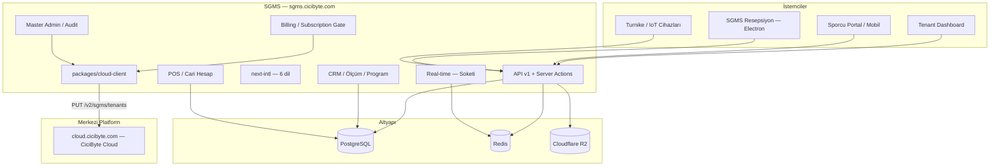

# CiCiByte SGMS — Product & Technical Roadmap

| Alan | Değer |
|------|--------|
| **Proje** | Smart Gym Management System — **Digital Boutique SaaS** |
| **Vizyon** | Standart kayıt panelinden → **Uluslararası, Premium, Tam Kapsamlı Spor Salonu İşletim Sistemi** |
| **VDS** | `/www/wwwroot/sgms.cicibyte.com` → `sgms.cicibyte.com` |
| **Repo** | https://github.com/RealMrNovember/SGMS.git |
| **Strateji** | Local geliştir → Git push → VDS `git pull` (`www:www`) |
| **Merkezi platform** | `cloud.cicibyte.com` — CiciByte Cloud (Developer → Products → `sgms`) |
| **Legacy (kullanımdan kalktı)** | `license.cicibyte.com` — SGMS artık bu servisi kullanmıyor (bkz. Faz 13). Sunucu diğer istemciler (GarageLedger vb.) için ayakta kalmaya devam ediyor, SGMS'in ona bağımlılığı yok. |
| **Kaynak doküman** | `sgms.cicibyte.com - readme.md` (teknik günlük/arşiv), `CiCiByte_SGMS_Ultimate_Enterprise_Blueprint.docx` |

**Son güncelleme:** 2026-07-14 · **Bu dosya artık tek doğru kaynaktır** (`readme.md` sadece hızlı başlangıç talimatlarını barındırır, faz/durum takibi burada yapılır).

---

## Vizyon Özeti

SGMS; spor salonunun **fiziksel** (turnike, RFID, check-in) ve **dijital** (CRM, PT, mesajlaşma, kasa, cari hesap, abonelik/ödeme, çok dilli deneyim) operasyonlarını tek tenant çatısı altında yöneten bir platformdur. Şirket çapında **CiciByte Cloud** (`cloud.cicibyte.com`) merkezi platformuna tenant senkronu ile bağlanır.

| Katman | Kapsam |
|--------|--------|
| **Çekirdek (tamamlandı)** | Multi-tenant, RBAC, CRM, ölçüm, program, mesaj |
| **Premium deneyim** | i18n (6 dil), avatar/kimlik, boutique UI |
| **İşletme & finans** | POS, market/kafe borçları, cari hesap, abonelik/ödeme yönetimi |
| **Yönetim** | Master Admin konsolu, audit log platformu |
| **Bağlantı** | Real-time chat, mobil/sporcu API, SGMS Resepsiyon masaüstü |
| **Fiziksel entegrasyon** | QR/RFID turnike, offline sync |
| **Merkezi platform** | CiciByte Cloud (`cloud.cicibyte.com`) tenant senkronu — şirket çapında görünürlük |

---

## Durum Özeti

| Faz | Ad | Durum | İlerleme |
|-----|-----|--------|----------|
| 0 | Altyapı & Monorepo | ✅ Tamamlandı | 100% |
| 1 | Veritabanı & Web Paneli | ✅ Tamamlandı | 100% |
| 2 | Multi-Tenant Core & API v1 | ✅ Tamamlandı | 100% |
| 3 | Production & Operasyon | ✅ Tamamlandı | 100% |
| 4 | Tenant UI — Core İş Mantığı (CRM) | ✅ Tamamlandı | 100% |
| 5 | ~~Merkezi Lisans Entegrasyonu (license.cicibyte.com)~~ | 🗑️ Emekli (bkz. Faz 13) | — |
| 6 | Uluslararasılaşma (i18n) & Medya/Kimlik | ✅ Tamamlandı | 100% |
| 7 | Mobil & Sporcu Auth (API-First) | ✅ Tamamlandı | 100% |
| 8 | POS, Kasa, Cari Hesap & Abonelik/Ödeme | ✅ Tamamlandı | ~95% (Invoice modeli hariç) |
| 9 | Gerçek Zamanlı İletişim (Real-time Chat) | ✅ Tamamlandı | 100% |
| 10 | IoT, Kapı, Turnike & SGMS Resepsiyon | ✅ Tamamlandı | 100% |
| 11 | Marketing & Showcase Sitesi | ✅ Tamamlandı | 100% |
| 12 | Master Admin, Billing & Audit Platformu | ✅ Tamamlandı | 100% |
| 13 | CiciByte Cloud Migrasyonu & Platform Sertleştirme | 🔄 Devam ediyor | ~90% (yalnızca Playwright E2E kaldı) |

> Fazlar 6/9/10'un durum özeti önceki revizyonlarda detay bölümleriyle **çelişiyordu** (özet tablo güncellenmeden unutulmuştu). Bu revizyon koda göre (tüm alt maddeler `[x]`, gerçek commit geçmişi) düzeltilmiştir.

---

## ✅ Faz 0 — Altyapı ve Repo (Tamamlandı)

- [x] Monorepo iskeleti (`pnpm-workspace.yaml`, `apps/*`, `packages/*`)
- [x] Docker: PostgreSQL 16 + Redis 7 (`infra/docker/docker-compose.yml`)
- [x] VDS volume: `data/{postgres,redis}` · bind mount
- [x] aaPanel `www:www` sahiplik + `vds-bootstrap.sh`
- [x] Git remote → GitHub (`RealMrNovember/SGMS`)
- [x] Proje içi Node 20 (`.tools/node`), PM2 (`.pm2`), loglar (`logs/pm2`)
- [x] `ecosystem.config.cjs`, `production-bootstrap.sh`, `systemd/sgms-pm2.service`
- [x] `@reboot` crontab → `pm2 resurrect`

**Çıktılar:** `sgms-postgres` (5432), `sgms-redis` (6380), `sgms-web` (3100)

---

## ✅ Faz 1 — Veritabanı ve Yönetim Paneli (Tamamlandı)

### Veritabanı
- [x] Prisma şema + client (`packages/database`)
- [x] Migration `20260605191622_init`
- [x] SaaS plan seed (Starter / Pro / Enterprise / Franchise × TRY/USD/AZN)
- [x] Migration `20260608193638_add_superadmin_flag`
- [x] Migration `20260608194923_add_gym_member_models` (`GymMember`, `GymMembershipPlan`)

### Kimlik & RBAC
- [x] NextAuth v5 (Credentials + JWT)
- [x] Session: `organizationId`, `role`, `isSuperAdmin`
- [x] Middleware: Super Admin → `/admin` · Tenant → `/dashboard`

### Paneller
- [x] Super Admin: `/admin` — sistem özeti, org listesi, yeni müşteri (`/admin/organizations/new`)
- [x] Tenant: `/dashboard` — özet
- [x] Tenant: `/dashboard/team` — personel davet (OWNER/ADMIN)
- [x] Tenant: `/dashboard/members` — sporcu kaydı (OWNER/ADMIN/STAFF)

### Seed hesapları (demo-gym)
| Rol | E-posta | Parola |
|-----|---------|--------|
| **Master Admin** | `admin@cicibyte.com` | `SEED_ADMIN_PASSWORD` (varsayılan seed) |
| Super Admin (eski demo) | `admin@demo.sgms.local` | `Admin123!` (yalnızca `SEED_ADMIN_EMAIL` override yoksa değişir) |
| Gym OWNER | `owner@demo-gym.local` | `Owner123!` |
| TRAINER | `trainer@demo-gym.local` | `Trainer123!` |
| Sporcu (User) | `athlete@demo-gym.local` | `Athlete123!` |

---

## ✅ Faz 2 — Multi-Tenant Core & API v1 (Tamamlandı)

### Veritabanı (Core ekosistem)
- [x] Migration `20260608210000_add_core_ecosystem_models`
- [x] `GymMember.userId` + `trainerId` (sporcu girişi + PT bağlantısı)
- [x] `HealthMeasurement`, `TrainingProgram`, `DirectMessage`
- [x] `organizationId` denormalizasyonu (tenant izolasyonu)
- [x] Demo seed: ölçüm + WORKOUT programı

### API v1 (Route Handlers)
- [x] `GET/POST /api/v1/members`
- [x] `GET/POST /api/v1/measurements`
- [x] `GET/POST /api/v1/programs`
- [x] `GET/POST /api/v1/messages`
- [x] `lib/api/guard.ts` — NextAuth session + rol + org doğrulama
- [x] Middleware: API → `401 JSON` (HTML redirect yok)
- [x] Bearer token (Faz 7'de tamamlandı), `PATCH`/`DELETE` (Faz 7), OpenAPI spec (Faz 7)

---

## ✅ Faz 3 — Production & Operasyon (Tamamlandı)

### 3.1 Nginx & TLS
- [x] aaPanel `sgms.cicibyte.com` → reverse proxy `127.0.0.1:3100`
- [x] `/_next/static/` Nginx alias
- [x] Site PHP → Static (aaPanel manuel; proxy çalışıyor) — `docs/deployment/AAPANEL-PHP-STATIC.md`
- [x] TLS / Cloudflare — `https://sgms.cicibyte.com/login` → 200
- [x] `AUTH_URL` prod doğrulandı

### 3.2 Deploy otomasyonu
- [x] `docs/deployment/deploy.sh`
- [x] `docs/deployment/verify-production.sh`
- [x] `pnpm db:migrate:deploy` + `pnpm deploy:verify`

### 3.3 Gözlemlenebilirlik
- [x] PM2 log rotasyonu
- [x] Docker healthcheck cron

---

## ✅ Faz 4 — Tenant UI: Core İş Mantığı / CRM (Tamamlandı)

### 4.1 Sağlık ölçümleri
- [x] `/dashboard/members/[id]` — CRM çekirdeği (profil + ölçüm + program)
- [x] `/dashboard/members/[id]/measurements` — detay + trend
- [x] `actions/measurements.ts` + `MEASUREMENT_ADDED` audit
- [x] `MemberHealthHistoryTable` + `AddMeasurementForm`

### 4.2 Antrenman & diyet programları
- [x] `/dashboard/programs` — oluşturma, filtre, aktif/pasif toggle
- [x] Program içerik editörü (`program-content-builder.tsx`, `program-content-view.tsx`)

### 4.3 Mesajlaşma (Faz 9'da real-time'a taşındı)
- [x] `/dashboard/messages` — inbox / sent, okundu işaretleme, thread + canlı yenileme

### 4.4 Salon üyelik planları
- [x] `/dashboard/plans` — `GymMembershipPlan` CRUD

### 4.5 Sporcu detay (CRM)
- [x] Tek Prisma `include` (ölçümler + aktif programlar)
- [x] Tenant izolasyonu (`organizationId` → `notFound`)
- [x] Yabancı üye alanları (foreign member fields, `20260630210000_add_foreign_member_fields`)

**Kabul kriteri:** ✅ OWNER/TRAINER ile ölçüm → program → mesaj → plan akışı panelden mümkün

---

## 🗑️ Faz 5 — Merkezi Lisans Entegrasyonu (Emekli — bkz. Faz 13)

> `license.cicibyte.com` entegrasyonu (`packages/license-client`, hwid/trial/activate/check akışı) **tamamen kaldırıldı** ve `cloud.cicibyte.com` (CiciByte Cloud) tenant senkronu ile değiştirildi. Bu bölüm yalnızca tarihsel referans için tutulur — güncel mimari için **Faz 13**'e bakın.

<details>
<summary>Eski içerik (arşiv)</summary>

- ~~`packages/license-client` → `license.cicibyte.com` (`app_code=sgms`)~~
- ~~Trial / check / activate + `LICENSE_API_KEY`~~
- ~~`pnpm license:heartbeat`~~

</details>

---

## ✅ Faz 6 — Uluslararasılaşma (i18n) & Medya/Kimlik (Tamamlandı)

> **Hedef:** Premium, uluslararası salon markası deneyimi. Resepsiyon ve PT sporcuları isim + fotoğrafla tanır.

### 6.1 Uluslararasılaşma (i18n)

**Altyapı**
- [x] `next-intl` — App Router uyumlu (`localePrefix: never`, cookie + `Accept-Language`)
- [x] Dil dosyaları: `apps/web/messages/{tr,en,ru,fr,es,az}.json`
- [x] Locale routing: cookie/header tabanlı (URL prefix yok — NextAuth `/login` uyumu)
- [x] Varsayılan dil: `Accept-Language` / tarayıcı algılama (middleware)
- [x] Fallback: geçersiz locale → `tr`

**Desteklenen diller**

| Kod | Dil |
|-----|-----|
| `en` | English |
| `tr` | Türkçe |
| `ru` | Русский |
| `fr` | Français |
| `es` | Español |
| `az` | Azərbaycan |

**Kullanıcı tercihi**
- [x] `User.locale` — JWT session + DB
- [x] `GymMember.locale` — sporcu paneli için
- [x] `LocaleSwitcher` — login + dashboard/admin header (cookie + DB güncelleme)
- [x] Org düzeyi varsayılan dil: `Organization.settings.defaultLocale` — `/dashboard/settings`

**Kapsam (tam çeviri)**
- [x] Auth, dashboard nav, admin nav
- [x] CRM üyeler, ölçüm formları, personel listesi
- [x] Mesajlar, planlar, programlar, dashboard özeti
- [x] API v1 hata mesajları — `lib/api/i18n-errors.ts` (`Accept-Language`)
- [x] `athlete` namespace (sporcu portalı, 6 dil)
- [x] `marketing` namespace (showcase sitesi, TR/EN tam, diğerleri genişletilebilir)
- [x] `expenses` namespace (POS/cari hesap, 6 dil)

### 6.2 Medya ve Kimlik Yönetimi

**Veritabanı**
- [x] `User.avatarUrl`, `GymMember.avatarUrl` — nullable `String` (migration `20260609140000_add_avatars_and_locales`)
- [x] Migration + seed placeholder avatarları (opsiyonel) — `SEED_PLACEHOLDER_AVATARS=true`

**UI / UX**
- [x] Üye listesi, sporcu detay CRM, PT/personel listesi — avatar
- [x] Varsayılan avatar: initials / generic silhouette

**Depolama**
- [x] Local storage abstraction (`lib/storage.ts`) + `POST /api/v1/upload/avatar`
- [x] Object storage — Cloudflare R2 (`lib/storage-r2.ts`, `STORAGE_PROVIDER=r2`, `docs/deployment/R2-STORAGE.md`)
- [x] Signed URL / public CDN path, max boyut, MIME whitelist

**Güvenlik**
- [x] Yalnızca kendi avatarı veya yetkili personel yükleyebilir
- [x] Tenant prefix: `{organizationId}/avatars/{entityId}.webp`

**Kabul kriteri:** ✅ 6 dilde login + dashboard · üye listesinde avatar görünür · dil profilden değiştirilebilir

---

## ✅ Faz 7 — Mobil & Sporcu Auth — API-First (Tamamlandı)

### 7.1 API token katmanı
- [x] `ApiToken` modeli, `POST /api/v1/auth/login|logout`, `lib/api/token.ts`, `lib/api/auth-context.ts`
- [x] Token revoke Redis cache (`lib/api/token-revoke-cache.ts`)

### 7.2 Sporcu oturumu
- [x] `GymMember.userId` → JWT session `gymMemberId` claim
- [x] `GET /api/v1/me` — profil + üyelik + locale + istatistikler

### 7.3 API tamamlama
- [x] `PATCH`/`DELETE` tüm kaynaklarda, cursor sayfalama
- [x] OpenAPI 3.1 (`docs/api/openapi.yaml`)

### 7.4 Sporcu web portalı
- [x] `/athlete` route group — özet, ölçüm, program, mesaj, hesap (cari bakiye)
- [x] `AthleteNav`, i18n, middleware yönlendirmesi

**Kabul kriteri:** ✅ Bearer ile curl/Postman tam akış

---

## ✅ Faz 8 — POS, Kasa, Cari Hesap & Abonelik/Ödeme (Tamamlandı, Invoice hariç)

> **Hedef:** Salon içi market/kafe/ekstra PT borçları (cari hesap) + SaaS abonelik/ödeme yönetimi.

### 8.1 Veri modeli

| Model | Durum |
|-------|--------|
| `ExpenseCategory`, `Expense`, `Transaction` | ✅ |
| `Invoice` | 🔲 (opsiyonel — sonraki iterasyon, tek eksik kalem) |

### 8.2 İş mantığı
- [x] `actions/expenses.ts` — ekleme, hızlı şablon, tahsilat (FIFO), iptal (audit zorunlu)
- [x] API v1: `expenses`, `transactions`
- [x] Tenant izolasyonu + `getTenantWriteBlockReason` guard

### 8.3 UI
- [x] Sporcu detay CRM: Cari Hesap paneli, hızlı ekleme butonları
- [x] `/dashboard/pos` — resepsiyon mini POS terminali
- [x] Sporcu portal: borç listesi + ödeme geçmişi (read-only)

### 8.4 Raporlama
- [x] Günlük kasa özeti, üye bazlı ekstre (CSV + PDF — `lib/member-statement-pdf.ts`)

### 8.5 Abonelik & Ödeme Yönetimi (2026-07-01 eklendi — önceki revizyonda belgelenmemişti)
- [x] `lib/billing/subscription-gate.ts` — yerel Subscription/Plan kaydına dayalı erişim kapısı (`full` / `billing_only`), deneme/ödeme süresi dolunca otomatik salt-okunur mod
- [x] `lib/billing/period-dates.ts`, `lib/billing/settings.ts` — dönem hesaplama + org ayarlarına gömülü ödeme talebi kuyruğu
- [x] `/dashboard/billing` — salon sahibi: plan talebi, ödeme durumu, `billing-checkout-panel.tsx`, `billing-status-poller.tsx`
- [x] `actions/billing.ts` — `submitBillingRequest`, durum sorgulama
- [x] `actions/admin-billing.ts` — Master Admin: `approveBillingRequest`, `rejectBillingRequest`
- [x] `actions/admin-organizations.ts` — deneme uzatma, abonelik aktifleştirme/iptal, plan değişikliği, dönem/durum düzenleme (tam Master Admin billing kontrolü)
- [x] Her abonelik durum değişikliği artık **cloud.cicibyte.com'a otomatik senkronize edilir** (bkz. Faz 13)

**Kabul kriteri:** ✅ Resepsiyon "Su - 15 TL" ekler → sporcu panelinde borç görünür → tahsilat sonrası bakiye sıfırlanır · deneme/ödeme süresi dolunca panel salt-okunur moda düşer, Master Admin onayıyla açılır

---

## ✅ Faz 9 — Gerçek Zamanlı İletişim (Real-time Chat) (Tamamlandı)

### 9.1 Altyapı
- [x] Soketi (self-host, Redis uyumlu, Pusher protokolü) — `sgms-soketi` + `sgms-redis`

### 9.2 Teknik
- [x] `DirectMessage.deliveredAt/readAt`, kanal adlandırma (`lib/realtime/channels.ts`)
- [x] `POST /api/v1/messages` → DB + broadcast (`lib/realtime/hub.ts`)
- [x] SSE fallback (`GET /api/v1/messages/events`), Soketi + Redis adapter, Pusher-js istemci

### 9.3 UI
- [x] Thread görünümü + canlı yenileme (dashboard + sporcu), unread badge, typing indicator

### 9.4 Güvenlik
- [x] Kanal yetkisi (`private-org.{orgId}.user.{userId}`), rate limit, `MessageReport` + `/admin/moderation`

**Kabul kriteri:** ✅ PT mesaj gönderir → sporcu paneli anında güncellenir (<2 sn)

---

## ✅ Faz 10 — IoT, Kapı, Turnike Sistemleri & SGMS Resepsiyon (Tamamlandı)

### 10.1 Cihaz & kayıt
- [x] `POST /api/v1/devices`, device-scoped API key, `Device.status` (ONLINE/OFFLINE/DISABLED/PENDING)

### 10.2 Check-in & erişim
- [x] `POST /api/v1/check-in` — QR (HMAC imzalı), RFID, manuel
- [x] `/dashboard/check-in` — canlı giriş listesi + Soketi canlı yenileme
- [x] Giriş/çıkış yönü (`ENTRY`/`EXIT`) + personel RFID
- [x] Webhook: `POST /api/v1/webhooks/turnstile` (üçüncü parti turnike yazılımı)

### 10.3 Offline sync
- [x] `SyncBatch` modeli, `POST /api/v1/sync/push` + `GET /api/v1/sync/pull`, idempotent `clientEventId`
- [x] Çakışma politikası: `client-wins` / `server-wins` / `reject-if-newer-exists`

### 10.4 SGMS Resepsiyon (masaüstü — Electron + Vite + React)
- [x] v0.3.0 — ilk Windows installer (check-in giriş/çıkış)
- [x] v0.4.0 — Master Admin senkron uyumu, audit iyileştirmeleri
- [x] v0.4.1 — Pusher constructor hata düzeltmesi (login akışı)
- [x] v0.5.0 — **tam resepsiyon masası UI**: üyeler, POS, check-in, ayarlar paneli
- [x] Kod imzalama (Authenticode), Windows toast bildirimleri, frameless UI + logo
- [x] `docs/desktop/RECEPTION-SCENARIO.md`, `docs/desktop/INSTALL.md`, `docs/desktop/CODE-SIGNING.md`
- [x] Web panelinden indirme linkleri (`reception-download-promo.tsx`)

**Kabul kriteri:** ✅ Offline check-in kuyruğu → online sync → `AuditLog` + üye giriş kaydı · SGMS Resepsiyon v0.5.0 ile tam resepsiyon masası akışı

---

## ✅ Faz 11 — Marketing & Showcase Sitesi (Tamamlandı)

### 11.1 Showcase ana sayfa
- [x] `/` — premium marketing landing, mobile-first header + app dock (2026-06-30 revizyonu)
- [x] Oturum açık kullanıcı → dashboard/athlete/admin yönlendirmesi korunur

### 11.2 14 günlük deneme kaydı
- [x] `/trial` — public self-service kayıt formu, `actions/trial-registration.ts`

### 11.3 Marka & iletişim
- [x] Logo, `SgmsLogo`, `lib/site-config.ts`, footer

### 11.4 i18n & teknik
- [x] `marketing` namespace — 6 dil, OpenGraph metadata

**Kabul kriteri:** ✅ Showcase → 14 gün deneme → login akışı çalışıyor

---

## ✅ Faz 12 — Master Admin, Billing & Audit Platformu (Tamamlandı)

> 2026-07-01 tarihinde şirket içi kullanım için eklendi; önceki roadmap revizyonunda hiç belgelenmemişti (bu revizyonun kapattığı en büyük dokümantasyon açığı).

### 12.1 Master Admin Konsolu
- [x] `/admin/admins` — Master Admin hesap yönetimi (`master-admin-panel.tsx`, `actions/admin-master-admins.ts`)
- [x] `/admin/organizations/[id]` — tam organizasyon detay: profil, ekip, abonelik paneli (`organization-subscription-panel.tsx`), hızlı işlemler
- [x] `/admin/plans` — SaaS plan CRUD (`plan-edit-form.tsx`)
- [x] `/admin/communications` — müşteri iletişim şablonları (`lib/admin/email-templates.ts`)

### 12.2 Audit Log Platformu (genişletilmiş)
- [x] `/admin/audit` + `/admin/organizations/[id]/audit` — kategori bazlı filtreleme, export (`GET /api/admin/audit/export`)
- [x] `audit-category-sidebar.tsx`, `audit-log-filters.tsx`, `audit-log-table.tsx`, `audit-log-toolbar.tsx`
- [x] `AuditAction` enum'una eksik değerlerin senkronu (migration `20260701120000_sync_audit_action_enum`) — production drift'i düzeltildi
- [x] Kategori sayaçlarının enum drift'ine karşı sertleştirilmesi

### 12.3 Moderasyon
- [x] `/admin/moderation` — mesaj şikayetleri (`MessageReport`)

**Kabul kriteri:** ✅ Master Admin tek panelden tüm organizasyonları, abonelikleri, planları ve audit geçmişini yönetebilir

---

## 🔄 Faz 13 — CiciByte Cloud Migrasyonu & Platform Sertleştirme (Devam ediyor, ~60%)

> **Hedef:** `license.cicibyte.com` (legacy, tek-cihaz hwid modeli) bağımlılığını tamamen kaldırıp SGMS'i şirketin merkezi platformu **CiciByte Cloud** (`cloud.cicibyte.com`) ile "gerçek" bir multi-tenant SaaS entegrasyonu üzerinden bağlamak; ayrıca eksik kalan mühendislik pratiklerini (test, CI/CD) tamamlamak.
>
> **Mimari karar:** SGMS kendi Subscription/Plan/billing-gate sistemini zaten yerelde barındırıyor (Faz 8.5) — erişim kararı hep yerel veriye göre verilir. `cloud.cicibyte.com`'un eski `trial/activate/check` (hwid tabanlı, tek cihaz lisansı) modeli yerine, çoklu-tenant SaaS ürünleri için tasarlanmış **`PUT /v2/{productSlug}/tenants`** (tenant sync) uç noktası kullanılır — CiciByte Cloud dokümantasyonunda tam da bu senaryo için tarif edilir ("self-managed multi-tenant SaaS... pushes tenant/billing state, rather than gating the product on an external check it doesn't need").

### 13.1 `packages/cloud-client` (yeni paket — `packages/license-client` tamamen kaldırıldı)
- [x] Eski `packages/license-client` dizini silindi (`LicenseClientService`, hwid/trial/activate/check akışı, `LICENSE_API_*` env değişkenleri)
- [x] `CloudClientService.syncOrganization()` — org'un güncel Subscription/Plan durumunu `PUT /v2/sgms/tenants` ile iter
- [x] `CloudClientService.syncAllOrganizations()` — cron/heartbeat için toplu senkron
- [x] `CloudClientService.checkPlatformHealth()` — `GET /v1/health` (public)
- [x] Legacy v1 hwid uçları (`checkDeviceLicense`, `issueOfflineToken` — Ed25519 imzalı offline token) masaüstü/turnike senaryoları için client'ta saklandı ama SGMS web app tarafından **kullanılmıyor** (yalnızca ileride Resepsiyon/turnike cihazları offline-grace-period isterse)
- [x] `AuditAction` enumuna `CLOUD_TENANT_SYNCED` / `CLOUD_SYNC_FAILED` eklendi (migration `20260714000000_add_cloud_sync_audit_actions`), eski `LICENSE_*` değerleri geriye dönük uyumluluk için enum'da bırakıldı (Postgres enum'dan değer silinemez, mevcut audit geçmişi bozulmasın diye)

### 13.2 Entegrasyon noktaları
- [x] `lib/cloud-sync.ts` — `syncOrganizationToCloud()` / `syncAllOrganizationsToCloud()`
- [x] Trial kayıt (`actions/trial-registration.ts`), Master Admin org oluşturma (`actions/organizations.ts`)
- [x] Master Admin abonelik aksiyonları — deneme uzatma, aktivasyon, plan değişikliği, dönem/durum düzenleme, iptal (`actions/admin-organizations.ts`) — **hepsi** artık mutasyon sonrası cloud senkronu tetikliyor
- [x] Ödeme onayı (`actions/admin-billing.ts` → `approveBillingRequest`)
- [x] Login akışı (`lib/auth.ts`) — deneme/ödeme süresi dolduğunda arka planda senkron dener
- [x] Dashboard yüklenişi (`lib/license-dashboard.ts` → `refreshDashboardLicense`)
- [x] `/admin` panelinde "Cloud senkronu" hızlı işlem butonu + `https://cloud.cicibyte.com/licenses` bağlantısı

### 13.3 Temizlik
- [x] Tüm `license.cicibyte.com` / `LICENSE_API_*` referansları kod tabanından temizlendi (env dosyaları, i18n mesajları, deploy scriptleri, `NGINX-AAPANEL.md`) — yalnızca "komşu vhost'a dokunma" uyarıları (gerçek, hâlâ geçerli — sunucu diğer istemciler için ayakta) korundu
- [x] `docs/deployment/license-heartbeat.sh` → `docs/deployment/cloud-heartbeat.sh`
- [x] `scripts/verify-license-integration.sh` → `scripts/verify-cloud-integration.sh` (artık `/v1/health` + key format kontrolü; eski script başka bir üretim sunucusunun MySQL'ine SSH ile bağlanıyordu — kaldırıldı)
- [x] cloud.cicibyte.com production API key rotasyonu: yetim `sgms-web-2026-07-13` anahtarı iptal edildi, yeni `sgms-web-production` (id 7) üretildi — kullanıcı onayıyla
- [x] Production `.env` (sgms.cicibyte.com sunucusu) → `CLOUD_API_BASE_URL` / `CLOUD_PRODUCT_SLUG` / `CLOUD_API_KEY` ile güncellendi
- [x] Kod GitHub `main`'e push edildi (`f3b3686`) ve production'a deploy edildi (`pnpm install` → `db:migrate:deploy` → `build:packages` → `web:build` → `pm2 reload`)
- [x] `pnpm db:migrate:deploy` — `CLOUD_TENANT_SYNCED`/`CLOUD_SYNC_FAILED` enum migration'ı production DB'de uygulandı
- [x] `pnpm cloud:heartbeat` production'da çalıştırıldı: **4/4 organizasyon başarıyla senkronize oldu** (pilates, pasha, test-salon, demo-gym) — cloud.cicibyte.com'da doğru `plan_code`/`billing_status` ile doğrulandı
- [x] `scripts/verify-cloud-integration.sh` → `cloud.cicibyte.com` health check `ok:true`, API key formatı doğru
- [x] `sgms.cicibyte.com/login` → 200 (deploy sonrası canlı doğrulama)

### 13.4 Mühendislik pratikleri (önceki roadmap'in "Teknik Borç" listesinden)
- [x] Test altyapısı: Vitest kuruldu (`packages/cloud-client`, `apps/web`) — 21 gerçek unit test (config normalizasyonu, slug, dönem/lisans hesaplamaları) yeşil
- [x] ESLint (flat config, `next/core-web-vitals` + `next/typescript`) — proje daha önce hiç yapılandırılmamıştı, `pnpm lint` artık çalışıyor
- [x] CI/CD: `.github/workflows/ci.yml` — Postgres servisiyle install → prisma generate → build:packages → typecheck → lint → migrate deploy → test → web build
- [x] Uçtan uca doğrulama: `pnpm typecheck`, `pnpm lint`, `pnpm test`, `pnpm web:build` yerelde çalıştırıldı — 51 route dahil tam production build başarılı
- [ ] Playwright E2E iskeleti (login, CRM ölçüm, expense akışları) — Vitest'ten sonraki adım, henüz kurulmadı
- [ ] `Invoice` modeli (Faz 8'den kalan tek opsiyonel kalem)

### 13.5 Dokümantasyon
- [x] `roadmap.md` tek doğru kaynak haline getirildi — özet tablo ile detay bölümleri arasındaki çelişkiler (Faz 6/9/10) düzeltildi, belgelenmemiş özellikler (Faz 12) eklendi
- [ ] `readme.md` — güncel mimariye göre sadeleştirme (eski "License API NestJS" placeholder'ının kaldırılması)

**Kabul kriteri:** Trial kayıt / plan değişikliği / ödeme onayı → cloud.cicibyte.com'da ilgili tenant anlık güncellenir · production'da `pnpm cloud:heartbeat` başarıyla çalışır · CI pipeline yeşil

**Bağımlılık:** Faz 8.5 (yerel billing-gate) ✅ · CiciByte Cloud License API (`cloud.cicibyte.com`, zaten canlı ve sağlıklı — `GET /v1/health` → 200) ✅

---

## Teknik Borç & Paralel İyileştirmeler

| Öğe | Öncelik | Faz | Durum |
|-----|---------|-----|-------|
| CiciByte Cloud API key rotasyonu (production) | P0 | 13 | ✅ tamamlandı |
| Production `.env` + migration deploy + `cloud:heartbeat` doğrulaması | P0 | 13 | ✅ tamamlandı — 4/4 organizasyon senkronize |
| Test altyapısı (Vitest) | P1 | 13 | ✅ kuruldu, 21 test yeşil |
| CI/CD GitHub Actions | P1 | 13 | ✅ `.github/workflows/ci.yml` |
| ESLint yapılandırması | P1 | 13 | ✅ hiç yoktu, bu revizyonla eklendi |
| E2E (Playwright): login, CRM ölçüm, expense | P2 | 13 | 🔲 |
| `Invoice` modeli | P2 | 8 | 🔲 opsiyonel |
| `readme.md` sadeleştirme | P2 | 13 | ✅ bu revizyonla kapatıldı |
| `roadmap.md` ↔ kod senkronu | P2 | — | ✅ bu revizyonla kapatıldı |
| PHP → Static (aaPanel) | P3 | 3 | ✅ `docs/deployment/AAPANEL-PHP-STATIC.md` |

---

## Önerilen Build Sırası

```text
Tamamlanan:
  Faz 0–4    Altyapı → CRM                                    ✅
  Faz 6–12   i18n/Medya, Mobil API, POS/Billing, Real-time,   ✅
             Turnike/Resepsiyon, Marketing, Master Admin

Emekli:
  Faz 5      license.cicibyte.com entegrasyonu                🗑️ (→ Faz 13)

Sıradaki:
  Faz 13     CiciByte Cloud migrasyonu + test/CI sertleştirme  ← DEVAM (~60%)
```

---

## Mimari Diyagram (Güncel Durum)



---

## Hızlı Komutlar (VDS)

```bash
cd /www/wwwroot/sgms.cicibyte.com
pnpm install
pnpm db:migrate:deploy
pnpm db:seed
pnpm web:build
pnpm pm2:reload
sudo bash docs/deployment/deploy.sh
pnpm deploy:verify
pnpm cloud:heartbeat
bash scripts/verify-cloud-integration.sh
```

---

## Referanslar

- Teknik günlük (arşiv): [`sgms.cicibyte.com - readme.md`](./sgms.cicibyte.com%20-%20readme.md)
- CiciByte Cloud License API sözleşmesi: `C:\CicibyteCloud\docs\license-api.md`, `docs/licensing.md` (CiciByte Cloud reposu)
- Nginx: [`docs/deployment/NGINX-AAPANEL.md`](./docs/deployment/NGINX-AAPANEL.md)
- Cloud client: `packages/cloud-client/src/cloud-client.service.ts`
- API guard: `apps/web/src/lib/api/guard.ts`
- Prisma: `packages/database/prisma/schema.prisma`
