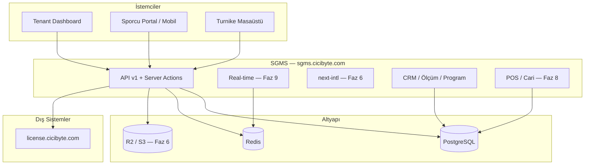

# CiCiByte SGMS — Product & Technical Roadmap

| Alan | Değer |
|------|--------|
| **Proje** | Smart Gym Management System — **Digital Boutique SaaS** |
| **Vizyon** | Standart kayıt panelinden → **Uluslararası, Premium, Tam Kapsamlı Spor Salonu İşletim Sistemi** |
| **VDS** | `/www/wwwroot/sgms.cicibyte.com` → `sgms.cicibyte.com` |
| **Repo** | https://github.com/RealMrNovember/SGMS.git |
| **Strateji** | Local geliştir → Git push → VDS `git pull` (`www:www`) |
| **Komşu (dokunulmaz)** | `license.cicibyte.com` |
| **Kaynak doküman** | `sgms.cicibyte.com - readme.md`, `CiCiByte_SGMS_Ultimate_Enterprise_Blueprint.docx` |

**Son güncelleme:** 2026-06-09 · **HEAD:** `76f5097`

---

## Vizyon Özeti

SGMS; spor salonunun **fiziksel** (turnike, RFID, check-in) ve **dijital** (CRM, PT, mesajlaşma, kasa, cari hesap, çok dilli deneyim) operasyonlarını tek tenant çatısı altında yöneten bir platformdur.

| Katman | Kapsam |
|--------|--------|
| **Çekirdek (tamamlandı)** | Multi-tenant, RBAC, CRM, ölçüm, program, mesaj, lisans |
| **Premium deneyim** | i18n (6 dil), avatar/kimlik, boutique UI |
| **İşletme & finans** | POS, market/kafe borçları, cari hesap |
| **Bağlantı** | Real-time chat, mobil/sporcu API |
| **Fiziksel entegrasyon** | QR/RFID turnike, offline sync |

---

## Durum Özeti

| Faz | Ad | Durum | İlerleme |
|-----|-----|--------|----------|
| 0 | Altyapı & Monorepo | ✅ Tamamlandı | 100% |
| 1 | Veritabanı & Web Paneli | ✅ Tamamlandı | 100% |
| 2 | Multi-Tenant Core & API v1 | ✅ Tamamlandı | 100% |
| 3 | Production & Operasyon | ✅ Tamamlandı | 100% |
| 4 | Tenant UI — Core İş Mantığı (CRM) | ✅ Tamamlandı | 100% |
| 5 | Merkezi Lisans Entegrasyonu | ✅ Tamamlandı | 100% |
| 6 | Uluslararasılaşma (i18n) & Medya/Kimlik | 🔲 Sırada | 0% |
| 7 | Mobil & Sporcu Auth (API-First) | 🔲 Planlandı | 0% |
| 8 | POS, Kasa & Cari Hesap Yönetimi | 🔲 Planlandı | 0% |
| 9 | Gerçek Zamanlı İletişim (Real-time Chat) | 🔲 Planlandı | 0% |
| 10 | IoT, Kapı & Turnike Sistemleri | 🔲 Gelecek Vizyon | 0% |

> **Öncelik mantığı:** Önce uluslararası ve görsel kimlik (Faz 6) → sporcu/mobil erişim (Faz 7) → salon içi finans (Faz 8) → anlık mesajlaşma (Faz 9) → fiziksel cihazlar (Faz 10).

---

## ✅ Faz 0 — Altyapı ve Repo (Tamamlandı)

- [x] Monorepo iskeleti (`pnpm-workspace.yaml`, `apps/*`, `packages/*`)
- [x] Docker: PostgreSQL 16 + Redis 7 (`infra/docker/docker-compose.yml`)
- [x] VDS volume: `data/{postgres,redis}` · bind mount
- [x] aaPanel `www:www` sahiplik + `vds-bootstrap.sh`
- [x] Git remote → GitHub (`RealMrNovember/SGMS`)
- [x] Proje içi Node 20 (`.tools/node`), PM2 (`.pm2`), loglar (`logs/pm2`)
- [x] `ecosystem.config.cjs`, `production-bootstrap.sh`, `systemd/sgms-pm2.service`
- [x] `@reboot` crontab → `pm2 resurrect`

**Çıktılar:** `sgms-postgres` (5432), `sgms-redis` (6380), `sgms-web` (3100)

---

## ✅ Faz 1 — Veritabanı ve Yönetim Paneli (Tamamlandı)

### Veritabanı
- [x] Prisma şema + client (`packages/database`)
- [x] Migration `20260605191622_init`
- [x] SaaS plan seed (Starter / Pro / Enterprise / Franchise × TRY/USD/AZN)
- [x] Migration `20260608193638_add_superadmin_flag`
- [x] Migration `20260608194923_add_gym_member_models` (`GymMember`, `GymMembershipPlan`)

### Kimlik & RBAC
- [x] NextAuth v5 (Credentials + JWT)
- [x] Session: `organizationId`, `role`, `isSuperAdmin`
- [x] Middleware: Super Admin → `/admin` · Tenant → `/dashboard`

### Paneller
- [x] Super Admin: `/admin` — sistem özeti, org listesi, yeni müşteri (`/admin/organizations/new`)
- [x] Tenant: `/dashboard` — özet
- [x] Tenant: `/dashboard/team` — personel davet (OWNER/ADMIN)
- [x] Tenant: `/dashboard/members` — sporcu kaydı (OWNER/ADMIN/STAFF)

### Seed hesapları (demo-gym)
| Rol | E-posta | Parola |
|-----|---------|--------|
| Super Admin | `admin@demo.sgms.local` | `Admin123!` |
| Gym OWNER | `owner@demo-gym.local` | `Owner123!` |
| TRAINER | `trainer@demo-gym.local` | `Trainer123!` |
| Sporcu (User) | `athlete@demo-gym.local` | `Athlete123!` |

---

## ✅ Faz 2 — Multi-Tenant Core & API v1 (Tamamlandı)

### Veritabanı (Core ekosistem)
- [x] Migration `20260608210000_add_core_ecosystem_models`
- [x] `GymMember.userId` + `trainerId` (sporcu girişi + PT bağlantısı)
- [x] `HealthMeasurement`, `TrainingProgram`, `DirectMessage`
- [x] `organizationId` denormalizasyonu (tenant izolasyonu)
- [x] Demo seed: ölçüm + WORKOUT programı

### API v1 (Route Handlers)
- [x] `GET/POST /api/v1/members`
- [x] `GET/POST /api/v1/measurements`
- [x] `GET/POST /api/v1/programs`
- [x] `GET/POST /api/v1/messages`
- [x] `lib/api/guard.ts` — NextAuth session + rol + org doğrulama
- [x] Middleware: API → `401 JSON` (HTML redirect yok)

**Eksik (sonraki fazlara):** Bearer token (Faz 7), OpenAPI spec, `PATCH`/`DELETE`

---

## ✅ Faz 3 — Production & Operasyon (Tamamlandı)

### 3.1 Nginx & TLS
- [x] aaPanel `sgms.cicibyte.com` → reverse proxy `127.0.0.1:3100`
- [x] `/_next/static/` Nginx alias
- [ ] Site PHP → Static (aaPanel manuel; proxy çalışıyor)
- [x] TLS / Cloudflare — `https://sgms.cicibyte.com/login` → 200
- [x] `AUTH_URL` prod doğrulandı

### 3.2 Deploy otomasyonu
- [x] `docs/deployment/deploy.sh`
- [x] `docs/deployment/verify-production.sh`
- [x] `pnpm db:migrate:deploy` + `pnpm deploy:verify`

### 3.3 Gözlemlenebilirlik
- [x] PM2 log rotasyonu
- [x] Docker healthcheck cron

---

## ✅ Faz 4 — Tenant UI: Core İş Mantığı / CRM (Tamamlandı)

### 4.1 Sağlık ölçümleri
- [x] `/dashboard/members/[id]` — CRM çekirdeği (profil + ölçüm + program)
- [x] `/dashboard/members/[id]/measurements` — detay + trend
- [x] `actions/measurements.ts` + `MEASUREMENT_ADDED` audit
- [x] `MemberHealthHistoryTable` + `AddMeasurementForm`

### 4.2 Antrenman & diyet programları
- [x] `/dashboard/programs` — oluşturma, filtre, aktif/pasif toggle

### 4.3 Mesajlaşma (async — polling tabanlı)
- [x] `/dashboard/messages` — inbox / sent, okundu işaretleme
- [ ] Thread + real-time → **Faz 9**

### 4.4 Salon üyelik planları
- [x] `/dashboard/plans` — `GymMembershipPlan` CRUD

### 4.5 Sporcu detay (CRM)
- [x] Tek Prisma `include` (ölçümler + aktif programlar)
- [x] Tenant izolasyonu (`organizationId` → `notFound`)

**Kabul kriteri:** ✅ OWNER/TRAINER ile ölçüm → program → mesaj → plan akışı panelden mümkün

---

## ✅ Faz 5 — Merkezi Lisans Entegrasyonu (Tamamlandı)

- [x] `packages/license-client` → `license.cicibyte.com`
- [x] Trial / check / heartbeat + `LICENSE_API_KEY` (shared key, `app_code=sgms`)
- [x] `lib/tenant-access.ts` — limit + salt okunur mod
- [x] Dashboard lisans özet kartları + `LicenseStatusBanner`

**Kabul kriteri:** ✅ `pnpm license:heartbeat` · panelde merkezi lisans durumu

---

## 🔲 Faz 6 — Uluslararasılaşma (i18n) & Medya/Kimlik (Öncelik: P0)

> **Hedef:** Premium, uluslararası salon markası deneyimi. Resepsiyon ve PT sporcuları isim + fotoğrafla tanır.

### 6.1 Uluslararasılaşma (i18n)

**Altyapı**
- [x] `next-intl` — App Router uyumlu (`localePrefix: never`, cookie + `Accept-Language`)
- [x] Dil dosyaları: `apps/web/messages/{tr,en,ru,fr,es,az}.json` (nav + auth taslak)
- [x] Locale routing: cookie/header tabanlı (URL prefix yok — NextAuth `/login` uyumu)
- [x] Varsayılan dil: `Accept-Language` / tarayıcı algılama (middleware)
- [x] Fallback: geçersiz locale → `tr`

**Desteklenen diller**

| Kod | Dil |
|-----|-----|
| `en` | English |
| `tr` | Türkçe |
| `ru` | Русский |
| `fr` | Français |
| `es` | Español |
| `az` | Azərbaycan |

**Kullanıcı tercihi**
- [x] `User.locale` — JWT session + DB
- [x] `GymMember.locale` — sporcu paneli için (şema hazır)
- [x] `LocaleSwitcher` — login + dashboard/admin header (cookie + DB güncelleme)
- [ ] Org düzeyi varsayılan dil: `Organization.settings.defaultLocale`

**Kapsam (aşamalı çeviri)**
- [x] Faz 6a (kısmi): Auth, dashboard nav, admin nav
- [ ] Faz 6a (devam): CRM, ölçüm formları
- [ ] Faz 6b: Mesajlar, planlar, lisans uyarıları
- [ ] Faz 6c: E-posta şablonları, hata mesajları API v1

**Teknik notlar**
- Server Component: `getTranslations()` · Client: `useTranslations()`
- Tarih/sayı formatı: `Intl` + locale (`tr-TR`, `en-US`, …)
- Para birimi: org `currency` + locale formatı (Faz 8 POS ile uyumlu)

### 6.2 Medya ve Kimlik Yönetimi

**Veritabanı**
- [x] `User.avatarUrl` — nullable `String` (migration `20260609140000_add_avatars_and_locales`)
- [x] `GymMember.avatarUrl` — nullable `String`
- [ ] Migration + seed placeholder avatarları (opsiyonel)

**UI / UX**
- [ ] Üye listesi: avatar + isim (resepsiyon tanıma)
- [ ] Sporcu detay CRM: büyük profil fotoğrafı
- [ ] PT / personel listesi: avatar
- [ ] Varsayılan avatar: initials veya generic silhouette

**Depolama (aşamalı)**
- [ ] **Faz 6.2a:** Harici URL veya base64 geçici (MVP)
- [ ] **Faz 6.2b:** Object storage — **Cloudflare R2** (tercih) veya AWS S3
  - [ ] `packages/storage` veya `lib/storage.ts` abstraction
  - [ ] Upload API: `POST /api/v1/media/avatar` (tenant + rol guard)
  - [ ] Signed URL / public CDN path
  - [ ] Max boyut, MIME whitelist (`image/jpeg`, `image/png`, `image/webp`)

**Güvenlik**
- [ ] Yalnızca kendi avatarı veya yetkili personel (OWNER/ADMIN/STAFF/PT) yükleyebilir
- [ ] Tenant prefix: `{organizationId}/avatars/{entityId}.webp`

**Kabul kriteri:** 6 dilde login + dashboard · üye listesinde avatar görünür · dil profilden değiştirilebilir

**Bağımlılık:** Faz 0–5 ✅

---

## 🔲 Faz 7 — Mobil & Sporcu Auth — API-First (Öncelik: P1)

> **Hedef:** Sporcu mobil uygulaması ve self-service; borç görüntüleme (Faz 8) için ön koşul.

### 7.1 API token katmanı
- [ ] `ApiToken` modeli veya JWT Bearer export
- [ ] `POST /api/v1/auth/login` → `{ accessToken, expiresAt }`
- [ ] `lib/api/guard.ts` — `Authorization: Bearer`
- [ ] Token revoke (Redis)

### 7.2 Sporcu oturumu
- [ ] `GymMember.userId` → session `gymMemberId` claim
- [ ] Sporcu scope: yalnızca kendi ölçüm/program/mesaj/borç
- [ ] `GET /api/v1/me` — profil + üyelik + locale

### 7.3 API tamamlama
- [ ] `PATCH`/`DELETE` — üyeler, ölçümler, programlar
- [ ] Cursor sayfalama tüm listelerde
- [ ] OpenAPI 3.1 (`docs/api/openapi.yaml`)

### 7.4 Sporcu web portalı
- [ ] `/athlete` veya `/app` — mobil uyumlu route group
- [ ] i18n entegre (Faz 6)
- [ ] Aktif program, son ölçüm, mesajlar, cari bakiye (Faz 8)

**Kabul kriteri:** `athlete@demo-gym.local` Bearer ile curl/Postman tam akış

**Bağımlılık:** Faz 4 ✅ · Faz 6 (tercih edilen) · Faz 5 ✅

---

## 🔲 Faz 8 — POS, Kasa & Cari Hesap Yönetimi (Öncelik: P1)

> **Hedef:** Salon içi market, kafe, ekstra PT dersi vb. **Extra Expenses** — üye cari hesabı.

### 8.1 Veri modeli

**Yeni modeller (Prisma)**

| Model | Amaç |
|-------|------|
| `ExpenseCategory` | Su, protein, PT ek ders, havlu kiralama… (org bazlı) |
| `Expense` | Tek kalem borç/harcama kaydı (`gymMemberId`, tutar, açıklama) |
| `Invoice` | Dönemsel veya toplu fatura (opsiyonel gruplama) |
| `Transaction` | Ödeme / tahsilat / iptal (`type`: CHARGE, PAYMENT, REFUND, ADJUSTMENT) |

**İlişkiler**
```
Organization ─┬─ ExpenseCategory
              ├─ Expense ── GymMember
              ├─ Invoice ── GymMember (opsiyonel)
              └─ Transaction ── GymMember, Expense?, Invoice?
```

**Alanlar (özet)**
- `Expense`: `organizationId`, `gymMemberId`, `categoryId`, `amount`, `currency`, `description`, `status` (OPEN, PAID, VOID), `createdById`, `paidAt`
- `Transaction`: `organizationId`, `gymMemberId`, `amount`, `type`, `paymentMethod` (CASH, CARD, TRANSFER), `reference`, `metadata`
- `GymMember.balance` veya hesaplanan bakiye: `SUM(charges) - SUM(payments)` (tercih: computed view / aggregate)

### 8.2 İş mantığı (Server Actions + API)

- [ ] `actions/expenses.ts` — `addMemberExpense` (tek tuş: "Su - 15 TL")
- [ ] Hızlı ekleme şablonları: sık kullanılan kalemler (org ayarı)
- [ ] `recordPayment` — kasa tahsilatı
- [ ] `voidExpense` — iptal (OWNER/ADMIN; audit zorunlu)
- [ ] API v1: `GET/POST /api/v1/expenses`, `GET/POST /api/v1/transactions`
- [ ] Tenant izolasyonu + `getTenantWriteBlockReason` guard

### 8.3 UI

**Personel (resepsiyon / PT)**
- [ ] Sporcu detay CRM: **Cari Hesap** sekmesi — bakiye, son hareketler
- [ ] Hızlı ekleme butonları: `+ Su 15₺` · `+ Protein 50₺` · özel tutar
- [ ] `/dashboard/pos` veya modal tabanlı mini POS ekranı

**Sporcu (Faz 7 portal)**
- [ ] Borç listesi + ödeme geçmişi (read-only veya online ödeme — sonraki faz)
- [ ] i18n + para birimi formatı

### 8.4 Raporlama (minimal)
- [ ] Günlük kasa özeti (OWNER/ADMIN)
- [ ] Üye bazlı ekstre export (CSV/PDF — P2)

**Kabul kriteri:** Resepsiyon "Su - 15 TL" ekler → sporcu panelinde borç görünür → tahsilat sonrası bakiye sıfırlanır

**Bağımlılık:** Faz 4 (CRM detay) ✅ · Faz 7 (sporcu görünümü) · Faz 6 (i18n/format)

---

## 🔲 Faz 9 — Gerçek Zamanlı İletişim (Real-time Chat) (Öncelik: P2)

> **Hedef:** Mevcut `DirectMessage` üzerine WhatsApp benzeri anlık mesajlaşma.

### 9.1 Altyapı seçenekleri

| Seçenek | Artı | Eksi |
|---------|------|------|
| **Soketi** (self-host) | Redis uyumlu, Pusher protokolü | VDS ops |
| **Pusher / Ably** (SaaS) | Hızlı entegrasyon | Maliyet |
| **Socket.io** + Redis adapter | Esnek | Custom sunucu |
| **Cloudflare Durable Objects** | Edge, ölçeklenebilir | Yeni binding |

**Öneri:** Redis mevcut → **Soketi** veya **Socket.io** + `sgms-redis`; uzun vadede Cloudflare değerlendirmesi.

### 9.2 Teknik gereksinimler

- [ ] `DirectMessage` modeli korunur; ek: `deliveredAt`, `readAt` (opsiyonel `isRead` yerine)
- [ ] Kanal adlandırma: `private-org.{organizationId}.user.{userId}`
- [ ] Presence: PT çevrimiçi / sporcu çevrimiçi (opsiyonel)
- [ ] `POST /api/v1/messages` → DB + broadcast event
- [ ] Client: thread görünümü, typing indicator (P2), unread badge
- [ ] Fallback: mevcut polling/inbox (bağlantı kopunca)

### 9.3 UI
- [ ] `/dashboard/messages` → konuşma listesi + aktif thread
- [ ] Sporcu portal mesajları (Faz 7)
- [ ] Push bildirim hook (Faz 9b — FCM/APNs abstraction)

### 9.4 Güvenlik
- [ ] Kanal yetkisi: yalnızca aynı `organizationId` üyeleri
- [ ] Rate limit (mesaj flood)
- [ ] Audit: şikayet / moderasyon (P3)

**Kabul kriteri:** PT mesaj gönderir → sporcu paneli anında güncellenir (WebSocket, <2 sn)

**Bağımlılık:** Faz 4.3 (mesaj modeli) ✅ · Faz 7 (sporcu client)

---

## 🔲 Faz 10 — IoT, Kapı & Turnike Sistemleri (Gelecek Vizyon — Öncelik: P3)

> **Hedef:** Masaüstü offline/online turnike; QR ve RFID entegrasyonu.

### 10.1 Cihaz & kayıt (`Device` modeli mevcut)
- [ ] `POST /api/v1/devices/register` — `hardwareId`, org pairing
- [ ] Device-scoped API key (org + device)
- [ ] `Device.lastSeenAt`, `status`: ONLINE | OFFLINE | DISABLED

### 10.2 Check-in & erişim
- [ ] `POST /api/v1/check-in` — payload: `gymMemberId` | QR token | RFID tag
- [ ] QR: zaman sınırlı signed token (JWT veya HMAC)
- [ ] RFID: `GymMember.rfidTag` veya harici kart eşlemesi
- [ ] Webhook: `POST /api/v1/webhooks/turnstile` — üçüncü parti turnike yazılımı

### 10.3 Offline sync
- [ ] `SyncBatch` modeli — `deviceId`, queued events, `syncedAt`
- [ ] `POST /api/v1/sync/push` + `GET /api/v1/sync/pull`
- [ ] Çakışma: last-write-wins + `AuditLog`

### 10.4 Dokümantasyon & istemci
- [ ] `docs/api/turnstile-protocol.md`
- [ ] Masaüstü referans istemci (Electron/Tauri — ayrı repo)
- [ ] Emülatör script (CI)

**Kabul kriteri:** Offline check-in kuyruğu → online sync → `AuditLog` + üye giriş kaydı

**Bağımlılık:** Faz 7 (API auth) · Faz 5 (`maxDevices` limiti) ✅

---

## Teknik Borç & Paralel İyileştirmeler

| Öğe | Öncelik | Faz |
|-----|---------|-----|
| API Bearer + OpenAPI | P1 | 7 |
| E2E (Playwright): login, CRM ölçüm, expense | P2 | 7–8 |
| Super Admin: org detay + askıya alma | P2 | — |
| `readme.md` ↔ `roadmap.md` senkron | P2 | — |
| PHP → Static (aaPanel) | P3 | 3 |
| CI/CD GitHub Actions (`migrate deploy` + build) | P2 | 3 |
| ~~i18n TR/EN~~ | — | → **Faz 6 (6 dil)** |

---

## Önerilen Build Sırası

```text
Tamamlanan:
  Faz 0–5  Altyapı → CRM → Lisans                    ✅

Sıradaki (Digital Boutique SaaS):
  Faz 6    i18n (6 dil) + Avatar / Medya             ← DEVAM (6a altyapı ✅)
  Faz 7    Mobil API + Sporcu portal
  Faz 8    POS & Cari hesap (Invoice/Expense/Transaction)
  Faz 9    Real-time chat (WebSocket)
  Faz 10   Turnike / QR / RFID / IoT
```

---

## Mimari Diyagram (Hedef Durum)



---

## Hızlı Komutlar (VDS)

```bash
cd /www/wwwroot/sgms.cicibyte.com
pnpm install
pnpm db:migrate:deploy
pnpm db:seed
pnpm web:build
pnpm pm2:reload          # veya: pnpm pm2:reload (www PM2_HOME)
sudo bash docs/deployment/deploy.sh
pnpm deploy:verify
pnpm license:heartbeat
```

---

## Referanslar

- Teknik günlük: [`sgms.cicibyte.com - readme.md`](./sgms.cicibyte.com%20-%20readme.md)
- Lisans protokolü: readme → Faz 2 · Merkezi Lisans bölümü
- Nginx: [`docs/deployment/NGINX-AAPANEL.md`](./docs/deployment/NGINX-AAPANEL.md)
- API guard: `apps/web/src/lib/api/guard.ts`
- Prisma: `packages/database/prisma/schema.prisma`
- GarageLedger referans (salt okunur): `license.cicibyte.com` + `garageledger` istemci
