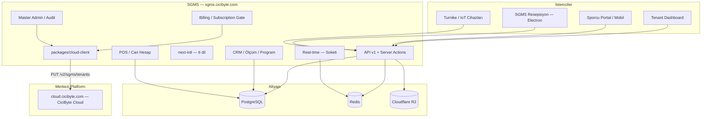

# CiCiByte SGMS — Product & Technical Roadmap

| Alan | Değer |
|------|--------|
| **Proje** | Smart Gym Management System — **Digital Boutique SaaS** |
| **Vizyon** | Standart kayıt panelinden → **Uluslararası, Premium, Tam Kapsamlı Spor Salonu İşletim Sistemi** |
| **VDS** | `/www/wwwroot/sgms.cicibyte.com` → `sgms.cicibyte.com` |
| **Repo** | https://github.com/RealMrNovember/SGMS.git |
| **Strateji** | Local geliştir → Git push → VDS `git pull` (`www:www`) |
| **Merkezi platform** | `cloud.cicibyte.com` — CiciByte Cloud (Developer → Products → `sgms`) |
| **Legacy (kullanımdan kalktı)** | `license.cicibyte.com` — SGMS artık bu servisi kullanmıyor (bkz. Faz 13). Sunucu diğer istemciler (GarageLedger vb.) için ayakta kalmaya devam ediyor, SGMS'in ona bağımlılığı yok. |
| **Kaynak doküman** | `sgms.cicibyte.com - readme.md` (teknik günlük/arşiv), `CiCiByte_SGMS_Ultimate_Enterprise_Blueprint.docx` |

**Son güncelleme:** 2026-07-15 · **Bu dosya artık tek doğru kaynaktır** (`readme.md` sadece hızlı başlangıç talimatlarını barındırır, faz/durum takibi burada yapılır).

---

## Vizyon Özeti

SGMS; spor salonunun **fiziksel** (turnike, RFID, check-in) ve **dijital** (CRM, PT, mesajlaşma, kasa, cari hesap, abonelik/ödeme, çok dilli deneyim) operasyonlarını tek tenant çatısı altında yöneten bir platformdur. Şirket çapında **CiciByte Cloud** (`cloud.cicibyte.com`) merkezi platformuna tenant senkronu ile bağlanır.

| Katman | Kapsam |
|--------|--------|
| **Çekirdek (tamamlandı)** | Multi-tenant, RBAC, CRM, ölçüm, program, mesaj |
| **Premium deneyim** | i18n (6 dil), avatar/kimlik, boutique UI |
| **İşletme & finans** | POS, market/kafe borçları, cari hesap, abonelik/ödeme yönetimi |
| **Yönetim** | Master Admin konsolu, audit log platformu |
| **Bağlantı** | Real-time chat, mobil/sporcu API, SGMS Resepsiyon masaüstü |
| **Fiziksel entegrasyon** | QR/RFID turnike, offline sync |
| **Merkezi platform** | CiciByte Cloud (`cloud.cicibyte.com`) tenant senkronu — şirket çapında görünürlük |

---

## Durum Özeti

| Faz | Ad | Durum | İlerleme |
|-----|-----|--------|----------|
| 0 | Altyapı & Monorepo | ✅ Tamamlandı | 100% |
| 1 | Veritabanı & Web Paneli | ✅ Tamamlandı | 100% |
| 2 | Multi-Tenant Core & API v1 | ✅ Tamamlandı | 100% |
| 3 | Production & Operasyon | ✅ Tamamlandı | 100% |
| 4 | Tenant UI — Core İş Mantığı (CRM) | ✅ Tamamlandı | 100% |
| 5 | ~~Merkezi Lisans Entegrasyonu (license.cicibyte.com)~~ | 🗑️ Emekli (bkz. Faz 13) | — |
| 6 | Uluslararasılaşma (i18n) & Medya/Kimlik | ✅ Tamamlandı | 100% |
| 7 | Mobil & Sporcu Auth (API-First) | ✅ Tamamlandı | 100% |
| 8 | POS, Kasa, Cari Hesap & Abonelik/Ödeme | ✅ Tamamlandı | ~95% (Invoice modeli hariç) |
| 9 | Gerçek Zamanlı İletişim (Real-time Chat) | ✅ Tamamlandı | 100% |
| 10 | IoT, Kapı, Turnike & SGMS Resepsiyon | ✅ Tamamlandı | 100% |
| 11 | Marketing & Showcase Sitesi | ✅ Tamamlandı | 100% |
| 12 | Master Admin, Billing & Audit Platformu | ✅ Tamamlandı | 100% |
| 13 | CiciByte Cloud Migrasyonu & Platform Sertleştirme | 🔄 Devam ediyor | ~90% (yalnızca Playwright E2E kaldı) |
| 14 | Demo Hesap Güvenliği & Master Admin Geçişi | ✅ Tamamlandı | 100% |
| 15 | Kimlik, Onboarding & Uyum Sertleştirme | ✅ Tamamlandı | ~95% (proaktif hatırlatma + 6 dil çevirisi kaldı) |
| 16 | CiciByte Cloud Ticari Entegrasyonu (Ödeme, Referans/Komisyon, Release) | 🔄 Devam ediyor | ~80% (gerçek iyzico anahtarı + sandbox kapatma bekliyor) |
| 17 | Üyelik Senaryoları & Ders/Sınıf Yönetimi | 🔲 Planlandı | 0% |
| 18 | Uyumluluk & Sağlamlaştırma (2FA, GDPR, E2E, Invoice) | 🔲 Planlandı | 0% |
| 19 | SGMS Masaüstü — Genişletme | 🔲 Gelecek Vizyon | 0% |
| 20 | SGMS Mobil Uygulama | 🔲 Gelecek Vizyon | 0% |
| 21 | PT Performans, Komisyon & Prim Yönetimi | ✅ Tamamlandı | 100% (CSV export ve POS entegrasyonu v2'ye ertelendi) |
| 22 | Personel Yönetimi / HR | 🔲 Planlandı | 0% |
| 23 | Ekipman Yönetimi & Bakım Planları | 🔲 Planlandı | 0% |
| 24 | Temizlik Yönetimi | 🔲 Planlandı | 0% |
| 25 | Kasa Yönetimi (Vardiya, X/Z Raporu) | 🔲 Planlandı | 0% |
| 26 | Dijital Üyelik Kartı (Wallet/NFC) | 🔲 Planlandı | 0% |
| 27 | Bildirim Merkezi (Push/SMS/WhatsApp/Mail) | 🔄 Devam ediyor | ~35% (tarayıcı Web Push tamamlandı) |
| 28 | İleri Raporlama & Business Intelligence | 🔲 Planlandı | 0% |
| 29 | Yapay Zeka Öngörüleri | 🔲 Planlandı | 0% |
| 30 | Kurumsal Hiyerarşi & Çoklu Şube/Bölge Yönetimi | 🔲 Planlandı | 0% |
| 31 | Entegrasyon Pazaryeri | 🔲 Planlandı | 0% |
| 32 | Ticarileştirme: Paket & Ek Kapasite Satışı | 🔲 Planlandı | 0% |
| 33 | Dinamik Rol Bazlı Kullanım Kılavuzu | 🔲 Planlandı | 0% |
| 34 | Tam Responsive Tasarım Sistemi | 🔄 Devam ediyor | ~10% (dashboard nav düzeltmesi tamamlandı) |
| 35 | Temsilci (Partner) Portalı | ✅ Tamamlandı | 100% |

> Fazlar 6/9/10'un durum özeti önceki revizyonlarda detay bölümleriyle **çelişiyordu** (özet tablo güncellenmeden unutulmuştu). Bu revizyon koda göre (tüm alt maddeler `[x]`, gerçek commit geçmişi) düzeltilmiştir.

---

## ✅ Faz 0 — Altyapı ve Repo (Tamamlandı)

- [x] Monorepo iskeleti (`pnpm-workspace.yaml`, `apps/*`, `packages/*`)
- [x] Docker: PostgreSQL 16 + Redis 7 (`infra/docker/docker-compose.yml`)
- [x] VDS volume: `data/{postgres,redis}` · bind mount
- [x] aaPanel `www:www` sahiplik + `vds-bootstrap.sh`
- [x] Git remote → GitHub (`RealMrNovember/SGMS`)
- [x] Proje içi Node 20 (`.tools/node`), PM2 (`.pm2`), loglar (`logs/pm2`)
- [x] `ecosystem.config.cjs`, `production-bootstrap.sh`, `systemd/sgms-pm2.service`
- [x] `@reboot` crontab → `pm2 resurrect`

**Çıktılar:** `sgms-postgres` (5432), `sgms-redis` (6380), `sgms-web` (3100)

---

## ✅ Faz 1 — Veritabanı ve Yönetim Paneli (Tamamlandı)

### Veritabanı
- [x] Prisma şema + client (`packages/database`)
- [x] Migration `20260605191622_init`
- [x] SaaS plan seed (Starter / Pro / Enterprise / Franchise × TRY/USD/AZN)
- [x] Migration `20260608193638_add_superadmin_flag`
- [x] Migration `20260608194923_add_gym_member_models` (`GymMember`, `GymMembershipPlan`)

### Kimlik & RBAC
- [x] NextAuth v5 (Credentials + JWT)
- [x] Session: `organizationId`, `role`, `isSuperAdmin`
- [x] Middleware: Super Admin → `/admin` · Tenant → `/dashboard`

### Paneller
- [x] Super Admin: `/admin` — sistem özeti, org listesi, yeni müşteri (`/admin/organizations/new`)
- [x] Tenant: `/dashboard` — özet
- [x] Tenant: `/dashboard/team` — personel davet (OWNER/ADMIN)
- [x] Tenant: `/dashboard/members` — sporcu kaydı (OWNER/ADMIN/STAFF)

### Seed hesapları (demo-gym)
| Rol | E-posta | Parola |
|-----|---------|--------|
| **Master Admin** | `admin@cicibyte.com` | `SEED_ADMIN_PASSWORD` (varsayılan seed) |
| Super Admin (eski demo) | `admin@demo.sgms.local` | `Admin123!` (yalnızca `SEED_ADMIN_EMAIL` override yoksa değişir) |
| Gym OWNER | `owner@demo-gym.local` | `Owner123!` |
| TRAINER | `trainer@demo-gym.local` | `Trainer123!` |
| Sporcu (User) | `athlete@demo-gym.local` | `Athlete123!` |

---

## ✅ Faz 2 — Multi-Tenant Core & API v1 (Tamamlandı)

### Veritabanı (Core ekosistem)
- [x] Migration `20260608210000_add_core_ecosystem_models`
- [x] `GymMember.userId` + `trainerId` (sporcu girişi + PT bağlantısı)
- [x] `HealthMeasurement`, `TrainingProgram`, `DirectMessage`
- [x] `organizationId` denormalizasyonu (tenant izolasyonu)
- [x] Demo seed: ölçüm + WORKOUT programı

### API v1 (Route Handlers)
- [x] `GET/POST /api/v1/members`
- [x] `GET/POST /api/v1/measurements`
- [x] `GET/POST /api/v1/programs`
- [x] `GET/POST /api/v1/messages`
- [x] `lib/api/guard.ts` — NextAuth session + rol + org doğrulama
- [x] Middleware: API → `401 JSON` (HTML redirect yok)
- [x] Bearer token (Faz 7'de tamamlandı), `PATCH`/`DELETE` (Faz 7), OpenAPI spec (Faz 7)

---

## ✅ Faz 3 — Production & Operasyon (Tamamlandı)

### 3.1 Nginx & TLS
- [x] aaPanel `sgms.cicibyte.com` → reverse proxy `127.0.0.1:3100`
- [x] `/_next/static/` Nginx alias
- [x] Site PHP → Static (aaPanel manuel; proxy çalışıyor) — `docs/deployment/AAPANEL-PHP-STATIC.md`
- [x] TLS / Cloudflare — `https://sgms.cicibyte.com/login` → 200
- [x] `AUTH_URL` prod doğrulandı

### 3.2 Deploy otomasyonu
- [x] `docs/deployment/deploy.sh`
- [x] `docs/deployment/verify-production.sh`
- [x] `pnpm db:migrate:deploy` + `pnpm deploy:verify`

### 3.3 Gözlemlenebilirlik
- [x] PM2 log rotasyonu
- [x] Docker healthcheck cron

---

## ✅ Faz 4 — Tenant UI: Core İş Mantığı / CRM (Tamamlandı)

### 4.1 Sağlık ölçümleri
- [x] `/dashboard/members/[id]` — CRM çekirdeği (profil + ölçüm + program)
- [x] `/dashboard/members/[id]/measurements` — detay + trend
- [x] `actions/measurements.ts` + `MEASUREMENT_ADDED` audit
- [x] `MemberHealthHistoryTable` + `AddMeasurementForm`

### 4.2 Antrenman & diyet programları
- [x] `/dashboard/programs` — oluşturma, filtre, aktif/pasif toggle
- [x] Program içerik editörü (`program-content-builder.tsx`, `program-content-view.tsx`)

### 4.3 Mesajlaşma (Faz 9'da real-time'a taşındı)
- [x] `/dashboard/messages` — inbox / sent, okundu işaretleme, thread + canlı yenileme

### 4.4 Salon üyelik planları
- [x] `/dashboard/plans` — `GymMembershipPlan` CRUD

### 4.5 Sporcu detay (CRM)
- [x] Tek Prisma `include` (ölçümler + aktif programlar)
- [x] Tenant izolasyonu (`organizationId` → `notFound`)
- [x] Yabancı üye alanları (foreign member fields, `20260630210000_add_foreign_member_fields`)

**Kabul kriteri:** ✅ OWNER/TRAINER ile ölçüm → program → mesaj → plan akışı panelden mümkün

---

## 🗑️ Faz 5 — Merkezi Lisans Entegrasyonu (Emekli — bkz. Faz 13)

> `license.cicibyte.com` entegrasyonu (`packages/license-client`, hwid/trial/activate/check akışı) **tamamen kaldırıldı** ve `cloud.cicibyte.com` (CiciByte Cloud) tenant senkronu ile değiştirildi. Bu bölüm yalnızca tarihsel referans için tutulur — güncel mimari için **Faz 13**'e bakın.

<details>
<summary>Eski içerik (arşiv)</summary>

- ~~`packages/license-client` → `license.cicibyte.com` (`app_code=sgms`)~~
- ~~Trial / check / activate + `LICENSE_API_KEY`~~
- ~~`pnpm license:heartbeat`~~

</details>

---

## ✅ Faz 6 — Uluslararasılaşma (i18n) & Medya/Kimlik (Tamamlandı)

> **Hedef:** Premium, uluslararası salon markası deneyimi. Resepsiyon ve PT sporcuları isim + fotoğrafla tanır.

### 6.1 Uluslararasılaşma (i18n)

**Altyapı**
- [x] `next-intl` — App Router uyumlu (`localePrefix: never`, cookie + `Accept-Language`)
- [x] Dil dosyaları: `apps/web/messages/{tr,en,ru,fr,es,az}.json`
- [x] Locale routing: cookie/header tabanlı (URL prefix yok — NextAuth `/login` uyumu)
- [x] Varsayılan dil: `Accept-Language` / tarayıcı algılama (middleware)
- [x] Fallback: geçersiz locale → `tr`

**Desteklenen diller**

| Kod | Dil |
|-----|-----|
| `en` | English |
| `tr` | Türkçe |
| `ru` | Русский |
| `fr` | Français |
| `es` | Español |
| `az` | Azərbaycan |

**Kullanıcı tercihi**
- [x] `User.locale` — JWT session + DB
- [x] `GymMember.locale` — sporcu paneli için
- [x] `LocaleSwitcher` — login + dashboard/admin header (cookie + DB güncelleme)
- [x] Org düzeyi varsayılan dil: `Organization.settings.defaultLocale` — `/dashboard/settings`

**Kapsam (tam çeviri)**
- [x] Auth, dashboard nav, admin nav
- [x] CRM üyeler, ölçüm formları, personel listesi
- [x] Mesajlar, planlar, programlar, dashboard özeti
- [x] API v1 hata mesajları — `lib/api/i18n-errors.ts` (`Accept-Language`)
- [x] `athlete` namespace (sporcu portalı, 6 dil)
- [x] `marketing` namespace (showcase sitesi, TR/EN tam, diğerleri genişletilebilir)
- [x] `expenses` namespace (POS/cari hesap, 6 dil)

### 6.2 Medya ve Kimlik Yönetimi

**Veritabanı**
- [x] `User.avatarUrl`, `GymMember.avatarUrl` — nullable `String` (migration `20260609140000_add_avatars_and_locales`)
- [x] Migration + seed placeholder avatarları (opsiyonel) — `SEED_PLACEHOLDER_AVATARS=true`

**UI / UX**
- [x] Üye listesi, sporcu detay CRM, PT/personel listesi — avatar
- [x] Varsayılan avatar: initials / generic silhouette

**Depolama**
- [x] Local storage abstraction (`lib/storage.ts`) + `POST /api/v1/upload/avatar`
- [x] Object storage — Cloudflare R2 (`lib/storage-r2.ts`, `STORAGE_PROVIDER=r2`, `docs/deployment/R2-STORAGE.md`)
- [x] Signed URL / public CDN path, max boyut, MIME whitelist

**Güvenlik**
- [x] Yalnızca kendi avatarı veya yetkili personel yükleyebilir
- [x] Tenant prefix: `{organizationId}/avatars/{entityId}.webp`

**Kabul kriteri:** ✅ 6 dilde login + dashboard · üye listesinde avatar görünür · dil profilden değiştirilebilir

---

## ✅ Faz 7 — Mobil & Sporcu Auth — API-First (Tamamlandı)

### 7.1 API token katmanı
- [x] `ApiToken` modeli, `POST /api/v1/auth/login|logout`, `lib/api/token.ts`, `lib/api/auth-context.ts`
- [x] Token revoke Redis cache (`lib/api/token-revoke-cache.ts`)

### 7.2 Sporcu oturumu
- [x] `GymMember.userId` → JWT session `gymMemberId` claim
- [x] `GET /api/v1/me` — profil + üyelik + locale + istatistikler

### 7.3 API tamamlama
- [x] `PATCH`/`DELETE` tüm kaynaklarda, cursor sayfalama
- [x] OpenAPI 3.1 (`docs/api/openapi.yaml`)

### 7.4 Sporcu web portalı
- [x] `/athlete` route group — özet, ölçüm, program, mesaj, hesap (cari bakiye)
- [x] `AthleteNav`, i18n, middleware yönlendirmesi

**Kabul kriteri:** ✅ Bearer ile curl/Postman tam akış

---

## ✅ Faz 8 — POS, Kasa, Cari Hesap & Abonelik/Ödeme (Tamamlandı, Invoice hariç)

> **Hedef:** Salon içi market/kafe/ekstra PT borçları (cari hesap) + SaaS abonelik/ödeme yönetimi.

### 8.1 Veri modeli

| Model | Durum |
|-------|--------|
| `ExpenseCategory`, `Expense`, `Transaction` | ✅ |
| `Invoice` | 🔲 (opsiyonel — sonraki iterasyon, tek eksik kalem) |

### 8.2 İş mantığı
- [x] `actions/expenses.ts` — ekleme, hızlı şablon, tahsilat (FIFO), iptal (audit zorunlu)
- [x] API v1: `expenses`, `transactions`
- [x] Tenant izolasyonu + `getTenantWriteBlockReason` guard

### 8.3 UI
- [x] Sporcu detay CRM: Cari Hesap paneli, hızlı ekleme butonları
- [x] `/dashboard/pos` — resepsiyon mini POS terminali
- [x] Sporcu portal: borç listesi + ödeme geçmişi (read-only)

### 8.4 Raporlama
- [x] Günlük kasa özeti, üye bazlı ekstre (CSV + PDF — `lib/member-statement-pdf.ts`)

### 8.5 Abonelik & Ödeme Yönetimi (2026-07-01 eklendi — önceki revizyonda belgelenmemişti)
- [x] `lib/billing/subscription-gate.ts` — yerel Subscription/Plan kaydına dayalı erişim kapısı (`full` / `billing_only`), deneme/ödeme süresi dolunca otomatik salt-okunur mod
- [x] `lib/billing/period-dates.ts`, `lib/billing/settings.ts` — dönem hesaplama + org ayarlarına gömülü ödeme talebi kuyruğu
- [x] `/dashboard/billing` — salon sahibi: plan talebi, ödeme durumu, `billing-checkout-panel.tsx`, `billing-status-poller.tsx`
- [x] `actions/billing.ts` — `submitBillingRequest`, durum sorgulama
- [x] `actions/admin-billing.ts` — Master Admin: `approveBillingRequest`, `rejectBillingRequest`
- [x] `actions/admin-organizations.ts` — deneme uzatma, abonelik aktifleştirme/iptal, plan değişikliği, dönem/durum düzenleme (tam Master Admin billing kontrolü)
- [x] Her abonelik durum değişikliği artık **cloud.cicibyte.com'a otomatik senkronize edilir** (bkz. Faz 13)

**Kabul kriteri:** ✅ Resepsiyon "Su - 15 TL" ekler → sporcu panelinde borç görünür → tahsilat sonrası bakiye sıfırlanır · deneme/ödeme süresi dolunca panel salt-okunur moda düşer, Master Admin onayıyla açılır

---

## ✅ Faz 9 — Gerçek Zamanlı İletişim (Real-time Chat) (Tamamlandı)

### 9.1 Altyapı
- [x] Soketi (self-host, Redis uyumlu, Pusher protokolü) — `sgms-soketi` + `sgms-redis`

### 9.2 Teknik
- [x] `DirectMessage.deliveredAt/readAt`, kanal adlandırma (`lib/realtime/channels.ts`)
- [x] `POST /api/v1/messages` → DB + broadcast (`lib/realtime/hub.ts`)
- [x] SSE fallback (`GET /api/v1/messages/events`), Soketi + Redis adapter, Pusher-js istemci

### 9.3 UI
- [x] Thread görünümü + canlı yenileme (dashboard + sporcu), unread badge, typing indicator

### 9.4 Güvenlik
- [x] Kanal yetkisi (`private-org.{orgId}.user.{userId}`), rate limit, `MessageReport` + `/admin/moderation`

**Kabul kriteri:** ✅ PT mesaj gönderir → sporcu paneli anında güncellenir (<2 sn)

---

## ✅ Faz 10 — IoT, Kapı, Turnike Sistemleri & SGMS Resepsiyon (Tamamlandı)

### 10.1 Cihaz & kayıt
- [x] `POST /api/v1/devices`, device-scoped API key, `Device.status` (ONLINE/OFFLINE/DISABLED/PENDING)

### 10.2 Check-in & erişim
- [x] `POST /api/v1/check-in` — QR (HMAC imzalı), RFID, manuel
- [x] `/dashboard/check-in` — canlı giriş listesi + Soketi canlı yenileme
- [x] Giriş/çıkış yönü (`ENTRY`/`EXIT`) + personel RFID
- [x] Webhook: `POST /api/v1/webhooks/turnstile` (üçüncü parti turnike yazılımı)

### 10.3 Offline sync
- [x] `SyncBatch` modeli, `POST /api/v1/sync/push` + `GET /api/v1/sync/pull`, idempotent `clientEventId`
- [x] Çakışma politikası: `client-wins` / `server-wins` / `reject-if-newer-exists`

### 10.4 SGMS Resepsiyon (masaüstü — Electron + Vite + React)
- [x] v0.3.0 — ilk Windows installer (check-in giriş/çıkış)
- [x] v0.4.0 — Master Admin senkron uyumu, audit iyileştirmeleri
- [x] v0.4.1 — Pusher constructor hata düzeltmesi (login akışı)
- [x] v0.5.0 — **tam resepsiyon masası UI**: üyeler, POS, check-in, ayarlar paneli
- [x] Kod imzalama (Authenticode), Windows toast bildirimleri, frameless UI + logo
- [x] `docs/desktop/RECEPTION-SCENARIO.md`, `docs/desktop/INSTALL.md`, `docs/desktop/CODE-SIGNING.md`
- [x] Web panelinden indirme linkleri (`reception-download-promo.tsx`)

**Kabul kriteri:** ✅ Offline check-in kuyruğu → online sync → `AuditLog` + üye giriş kaydı · SGMS Resepsiyon v0.5.0 ile tam resepsiyon masası akışı

---

## ✅ Faz 11 — Marketing & Showcase Sitesi (Tamamlandı)

### 11.1 Showcase ana sayfa
- [x] `/` — premium marketing landing, mobile-first header + app dock (2026-06-30 revizyonu)
- [x] Oturum açık kullanıcı → dashboard/athlete/admin yönlendirmesi korunur

### 11.2 14 günlük deneme kaydı
- [x] `/trial` — public self-service kayıt formu, `actions/trial-registration.ts`

### 11.3 Marka & iletişim
- [x] Logo, `SgmsLogo`, `lib/site-config.ts`, footer

### 11.4 i18n & teknik
- [x] `marketing` namespace — 6 dil, OpenGraph metadata

**Kabul kriteri:** ✅ Showcase → 14 gün deneme → login akışı çalışıyor

---

## ✅ Faz 12 — Master Admin, Billing & Audit Platformu (Tamamlandı)

> 2026-07-01 tarihinde şirket içi kullanım için eklendi; önceki roadmap revizyonunda hiç belgelenmemişti (bu revizyonun kapattığı en büyük dokümantasyon açığı).

### 12.1 Master Admin Konsolu
- [x] `/admin/admins` — Master Admin hesap yönetimi (`master-admin-panel.tsx`, `actions/admin-master-admins.ts`)
- [x] `/admin/organizations/[id]` — tam organizasyon detay: profil, ekip, abonelik paneli (`organization-subscription-panel.tsx`), hızlı işlemler
- [x] `/admin/plans` — SaaS plan CRUD (`plan-edit-form.tsx`)
- [x] `/admin/communications` — müşteri iletişim şablonları (`lib/admin/email-templates.ts`)

### 12.2 Audit Log Platformu (genişletilmiş)
- [x] `/admin/audit` + `/admin/organizations/[id]/audit` — kategori bazlı filtreleme, export (`GET /api/admin/audit/export`)
- [x] `audit-category-sidebar.tsx`, `audit-log-filters.tsx`, `audit-log-table.tsx`, `audit-log-toolbar.tsx`
- [x] `AuditAction` enum'una eksik değerlerin senkronu (migration `20260701120000_sync_audit_action_enum`) — production drift'i düzeltildi
- [x] Kategori sayaçlarının enum drift'ine karşı sertleştirilmesi

### 12.3 Moderasyon
- [x] `/admin/moderation` — mesaj şikayetleri (`MessageReport`)

**Kabul kriteri:** ✅ Master Admin tek panelden tüm organizasyonları, abonelikleri, planları ve audit geçmişini yönetebilir

---

## 🔄 Faz 13 — CiciByte Cloud Migrasyonu & Platform Sertleştirme (Devam ediyor, ~60%)

> **Hedef:** `license.cicibyte.com` (legacy, tek-cihaz hwid modeli) bağımlılığını tamamen kaldırıp SGMS'i şirketin merkezi platformu **CiciByte Cloud** (`cloud.cicibyte.com`) ile "gerçek" bir multi-tenant SaaS entegrasyonu üzerinden bağlamak; ayrıca eksik kalan mühendislik pratiklerini (test, CI/CD) tamamlamak.
>
> **Mimari karar:** SGMS kendi Subscription/Plan/billing-gate sistemini zaten yerelde barındırıyor (Faz 8.5) — erişim kararı hep yerel veriye göre verilir. `cloud.cicibyte.com`'un eski `trial/activate/check` (hwid tabanlı, tek cihaz lisansı) modeli yerine, çoklu-tenant SaaS ürünleri için tasarlanmış **`PUT /v2/{productSlug}/tenants`** (tenant sync) uç noktası kullanılır — CiciByte Cloud dokümantasyonunda tam da bu senaryo için tarif edilir ("self-managed multi-tenant SaaS... pushes tenant/billing state, rather than gating the product on an external check it doesn't need").

### 13.1 `packages/cloud-client` (yeni paket — `packages/license-client` tamamen kaldırıldı)
- [x] Eski `packages/license-client` dizini silindi (`LicenseClientService`, hwid/trial/activate/check akışı, `LICENSE_API_*` env değişkenleri)
- [x] `CloudClientService.syncOrganization()` — org'un güncel Subscription/Plan durumunu `PUT /v2/sgms/tenants` ile iter
- [x] `CloudClientService.syncAllOrganizations()` — cron/heartbeat için toplu senkron
- [x] `CloudClientService.checkPlatformHealth()` — `GET /v1/health` (public)
- [x] Legacy v1 hwid uçları (`checkDeviceLicense`, `issueOfflineToken` — Ed25519 imzalı offline token) masaüstü/turnike senaryoları için client'ta saklandı ama SGMS web app tarafından **kullanılmıyor** (yalnızca ileride Resepsiyon/turnike cihazları offline-grace-period isterse)
- [x] `AuditAction` enumuna `CLOUD_TENANT_SYNCED` / `CLOUD_SYNC_FAILED` eklendi (migration `20260714000000_add_cloud_sync_audit_actions`), eski `LICENSE_*` değerleri geriye dönük uyumluluk için enum'da bırakıldı (Postgres enum'dan değer silinemez, mevcut audit geçmişi bozulmasın diye)

### 13.2 Entegrasyon noktaları
- [x] `lib/cloud-sync.ts` — `syncOrganizationToCloud()` / `syncAllOrganizationsToCloud()`
- [x] Trial kayıt (`actions/trial-registration.ts`), Master Admin org oluşturma (`actions/organizations.ts`)
- [x] Master Admin abonelik aksiyonları — deneme uzatma, aktivasyon, plan değişikliği, dönem/durum düzenleme, iptal (`actions/admin-organizations.ts`) — **hepsi** artık mutasyon sonrası cloud senkronu tetikliyor
- [x] Ödeme onayı (`actions/admin-billing.ts` → `approveBillingRequest`)
- [x] Login akışı (`lib/auth.ts`) — deneme/ödeme süresi dolduğunda arka planda senkron dener
- [x] Dashboard yüklenişi (`lib/license-dashboard.ts` → `refreshDashboardLicense`)
- [x] `/admin` panelinde "Cloud senkronu" hızlı işlem butonu + `https://cloud.cicibyte.com/licenses` bağlantısı

### 13.3 Temizlik
- [x] Tüm `license.cicibyte.com` / `LICENSE_API_*` referansları kod tabanından temizlendi (env dosyaları, i18n mesajları, deploy scriptleri, `NGINX-AAPANEL.md`) — yalnızca "komşu vhost'a dokunma" uyarıları (gerçek, hâlâ geçerli — sunucu diğer istemciler için ayakta) korundu
- [x] `docs/deployment/license-heartbeat.sh` → `docs/deployment/cloud-heartbeat.sh`
- [x] `scripts/verify-license-integration.sh` → `scripts/verify-cloud-integration.sh` (artık `/v1/health` + key format kontrolü; eski script başka bir üretim sunucusunun MySQL'ine SSH ile bağlanıyordu — kaldırıldı)
- [x] cloud.cicibyte.com production API key rotasyonu: yetim `sgms-web-2026-07-13` anahtarı iptal edildi, yeni `sgms-web-production` (id 7) üretildi — kullanıcı onayıyla
- [x] Production `.env` (sgms.cicibyte.com sunucusu) → `CLOUD_API_BASE_URL` / `CLOUD_PRODUCT_SLUG` / `CLOUD_API_KEY` ile güncellendi
- [x] Kod GitHub `main`'e push edildi (`f3b3686`) ve production'a deploy edildi (`pnpm install` → `db:migrate:deploy` → `build:packages` → `web:build` → `pm2 reload`)
- [x] `pnpm db:migrate:deploy` — `CLOUD_TENANT_SYNCED`/`CLOUD_SYNC_FAILED` enum migration'ı production DB'de uygulandı
- [x] `pnpm cloud:heartbeat` production'da çalıştırıldı: **4/4 organizasyon başarıyla senkronize oldu** (pilates, pasha, test-salon, demo-gym) — cloud.cicibyte.com'da doğru `plan_code`/`billing_status` ile doğrulandı
- [x] `scripts/verify-cloud-integration.sh` → `cloud.cicibyte.com` health check `ok:true`, API key formatı doğru
- [x] `sgms.cicibyte.com/login` → 200 (deploy sonrası canlı doğrulama)

### 13.4 Mühendislik pratikleri (önceki roadmap'in "Teknik Borç" listesinden)
- [x] Test altyapısı: Vitest kuruldu (`packages/cloud-client`, `apps/web`) — 21 gerçek unit test (config normalizasyonu, slug, dönem/lisans hesaplamaları) yeşil
- [x] ESLint (flat config, `next/core-web-vitals` + `next/typescript`) — proje daha önce hiç yapılandırılmamıştı, `pnpm lint` artık çalışıyor
- [x] CI/CD: `.github/workflows/ci.yml` — Postgres servisiyle install → prisma generate → build:packages → typecheck → lint → migrate deploy → test → web build
- [x] Uçtan uca doğrulama: `pnpm typecheck`, `pnpm lint`, `pnpm test`, `pnpm web:build` yerelde çalıştırıldı — 51 route dahil tam production build başarılı
- [ ] Playwright E2E iskeleti (login, CRM ölçüm, expense akışları) — Vitest'ten sonraki adım, henüz kurulmadı
- [ ] `Invoice` modeli (Faz 8'den kalan tek opsiyonel kalem)

### 13.5 Dokümantasyon
- [x] `roadmap.md` tek doğru kaynak haline getirildi — özet tablo ile detay bölümleri arasındaki çelişkiler (Faz 6/9/10) düzeltildi, belgelenmemiş özellikler (Faz 12) eklendi
- [ ] `readme.md` — güncel mimariye göre sadeleştirme (eski "License API NestJS" placeholder'ının kaldırılması)

**Kabul kriteri:** Trial kayıt / plan değişikliği / ödeme onayı → cloud.cicibyte.com'da ilgili tenant anlık güncellenir · production'da `pnpm cloud:heartbeat` başarıyla çalışır · CI pipeline yeşil

**Bağımlılık:** Faz 8.5 (yerel billing-gate) ✅ · CiciByte Cloud License API (`cloud.cicibyte.com`, zaten canlı ve sağlıklı — `GET /v1/health` → 200) ✅

---

## ✅ Faz 14 — Demo Hesap Güvenliği & Master Admin Geçişi (Tamamlandı)

> **Tetikleyici:** Kod denetimi sırasında **canlı bir güvenlik açığı** bulundu — login sayfasındaki tek tıkla demo giriş butonlarından biri (`admin@demo.sgms.local`) gerçek `isSuperAdmin: true` yetkisine sahipti. Bu, sitesine gelen herhangi bir ziyaretçinin tek tıkla **tüm organizasyonları, faturaları, audit kayıtlarını görüntüleyip/değiştirebileceği** anlamına geliyordu — muhtemelen varsayılan seed e-postası `admin@cicibyte.com` olarak değiştirilmeden önceki bir dönemden kalma, hiç temizlenmemiş bir kalıntı.

### 14.1 Demo hesap salt-okunur kilidi
- [x] `User.isDemo` alanı eklendi (migration `20260714010000_add_user_is_demo`) — mevcut 5 demo hesabı (`admin@demo.sgms.local`, `owner/staff/trainer/athlete@demo-gym.local`) production'da işaretlendi
- [x] `isDemo` NextAuth JWT/session'a taşındı (`auth.config.ts`, `auth.ts`)
- [x] Merkezi yazma kapısı (`lib/tenant-access.ts` → `getTenantWriteBlockReason`) demo hesapları engelleyecek şekilde genişletildi — **tek değişiklik** ölçüm, üye, borç, program, plan, ekip, cihaz, mesaj ve API guard'ı (10 dosya) otomatik kapsadı
- [x] 6 admin action dosyasında (`admin-organizations.ts`, `admin-billing.ts`, `admin-master-admins.ts`, `admin-audit.ts`, `admin-team.ts`, `admin-plans.ts`) birebir kopyalanmış `requireSuperAdmin()` fonksiyonu tek bir paylaşılan `lib/admin/guards.ts`'e taşındı ve demo kontrolü eklendi (aynı zamanda bir kod tekrarı temizliği)
- [x] Kalan tekil noktalar da kapatıldı: `organizations.ts` (org oluşturma), `billing.ts` (`requireOwnerContext`), `organization-settings.ts`, `message-reports.ts`, avatar upload API route
- [x] Demo hesaplar panelin **tamamını okuyabilir** (satış aracı olarak değerli — bir potansiyel müşteri Master Admin panelini bile gezebilir) ama her mutasyon net bir "bu bir inceleme hesabıdır" mesajıyla reddedilir
- [x] `seed.ts` güncellendi — yeni kurulumlarda demo hesaplar otomatik `isDemo: true` ile oluşur

### 14.2 Master Admin hesap geçişi
- [x] `admin@cicibyte.com` → `mozkarci1991@gmail.com` (production'da e-posta + parola güncellendi, `isSuperAdmin: true` korundu, org üyelikleri temizlendi — seed script'in orijinal davranışı)
- [x] Yeni parola kullanıcıya iletildi (bu konuşmada — kalıcı olarak saklanmadı)

**Kabul kriteri:** ✅ Demo giriş butonlarından hiçbiri artık herhangi bir kayıt oluşturamıyor/güncelleyemiyor/silemiyor · `mozkarci1991@gmail.com` production'da Master Admin olarak giriş yapabiliyor

**Bağımlılık:** yok — bağımsız, acil güvenlik düzeltmesi

---

## ✅ Faz 15 — Kimlik, Onboarding & Uyum Sertleştirme (Tamamlandı — 2026-07-15)

> **Hedef:** Ürün denetiminde (2026-07-14, `docs/audit/sgms-product-audit.html`) tespit edilen ve **mevcut 4 canlı müşteriyi doğrudan etkileyen** kritik eksiklerin kapatılması.

### 15.1 Şifremi unuttum (CiciByte Cloud üzerinden e-posta)
- [x] **Cloud tarafı:** `POST /api/v2/{productSlug}/mail/send` — API key ile kimliği doğrulanmış bir ürünün `mail.cicibyte.com` SMTP'si üzerinden e-posta göndermesini sağlar; `mail_relay_logs` tablosuna kaydedilir, `mail-api` rate limiter (20/dk) ile korunur
- [x] SGMS: `password_reset_tokens` tablosu — SHA-256 hash'lenmiş, 60 dakika geçerli, tek kullanımlık token (migration `20260715000000`)
- [x] SGMS: `/login` → "Şifremi unuttum" linki, `/forgot-password` ve `/reset-password` sayfaları
- [x] `packages/cloud-client`'a `sendMail()` metodu eklendi, `actions/password-reset.ts` bunu kullanıyor
- [x] E-posta numaralandırma saldırısına karşı: kayıtlı olmayan e-postalar için de aynı genel "gönderildi" mesajı

### 15.2 Üye listesi — arama, filtre, sayfalama
- [x] `/dashboard/members` — ad/soyad/e-posta/telefon/TC/pasaport arama, durum filtresi, 25'lik sayfalama (önceden sabit `take: 50`, sayfalama yoktu)

### 15.3 Operasyonel KPI dashboard'u
- [x] `/dashboard` ana sayfasına 3 yeni KPI kartı: bugünkü check-in sayısı, bu ayki ciro (Transaction toplamı), 7 gün içinde bitecek üyelik sayısı — mevcut hesap/lisans durumu kartları korunarak üstüne eklendi

### 15.4 Güvenlik sertleştirme
- [x] Login'e rate limiting: e-posta bazlı (10/5dk) + IP bazlı (30/5dk), `auth.ts`'in `authorize()` akışına bağlandı, `USER_LOGIN_FAILED` audit'ine yeni `rate_limited` nedeni eklendi
- [x] Şifre sıfırlama talebine de ayrı rate limit (3/15dk e-posta, 10/15dk IP)
- [ ] Proaktif üyelik/ödeme hatırlatmaları (deneme/üyelik bitmeden otomatik e-posta) — mail API artık hazır, cron job'ı henüz yazılmadı (fast-follow)

### 15.5 Hukuki uyumluluk
- [x] `/privacy` (KVKK aydınlatma metni) ve `/terms` (Kullanım Şartları) sayfaları — Türkçe, footer'dan bağlantılı
- [x] `/trial` kayıt formuna zorunlu açık rıza onay kutusu (Gizlilik Politikası + Kullanım Şartları linkli)
- [ ] 6 dilde tam çeviri — şu an yalnızca Türkçe (diğer diller `tr` içeriğe düşer, hukuki metin niteliği gereği makine çevirisi yerine profesyonel çeviri önerilir)

**Kabul kriteri:** ✅ Bir kullanıcı şifresini unutup e-posta ile sıfırlayabiliyor · üye listesinde arama yapılabiliyor · dashboard günün özetini gösteriyor · KVKK sayfaları yayında

**Bağımlılık:** cloud.cicibyte.com mail API — ✅ kullanıcı onayıyla eklendi ve production'da doğrulandı

---

## 🔄 Faz 16 — CiciByte Cloud Ticari Entegrasyonu (Devam ediyor, ~80% — 2026-07-15)

> **Hedef:** Gerçek ödeme ağ geçidi, referans/komisyon takibi, masaüstü/mobil release'lerin merkezi kayda düşmesi — hepsi cloud.cicibyte.com üzerinden, **tüm CiciByte ürünlerinin (SGMS, BusinessOS, RUNIVERSE, GarageLedger, CleanLedger, TalkMalk) ortak kullanacağı** şekilde tasarlandı.

### 16.1 CiciByte Cloud tarafı — kullanıcı onayıyla tamamlandı
- [x] `PUT /api/v2/{slug}/commerce/checkout` — Organization/Subscription/Invoice/Payment kayıtlarını oluşturur/günceller, **gerçek iyzico Checkout Form** başlatır (IYZWSv2 HMAC imzalı, vendor SDK'sız — `app/Services/Payments/IyzicoClient.php`)
- [x] `POST /api/v2/commerce/callback/iyzico` — ödeme sonucunu **sunucu tarafında yeniden doğrular** (tarayıcı yönlendirmesine güvenmez), ürünün kendi `return_url`'üne yönlendirir
- [x] `GET /api/v2/{slug}/commerce/payments/{id}` — durum sorgulama (polling fallback)
- [x] Ödeme başarılı/başarısız olunca mevcut `WebhookEndpoint::dispatchEvent()` ile ürüne `payment.succeeded`/`payment.failed` webhook'u iletilir
- [x] Products formuna **"Enabled payment providers"** checkbox listesi (`products.enabled_payment_providers`) — kullanıcının tarif ettiği "işaretleyeceğim" akışı; SGMS için `iyzico` işaretlendi
- [x] `TenantSyncController`'a opsiyonel `referrer_name` — aktif bir Partner ile **tam eşleşirse** otomatik atanır, eşleşmezse not olarak bırakılır (yanlış komisyon atamasındansa hiç atamamak tercih edildi)
- [x] Test kapsamı: `tests/Feature/Commerce/CheckoutApiTest.php`, `tests/Feature/Developer/MailRelayTest.php`, `TenantSyncApiTest.php` genişletmesi (izole `cicibyte_cloud_test` DB'sinde, kullanıcı onayıyla çalıştırıldı)
- [ ] PayTR / Stripe gerçek entegrasyonu — veri modeli (`PaymentProviderSettings`) hazır ama SDK bağlantısı yapılmadı; iyzico ilk faz için önceliklendirildi (Türkiye pazarı)
- [ ] Ürün release'lerini API ile kaydetmek için uç nokta — henüz yok, `product_releases` hâlâ yalnızca Filament panelinden elle giriliyor

### 16.2 SGMS tarafı — Referans/Komisyon takibi
- [x] `/trial` formunda **"Sizi kim yönlendirdi? (opsiyonel)"** alanı, 6 dilde
- [x] `Organization.settings.referrerName` olarak kaydedilir, `syncOrganizationToCloud()` her senkronda Cloud'a iletir

### 16.3 SGMS tarafı — Gerçek ödeme entegrasyonu
- [x] `/dashboard/billing` → **"Kartla öde"** butonu gerçek cloud.cicibyte.com checkout'una yönlendirir (eski "yakında" placeholder'ının yerini aldı)
- [x] `POST /api/v1/webhooks/cloud-commerce` — Cloud'dan gelen `payment.succeeded`/`payment.failed` webhook'unu `X-CB-Signature` HMAC imzasıyla doğrular, `Subscription`/`Organization` durumunu otomatik günceller (manuel Master Admin onayına gerek kalmadan)
- [x] Ödeme dönüşünde (`?payment_id=&status=`) anlık başarı/başarısızlık banner'ı
- [x] Manuel "ödedim/onaylıyorum" akışı (banka havalesi için) korunuyor — iki yöntem birlikte sunuluyor

### 16.4 SGMS Resepsiyon / gelecek masaüstü-mobil release'leri
- [ ] `pnpm reception:dist` sonrası otomatik Cloud release API'sine `POST` — 16.1'deki release API'si tamamlanınca yapılacak
- [x] **[Karar verildi]** Mevcut v0.3.0–v0.5.0 release'leri geriye dönük kaydedilmeyecek (kullanıcı: "sorunlu ve problemli, henüz müşteri yok") — yalnızca gelecekteki release'ler otomatikleşecek

### 16.5 Production doğrulaması
- [x] `POST /api/v2/sgms/mail/send`, `/commerce/checkout` uç noktaları canlıda 401/403 davranışlarıyla doğrulandı
- [x] `POST /api/v1/webhooks/cloud-commerce` geçersiz imzayı doğru şekilde reddediyor (401)
- [x] cloud.cicibyte.com'da SGMS için `WebhookEndpoint` kaydı oluşturuldu (`payment.succeeded`, `payment.failed`), secret production `.env`'e yazıldı
- [ ] **[Kullanıcı kararı bekliyor]** `DeveloperSettings::sandbox_mode_enabled` şu an **`true`** (platform genelinde, yalnızca SGMS'e özel değil) — bu açıkken webhook teslimatları **simüle edilir**, gerçek HTTP isteği SGMS'e ulaşmaz. Gerçek iyzico anahtarları girilip canlıya geçilecekse bu ayarın kapatılması gerekir; diğer ürünleri de etkileyen bir platform ayarı olduğu için tek taraflı değiştirilmedi.
- [ ] **[Kullanıcı kararı bekliyor]** Gerçek iyzico (sandbox veya production) API anahtarlarının Platform Settings → Payment Providers'a girilmesi — bu olmadan "Kartla öde" butonu güvenli şekilde "sağlayıcı yapılandırılmamış" hatası döner, hiçbir sahte/test ödeme oluşturulmaz

**Kabul kriteri:** ✅ Kod tarafı tamamlandı ve production'da yayında · 🔲 Gerçek bir ödeme uçtan uca yalnızca iyzico anahtarları girilip sandbox modu kapatıldıktan sonra test edilebilir

**Bağımlılık:** yok — hem Cloud hem SGMS tarafı bu oturumda tamamlandı; kalan tek şey kullanıcının gerçek ödeme sağlayıcı kimlik bilgilerini girmesi

---

## 🔲 Faz 17 — Üyelik Senaryoları & Ders/Sınıf Yönetimi (Öncelik: P1)

> **Kullanıcı notu (2026-07-15):** *"Adam 12 aylık aldı, 3 ay sonra askere gitti, üyelik donduruldu, sonra eşine devretti... kurumsal üyelik, aile paketi, çift paketi, çocuk üyeliği — bunlar oldukça yaygın."* Gerçek bir salonda üyelik tek bir "aktif/pasif" durumu değil; bir **yaşam döngüsü**dür. Bu faz, ürün denetiminin "Önemli" bulgusu olan büyüme özelliklerini gerçek hayat senaryolarıyla derinleştirir.

### 17.1 Üyelik dondurma/erteleme
- [ ] `GymMemberStatus`'a `FROZEN` eklenir; `MembershipFreeze` modeli (`startDate`, `endDate`, `reason`: `MILITARY`/`MEDICAL`/`TRAVEL`/`OTHER`, `approvedById`)
- [ ] Dondurma süresi kadar `membershipEndsAt` otomatik ileri kayar (askerlik/sağlık raporu gibi belgeli durumlarda süre sınırı yok, kişisel tercihte örn. yılda max 60 gün gibi salon ayarı)
- [ ] Sporcu portalından dondurma talebi oluşturma → resepsiyon/OWNER onayı akışı

### 17.2 Üyelik devri ve hak satışı
- [ ] **Senaryo — devir:** Üye A, kalan 9 aylık üyeliğini eşi/aile bireyi Üye B'ye devrediyor. `MembershipTransfer` kaydı (`fromMemberId`, `toMemberId`, `transferredAt`, `remainingDays`, `approvedById`) — yeni üye mevcut kayıtları (ölçüm geçmişi vb.) devralmaz, yalnızca kalan süre ve plan aktarılır
- [ ] **Senaryo — kalan hakkın iadesi/satışı:** Üye ayrılırken kalan gün karşılığı cari hesaba kısmi iade veya sonraki faturaya mahsup (`Expense` ile entegre)

### 17.3 Kurumsal, aile, çift ve çocuk üyelikleri
- [ ] `MembershipGroupType`: `INDIVIDUAL` / `COUPLE` / `FAMILY` / `CORPORATE`
- [ ] `MembershipGroup` modeli — bir kurumsal/aile paketine bağlı birden fazla `GymMember`, ortak faturalandırma (tek `Organization`'a değil, tek bir grup cari hesabına borç yazılır) ve grup içi toplu iskonto oranı
- [ ] Kurumsal üyelikte İK/firma yetkilisi için "şirket panosu" (kaç çalışanı üye, kullanım oranı) — büyük şirket anlaşmaları (banka, holding vb.) için satış aracı
- [ ] Çocuk üyeliği: veli/vasi bilgisi zorunlu alan, 18 yaş altı için ayrı onay/rıza akışı (KVKK açısından da önemli — veli onayı olmadan çocuk verisi işlenemez)

### 17.4 Ders/Sınıf Yönetimi (Group Class Scheduling)
> **Senaryo:** Pazartesi 18:00 Pilates dersi, eğitmen Ayşe, A Salonu, 15 kişi kapasiteli. 15. kişi kayıt olduğunda sistem otomatik bekleme listesine alır; biri iptal ederse sıradaki kişiye SMS/push ile "yeriniz açıldı, 15 dakika içinde onaylayın" bildirimi gider.
- [ ] `GymClass` modeli — `name` (Yoga/Pilates/Crossfit/Spinning/serbest), `trainerId`, `roomName`, `capacity`, `durationMinutes`, tekrarlayan program (`RRULE` benzeri haftalık şablon)
- [ ] `ClassSession` — `GymClass`'ın belirli bir tarih/saatteki somut oturumu (eğitmen değişikliği, iptal, kapasite override edilebilir)
- [ ] `ClassBooking` — üye kaydı, `status`: `BOOKED`/`WAITLISTED`/`CANCELLED`/`ATTENDED`/`NO_SHOW`, bekleme listesi otomatik sıraya alma + boşalınca otomasyon
- [ ] Sporcu portalı: haftalık ders programı görünümü, tek tıkla kayıt/iptal
- [ ] QR ile derse giriş — mevcut check-in altyapısı (Faz 10) genişletilir: `CheckIn`'e opsiyonel `classSessionId` bağlanır, derse kayıtlı olmayan biri QR okutursa net bir uyarı verir
- [ ] Resepsiyon/PT paneli: günlük ders akışı, yoklama alma (attendance) ekranı

### 17.5 İndirim/kupon/referans kodu sistemi
- [ ] `DiscountCode` modeli — sabit tutar/yüzde, kullanım limiti, geçerlilik tarihi, `/trial` ve plan değişikliğinde uygulanabilir

### 17.6 POS stok/envanter takibi
- [ ] `ExpenseCategory`'ye `stockQuantity`, satışta otomatik düşüm, düşük stok uyarısı (dashboard KPI'sına eklenir)

**Kabul kriteri:** Bir üye askerlik nedeniyle üyeliğini dondurabiliyor ve eşine devredebiliyor · bir şirket 50 çalışanı için kurumsal üyelik alıp kullanım oranını görebiliyor · pilates dersine kontenjan dahilinde kayıt olunup QR ile girilebiliyor, kontenjan dolunca bekleme listesi otomatik işliyor

**Bağımlılık:** Faz 15 (arama/filtre altyapısı) · Faz 27 (Bildirim Merkezi — bekleme listesi bildirimleri için)

---

## 🔲 Faz 18 — Uyumluluk & Sağlamlaştırma (Öncelik: P2)

- [ ] 2FA (en azından Master Admin ve OWNER rolü için — TOTP, `otplib` veya benzeri)
- [ ] Kendi kendine veri indirme / hesap silme (KVKK/GDPR self-servis — `/dashboard/settings` altına)
- [ ] Personel vardiya planlama — basit haftalık takvim
- [ ] Sağlık formu / rıza metni — üye kaydında imza/onay kaydı
- [ ] Playwright E2E — login, CRM ölçüm ekleme, expense akışı (Faz 13.4'ten kalan)
- [ ] `Invoice` modeli (Faz 8'den kalan tek opsiyonel kalem) — e-fatura/resmi fatura kaydı

**Kabul kriteri:** Master Admin girişinde 2FA zorunlu · bir üye kendi verisini indirebiliyor · CI'da Playwright suite'i yeşil

**Bağımlılık:** Faz 15-17 tamamlanmış olmalı (bu faz üstüne inşa edilen bir olgunluk katmanı)

---

## 🔲 Faz 19 — SGMS Masaüstü — Genişletme (Öncelik: P2, gelecek vizyon)

> Mevcut SGMS Resepsiyon (Electron, v0.5.0) temel check-in/POS akışını karşılıyor. Bu faz, web tarafı (Faz 15-18) tamamlandıktan **sonra** ele alınacak — kullanıcının notu: *"hem mobil hem de desktop uygulamalarını da yazacağımız için bunları da sıraya ekle"*.

- [ ] Resepsiyon uygulamasına offline lisans/grace-period desteği (`packages/cloud-client`'ta zaten hazır bekleyen `issueOfflineToken`/`checkDeviceLicense` — Ed25519 imzalı, internet kesintisinde bile cihaz doğrulaması)
- [ ] Otomatik güncelleme (Electron auto-updater), Cloud'un release API'sinden (Faz 16.4) versiyon kontrolü
- [ ] PT/antrenör için ayrı bir masaüstü modülü (program takibi, ölçüm girişi) — ihtiyaç netleşince kapsam belirlenecek

**Bağımlılık:** Faz 15-18 (web tarafının olgunlaşması) · Faz 16.4 (release API)

---

## 🔲 Faz 20 — SGMS Mobil Uygulama (Öncelik: P3, gelecek vizyon)

> Sporcu portalının (`/athlete`, mevcut responsive web) yerini alacak/tamamlayacak native veya hibrit mobil uygulama.

- [ ] Platform kararı: React Native / Flutter / native (Swift+Kotlin) — API v1 zaten Bearer token + OpenAPI 3.1 ile hazır (Faz 7), mobil için ek backend işi gerekmiyor
- [ ] Push notification altyapısı (üyelik/ödeme hatırlatmaları, PT mesajları)
- [ ] QR check-in kartı, ölçüm/program görüntüleme, mesajlaşma — `/athlete` web portalının mobil karşılığı
- [ ] App Store / Play Store release süreci, Cloud'un release API'sine (Faz 16.4) entegrasyon

**Kabul kriteri:** Bir sporcu telefonundan QR ile check-in yapabiliyor, ölçümlerini görebiliyor, PT'siyle mesajlaşabiliyor

**Bağımlılık:** Faz 15-19 (web + masaüstü olgunluğu) · API v1 zaten hazır (Faz 7) — bu faz büyük ölçüde bağımsız başlatılabilir

---

# Genişleme Vizyonu — "Tam Kapsamlı Spor Salonu İşletim Sistemi" (Faz 21-34)

> **Kaynak:** Kullanıcı talebi, 2026-07-15 — *"PT tarafı daha derin olabilir... gerçek salonlarda bunlar önemli."* Bu bölüm, SGMS'i basit bir üye takip sisteminden gerçek bir **spor salonu ERP'sine** taşıyacak 14 yeni fazı, gerçek işletme senaryolarıyla birlikte tanımlar. Fazlar önceliklendirilmiştir ama bağımsız modüller olarak da başlatılabilir — hiçbiri bir öncekinin bitmesini zorunlu kılmaz (Faz 21 hariç, çünkü PT prim/komisyon hesaplaması POS/Transaction üzerine kuruludur).

## ✅ Faz 21 — PT (Personal Trainer) Performans, Komisyon & Prim Yönetimi (2026-07-15'te tamamlandı)

> **Senaryo:** Salon sahibi ay sonunda "Mehmet Hoca bu ay kaç ders verdi, ne kadar ciro yaptı, primi ne kadar?" sorusuna artık tek ekrandan cevap verebiliyor.

- [x] `TrainerProfile` modeli (organizasyon + User bazında benzersiz) — `commissionModel`: `FIXED_PER_SESSION` / `PERCENTAGE_OF_REVENUE` / `TIERED`, `baseCommissionRate`, `hourlyRate`
- [x] `PtSession` modeli — `trainerUserId`, `gymMemberId`, `scheduledAt`, `durationMinutes`, `status`: `SCHEDULED`/`COMPLETED`/`CANCELED_BY_MEMBER`/`CANCELED_BY_TRAINER`/`NO_SHOW`, `revenueAmount`, `commissionAmount`
- [x] Otomatik hesaplananlar (aylık, PT bazında): tamamlanan seans sayısı, çalışılan saat, brüt ciro, hak edilen komisyon/prim, iptal sayısı ve **no-show oranı** — `lib/trainers/queries.ts`
- [x] Komisyon hesaplama motoru (`lib/trainers/commission.ts`, birim testli): sabit tutar, cirodan yüzde, ve basitleştirilmiş kademeli model (20+ seans sonrası +%5 — v1, daha esnek çok kademeli yapı ileride eklenebilir)
- [x] `/dashboard/trainers` — PT roster'ı + aylık performans kartları (OWNER/ADMIN/STAFF görür); `/dashboard/trainers/[id]` — tek PT'nin detaylı karnesi, komisyon modeli tanımlama, seans planlama, tamamlama/iptal/no-show işaretleme
- [x] PT'nin kendi görünümü: TRAINER rolüyle giriş yapan bir kullanıcı otomatik olarak kendi karnesine yönlendirilir, yalnızca kendi seanslarını planlayıp tamamlayabilir/iptal edebilir (başka PT'ninkine dokunamaz)
- [x] Her işlem audit log'a yazılır (`TRAINER_PROFILE_UPDATED`, `PT_SESSION_SCHEDULED`, `PT_SESSION_COMPLETED`, `PT_SESSION_CANCELED`)

**Ertelendi (v2):** bordroya taşınabilir CSV export · aylık prim özetinin POS/cari hesaba otomatik `Expense` kalemi olarak yansıması (şimdilik yalnızca raporlama amaçlı, gerçek ödeme POS'tan ayrı yürütülüyor)

**Kabul kriteri:** ✅ Salon sahibi ay sonunda her PT için ciro/seans/saat/prim/iptal/no-show özetini tek ekrandan görebiliyor

**Bağımlılık:** Faz 8 (POS/cari hesap) ✅ · Faz 17.4 (ders yönetimi, grup dersi veren PT'ler için — henüz yapılmadı, bağımsız ilerledi)

---

## 🔲 Faz 22 — Personel Yönetimi / HR (Öncelik: P2)

> **Senaryo:** Resepsiyonist Ayşe hafta sonu izin istiyor, salon sahibi kimin hangi vardiyada olduğunu bir WhatsApp grubundan takip ediyor. 10+ personelli bir salonda bu sürdürülemez.

- [ ] `LeaveRequest` — izin talebi (`type`: yıllık/mazeret/sağlık, `startDate`/`endDate`, `status`: beklemede/onaylı/reddedildi), OWNER/ADMIN onay akışı
- [ ] `Shift` / `ShiftAssignment` — haftalık vardiya planlama takvimi, personel kendi vardiyasını görebilir, çakışma uyarısı
- [ ] `PerformanceReview` — periyodik değerlendirme kaydı (serbest metin + puanlama), yalnızca OWNER/ADMIN erişimi
- [ ] `DisciplinaryRecord` — uyarı/tutanak kaydı (hassas veri, sıkı yetkilendirme + audit log)
- [ ] Maaş/prim alanı — SGMS bir bordro sistemi **olmayacak** (bu, muhasebe yazılımlarının işi — bkz. Faz 31 Entegrasyon Pazaryeri), ama temel `baseSalary` + prim özeti alanları tutulup dışa aktarılabilir (CSV/Excel), böylece mevcut muhasebe/bordro yazılımına aktarılabilir
- [ ] `/dashboard/hr` — personel özet paneli: kim izinli, kim bugün vardiyada, bekleyen izin talepleri

**Kabul kriteri:** Bir personel izin talebi oluşturup onay bekleyebiliyor · haftalık vardiya çizelgesi tüm ekip tarafından görülebiliyor

**Bağımlılık:** Faz 1 (Team/personel modeli) ✅ — bu faz mevcut `OrganizationMember` üzerine inşa edilir

---

## 🔲 Faz 23 — Ekipman Yönetimi & Bakım Planları (Öncelik: P2)

> **Senaryo:** Koşu bandı arızalandı → servis çağrıldı → garantisi var mı? → son bakım tarihi ne zamandı? → bir sonraki bakım ne zaman? Bugün bu bilgi bir Excel dosyasında ya da hiçbir yerde yok. Ekipman yönetimi, büyük gym zincirlerinde standart bir modüldür.

### 23.1 Ekipman Envanteri
- [ ] `GymEquipment` modeli — `name`, `category` (kardiyo/ağırlık/grup dersi ekipmanı), `serialNumber`, `purchaseDate`, `purchasePrice`, `warrantyExpiresAt`, `location` (hangi salon/oda), `qrCode` (benzersiz, ekipman üzerine yapıştırılan fiziksel QR ile eşleşir), fotoğraflar (mevcut avatar/storage altyapısı — `lib/storage.ts` — yeniden kullanılır)
- [ ] `EquipmentStatus`: `OPERATIONAL` / `UNDER_MAINTENANCE` / `OUT_OF_SERVICE` / `RETIRED`

### 23.2 Servis ve Bakım Geçmişi
- [ ] `EquipmentServiceLog` — `reportedAt`, `reportedById` (QR okutup arıza bildiren personel), `issueDescription`, `serviceProvider`, `serviceDate`, `cost`, `warrantyClaim` (bool), fotoğraf ekleme
- [ ] `MaintenanceSchedule` — periyodik bakım planı (yalnızca ekipman değil, **tesisin geneli**: klima, sauna, havuz, buhar odası, filtreler) — `frequency` (aylık/3 aylık/yıllık), `nextDueDate`, otomatik hatırlatma (Faz 27 Bildirim Merkezi ile)
- [ ] QR okutarak arıza bildirme: personel telefonuyla ekipman üzerindeki QR'ı okutur → o ekipmanın sayfası açılır → "Arıza Bildir" butonu → fotoğraf + açıklama

**Kabul kriteri:** Bir koşu bandının QR kodu okutulduğunda garanti durumu, son/sonraki bakım tarihi ve servis geçmişi görülebiliyor · bakımı yaklaşan ekipmanlar için otomatik hatırlatma gidiyor

**Bağımlılık:** Faz 27 (Bildirim Merkezi, bakım hatırlatmaları için) — modülün kendisi bağımsız başlatılabilir

---

## 🔲 Faz 24 — Temizlik Yönetimi (Öncelik: P3)

> **Senaryo:** Sabah vardiyasında temizlik personeli soyunma odası, duş, havuz ve kardiyo alanını temizler, her birini işaretleyip imzalar. Büyük zincirlerde (özellikle havuzlu/spa'lı tesislerde) bu bir hijyen/denetim gerekliliğidir.

- [ ] `CleaningChecklistTemplate` — salon bazında tanımlanabilir kontrol listesi şablonu (ör. "Sabah Açılış", "Akşam Kapanış"), madde listesi (soyunma odası, duş, havuz, kardiyo alanı vb.)
- [ ] `CleaningChecklistRun` — bir vardiyada doldurulan somut kayıt: her madde için işaretleme + opsiyonel fotoğraf + personelin dijital imzası (mevcut oturum/kimlik doğrulamasıyla — gerçek imza atma değil, "onaylıyorum" tıklaması + zaman damgası + kullanıcı kimliği, hukuken yeterli bir denetim izi)
- [ ] `/dashboard/cleaning` — günlük checklist durumu, tamamlanmamış maddeler için OWNER/ADMIN'e uyarı

**Kabul kriteri:** Sabah vardiyası temizlik listesini işaretleyip onaylayabiliyor, salon sahibi günün tüm checklist'lerinin tamamlanma durumunu görebiliyor

**Bağımlılık:** yok — bağımsız, düşük karmaşıklıkta bir modül

---

## 🔲 Faz 25 — Kasa Yönetimi (Vardiya, X/Z Raporu) (Öncelik: P2)

> **Senaryo:** Sabah kasaya 1000 TL nakit konuyor. Akşam sayımda 980 TL çıkıyor. Neden? Kasada açık mı var, fazla mı var, hangi vardiyada oldu? Mevcut POS (Faz 8) yalnızca borç/tahsilat kaydediyor — gerçek bir "kasa açılış/kapanış" disiplini yok.

- [ ] `CashRegisterShift` modeli — `openedById`, `openedAt`, `openingBalance` (sayılan nakit), `closedById`, `closedAt`, `closingBalanceExpected` (sistem hesaplaması: açılış + nakit tahsilatlar − nakit iadeler), `closingBalanceCounted` (personelin fiilen saydığı), `discrepancy` (fark, otomatik hesaplanır ve **sıfır değilse** vurgulanır)
- [ ] Vardiya kapanışında **X Raporu** (vardiya devam ederken ara özet, kasayı sıfırlamaz) ve **Z Raporu** (vardiya kapanış — gün/vardiya sonu kesin özet, ödeme yöntemine göre kırılım: nakit/kart/havale)
- [ ] Her `Transaction`, açık bir `CashRegisterShift`'e bağlanır — vardiya kapalıyken POS'ta nakit tahsilat girilemez (kart/havale girilebilir)
- [ ] `/dashboard/pos` üzerine vardiya açma/kapama akışı eklenir, `/dashboard/pos/shifts` — geçmiş vardiya raporları arşivi

**Kabul kriteri:** Bir resepsiyonist vardiya açıp kapatabiliyor, kapanışta beklenen/sayılan tutar farkı otomatik hesaplanıp gösteriliyor, Z raporu PDF/CSV olarak alınabiliyor

**Bağımlılık:** Faz 8 (POS & Transaction modeli) ✅

---

## 🔲 Faz 26 — Dijital Üyelik Kartı (Öncelik: P2)

> **Senaryo:** Üye salona giderken fiziksel kart taşımak istemiyor, telefonunun kilit ekranından tek dokunuşla giriş yapmak istiyor.

- [ ] **Apple Wallet / Google Wallet** entegrasyonu — mevcut QR check-in token'ı (Faz 10, `lib/check-in/qr-token.ts`) bir `.pkpass` (Apple) / Google Wallet nesnesine gömülür; üyelik durumu değiştiğinde (dondurma, süre bitişi) kart otomatik güncellenir/geçersiz kılınır
- [ ] **NFC kart** desteği — mevcut `rfidTag` altyapısı (Faz 10) zaten hazır; fiziksel NFC kart basımı için üçüncü parti kart üretici entegrasyonu (opsiyonel, salon tercihine bağlı)
- [ ] **iOS/Android widget** — sporcu mobil uygulaması (Faz 20) çıkınca, ana ekrandan tek dokunuşla QR gösterimi

**Kabul kriteri:** Bir üye Apple Wallet'a eklediği SGMS kartıyla turnikeden geçebiliyor, üyeliği donunca kart otomatik pasif görünüyor

**Bağımlılık:** Faz 10 (QR/RFID altyapısı) ✅ · Faz 20 (mobil uygulama, widget için)

---

## 🔄 Faz 27 — Bildirim Merkezi (Öncelik: P1) — ~35%

> **Hedef:** Push, SMS, WhatsApp, e-posta ve (opsiyonel) Telegram bildirimlerinin **tek bir yerden** yönetilmesi — bugün her kanal (varsa) ayrı ayrı, tutarsız şekilde tetikleniyor.

### 27.1 Tarayıcı Web Push (2026-07-15 itibarıyla tamamlandı) ✅
- [x] `PushSubscription` modeli — kullanıcı bazlı, çoklu cihaz/tarayıcı desteği
- [x] VAPID tabanlı Web Push (`web-push` paketi), service worker (`public/sw.js`) — **masaüstü veya mobil uygulama kurmaya gerek kalmadan**, doğrudan tarayıcıdan bildirim
- [x] Salon girişi/çıkışı bildirimi: bir üye turnikeden geçtiğinde OWNER/ADMIN/STAFF/TRAINER rolündeki tüm aktif personel anlık push bildirimi alır (`lib/check-in/process.ts`)
- [x] Yeni mesaj bildirimi: `sendDirectMessage` her zaman alıcıya push gönderir — PT ↔ sporcu, personel ↔ personel (`actions/messages.ts`)
- [x] Kullanıcı arayüzü: dashboard, sporcu portalı ve temsilci panelinin üst çubuğunda tek tıkla bildirim aç/kapat butonu (🔔/🔕)
- [x] Geçersiz/süresi dolmuş abonelikler (410/404) otomatik temizlenir

### 27.2 Sırada (henüz yapılmadı) 🔲
- [ ] `NotificationTemplate` — kanal bazlı şablon (`channel`: `EMAIL`/`SMS`/`WHATSAPP`/`PUSH`/`TELEGRAM`, `trigger`: `TRIAL_ENDING`/`MEMBERSHIP_EXPIRING`/`CLASS_WAITLIST_OPENED`/`MAINTENANCE_DUE`/`PAYMENT_FAILED`/... — Faz 15-26'daki her modülün tetiklediği olaylar burada toplanır)
- [ ] `NotificationLog` — gönderim geçmişi, teslim durumu (gönderildi/başarısız/okundu — kanal destekliyorsa)
- [ ] Kanal sağlayıcıları: E-posta zaten hazır (Faz 15.1, cloud.cicibyte.com mail-relay); SMS ve WhatsApp Business API için Faz 31 Entegrasyon Pazaryeri'nde sağlayıcı seçimi (Twilio, Netgsm, WhatsApp Cloud API gibi) yapılır
- [ ] `/dashboard/settings` → Bildirim tercihleri: hangi olay hangi kanaldan gitsin (salon bazında yapılandırılabilir)
- [ ] Kullanıcı (üye/personel) kendi bildirim tercihini yönetebilir (`/athlete/account`, `/dashboard/settings`)

**Kabul kriteri:** ✅ Bir üye turnikeden geçtiğinde resepsiyon anlık tarayıcı bildirimi alıyor · 🔲 üyelik bitmeden 3 gün önce e-posta/SMS/WhatsApp otomatik gitmiyor henüz (şablon/tetikleyici sistemi kurulmadı)

**Bağımlılık:** Faz 15.1 (mail-relay) ✅ — SMS/WhatsApp sağlayıcıları Faz 31'de eklenecek

---

## 🔲 Faz 28 — İleri Raporlama & Business Intelligence (Öncelik: P1)

> **Senaryo:** Salon sahibi şunları sormak ister: Bugün kaç kişi geldi? En yoğun saat/gün hangisi? En çok PT satan kim? En çok satılan ürün ne? Üyeler neden ayrılıyor? Kaç kişi yeniledi, kaç kişi iptal etti? Faz 15.3'teki temel KPI'lar (bugünkü check-in, aylık ciro, süresi dolan üyelik) bunun yalnızca başlangıcı.

- [ ] `/dashboard/reports` — yeni, ayrı bir raporlama çalışma alanı (mevcut dashboard'un "günlük özet"inden farklı olarak, tarih aralığı seçilebilir derinlemesine analiz)
- [ ] **Operasyonel raporlar:** günlük/haftalık/aylık ziyaretçi trendi, saat/gün bazlı yoğunluk ısı haritası (check-in verisinden), PT bazlı satış sıralaması, ürün bazlı satış sıralaması (POS)
- [ ] **SaaS/işletme metrikleri:** MRR (Aylık Yinelenen Gelir), ARR (Yıllık), LTV (Müşteri Yaşam Boyu Değeri), churn oranı, yenileme oranı, ortalama üyelik süresi
- [ ] **Ayrılma analizi:** üyelik iptalinde opsiyonel "neden ayrılıyorsunuz?" anketi (fiyat/memnuniyetsizlik/taşınma/başka salon vb.), zaman içinde neden dağılımı raporu
- [ ] Dışa aktarma: CSV/Excel/PDF, zamanlanmış e-posta raporu (haftalık özet — Bildirim Merkezi ile entegre)

**Kabul kriteri:** Salon sahibi son 30 günün en yoğun saatini, en çok satan PT'yi ve churn oranını tek ekrandan görebiliyor

**Bağımlılık:** Faz 21 (PT verisi), Faz 25 (kasa verisi), Faz 27 (bildirim altyapısı, zamanlanmış raporlar için)

---

## 🔲 Faz 29 — Yapay Zeka Öngörüleri (Öncelik: P2 — farklılaştırıcı özellik)

> **Vizyon:** *"AI; son 30 günde gelmeyen üyeleri tespit etti → otomatik kampanya öner → bu üye üyeliğini iptal edecek gibi → bu PT'nin performansı düştü → bu ay protein satışları arttı → fiyatı %5 artırırsanız geliriniz artabilir."* Bu, SGMS'i rakiplerinden ayıracak katman.

- [ ] **Devamsızlık tespiti:** son N günde check-in yapmamış aktif üyelerin otomatik listelenmesi + "geri kazanma" kampanya önerisi (indirim kodu/mesaj taslağı)
- [ ] **Churn tahmini (basit model, kural tabanlı başlangıç):** check-in sıklığı düşüşü + ödeme gecikmesi + PT seans iptal oranı gibi sinyallerin ağırlıklı skoru — "bu üye önümüzdeki 30 gün içinde ayrılma riski taşıyor" etiketi (gelişmiş ML modeli fast-follow; ilk sürüm açıklanabilir kural tabanlı skor olmalı — "kara kutu" değil)
- [ ] **PT performans anomali tespiti:** bir PT'nin aylık ders/ciro trendinde ani düşüş tespit edilirse OWNER'a bildirim
- [ ] **Satış trend analizi:** POS verisinden ürün bazlı trend ("bu ay protein satışları %20 arttı")
- [ ] **Fiyatlandırma önerisi (bilgilendirici, otomatik uygulanmaz):** talep/doluluk verisine göre "plan fiyatını %X artırırsanız, geçmiş trend baz alındığında geliriniz artabilir" — **öneri sunar, karar her zaman salon sahibine aittir**
- [ ] `/dashboard/insights` — AI öngörüleri tek panelde, her öneri "neden bu sonuç" açıklamasıyla (şeffaflık — kullanıcı güveni için kritik)

**Kabul kriteri:** Sistem 30 gündür gelmeyen üyeleri otomatik listeleyip bir kampanya taslağı önerebiliyor · churn riski taşıyan üyeler önceden işaretleniyor

**Bağımlılık:** Faz 28 (raporlama altyapısı — AI, ham veri üzerine değil, zaten hesaplanmış metrikler üzerine kurulur)

---

## 🔲 Faz 30 — Kurumsal Hiyerarşi & Çoklu Şube/Bölge Yönetimi (Öncelik: P1 — Franchise planının gerçek vaadi)

> **Senaryo:** 100 şubeli bir zincir (ör. büyük bir gym markası) — her şubede bir Şube Müdürü, üstünde Bölge Müdürü, üstünde Ülke Müdürü/CEO, ayrıca Finans ve İK ekipleri farklı gösterge panelleri görüyor. Bugün SGMS'te `Organization` = tek salon; holding yapısı yok.

- [ ] **Veri modeli:** `Organization`'a opsiyonel `parentOrganizationId` (self-relation) — bir "Şirket" (holding) kaydı, altında "Bölge" kayıtları, altında gerçek şubeler (bugünkü `Organization` anlamında)
- [ ] Yeni rol seviyeleri: `BRANCH_MANAGER` (bugünkü OWNER'a eşdeğer, tek şube), `REGIONAL_MANAGER` (birden fazla şubeyi görür, salt okunur konsolide + kendi bölgesinde yönetim), `COMPANY_ADMIN` (tüm hiyerarşiyi görür)
- [ ] Konsolide raporlama: `Faz 28`'deki tüm raporlar, şube/bölge/şirket seviyesinde filtrelenip toplanabilir
- [ ] Şube bazlı fiyatlandırma/plan farklılıkları desteklenir (her şube kendi `Subscription`'ına sahip olmaya devam eder, ama fatura tek bir merkezi hesaba konsolide edilebilir)
- [ ] Finans/İK gibi fonksiyonel roller — yalnızca kendi alanlarındaki veriye (cari hesap/Faz 22 HR) erişir, operasyonel verilere (üye detayı vb.) erişemez

**Kabul kriteri:** Bir "Ülke Müdürü" rolü 100 şubenin konsolide cirosunu görebiliyor, bir "Bölge Müdürü" yalnızca kendi bölgesindeki 10 şubeyi görebiliyor, bir şube müdürü yalnızca kendi şubesini görebiliyor

**Bağımlılık:** Faz 28 (raporlama, konsolidasyonun üzerine kurulacağı temel) · mevcut Franchise planı (Faz 1'den beri satılıyor ama bu fazdan önce gerçek bir mimari karşılığı yoktu)

---

## 🔲 Faz 31 — Entegrasyon Pazaryeri (Öncelik: P2 — uzun vadeli platform değeri)

> **Vizyon:** SGMS bugün kendi içinde yaşıyor. Gerçek bir salon ekosisteminde bağlanılması gereken çok sayıda dış sistem var.

### 31.1 Sağlık/fitness cihazları
- [ ] Apple Health, Google Fit, Garmin, Fitbit — üyenin kendi rızasıyla adım/nabız/kalori verisini SGMS'e senkronize etmesi (sporcu portalı ölçüm geçmişini zenginleştirir)

### 31.2 Ödeme ve muhasebe
- [ ] Faz 16'daki iyzico entegrasyonuna ek olarak PayTR, Stripe (cloud.cicibyte.com Commerce üzerinden, zaten veri modeli hazır)
- [ ] Muhasebe yazılımları (Logo, Mikro, Paraşüt gibi Türkiye'de yaygın olanlar) ile senkron — `Transaction`/`Invoice` verisinin dışa aktarımı
- [ ] **E-Fatura** entegrasyonu — GİB uyumlu e-fatura/e-arşiv kesimi (Faz 18'deki opsiyonel `Invoice` modelinin üzerine inşa edilir)

### 31.3 İletişim
- [ ] SMS servisleri (Netgsm, İleti Merkezi gibi Türkiye'de yaygın sağlayıcılar)
- [ ] WhatsApp Business API (resmi Meta API — Faz 27 Bildirim Merkezi'nin soyutlama katmanına eklenir)
- [ ] Bildirim Merkezi'nin (Faz 27) soyut `NotificationDispatcher` arayüzüne somut sağlayıcı implementasyonları

### 31.4 Fiziksel güvenlik
- [ ] Kamera sistemleri (üye sayımı, güvenlik — üçüncü parti API'ler üzerinden, ör. doluluk analizi)
- [ ] Akıllı kilit sistemleri (dolap/soyunma odası kilitleri, üye kimliğiyle eşleşen dijital kilit açma)

### 31.5 Marketplace altyapısı
- [ ] `Integration` modeli — her entegrasyonun bağlantı durumu, API anahtarları (şifreli saklanır), aktif/pasif
- [ ] `/dashboard/integrations` — kullanıcının kendi entegrasyonlarını yönetebileceği bir "mağaza" arayüzü (her kart: logo, açıklama, "Bağlan" butonu)

**Kabul kriteri:** Bir salon sahibi kendi Netgsm hesabını bağlayıp SMS gönderimini aktifleştirebiliyor · bir üye Apple Health'i bağlayıp adım verisini SGMS'te görebiliyor

**Bağımlılık:** Faz 27 (Bildirim Merkezi soyutlaması), Faz 16 (Commerce altyapısı deseni — entegrasyon kimlik bilgisi yönetimi aynı güvenli saklama desenini kullanır)

---

## 🔲 Faz 32 — Ticarileştirme: Paket Yapısı, Ek Kapasite Satışı & Pazar Konumlandırma (Öncelik: P0 — gelir modeli)

> **Pazar araştırması (2026-07):** Uluslararası rakipler — Mindbody $129-469/ay, Glofox ~$110-350/ay, Zenoti (kurumsal) $400-1.800/ay; genel pazar girişi $0-100/lokasyon/ay'dan başlayıp kurumsal seviyede $300-1.000+/ay'a çıkıyor. Türkiye'deki yerel rakipler (Gymsoft vb.) çok daha düşük, tek katmanlı fiyatlandırma (~690₺/ay) kullanıyor ve genellikle üye/PT sayısına göre şeffaf olmayan fiyatlandırma sunuyor. **SGMS'in mevcut fiyatlandırması (999-9999₺/ay = ~$29-349) bu iki uç arasında, "Türkiye'de premium ama uluslararası ölçekte erişilebilir" konumlanmayı zaten doğru şekilde yakalamış durumda** — büyük bir fiyat değişikliğine gerek yok, ama paket **yapısı** gerçek satış ihtiyaçlarını karşılamıyor.
>
> *(Kaynaklar: [Gymdesk — Gym Software Cost 2026](https://gymdesk.com/blog/gym-management-software-cost), [Swipe Savvy — Mindbody vs Glofox 2026](https://swipesavvy.com/resources/blog/savvy-life-gym-fitness-management/), [Zenoti — Best Gym Software 2026](https://www.zenoti.com/thecheckin/best-fitness-gym-software-2026))*

### 32.1 Mevcut 4 katman korunuyor, içerik zenginleştiriliyor
| Plan | Fiyat (TRY/ay) | Hedef kitle | Bu fazdan sonra eklenen ayırt edici özellikler |
|---|---|---|---|
| **Starter** | 999₺ (~$29) | Tek şube, ≤150 üye stüdyo | Temel CRM + check-in (bugünkü kapsam) |
| **Pro** | 2.499₺ (~$79) | Büyüyen tek salon, 150-500 üye | + PT performans/komisyon (Faz 21), Ders Yönetimi (Faz 17.4), Bildirim Merkezi temel (Faz 27) |
| **Enterprise** | 5.999₺ (~$199) | Çok personelli tek/çift şube | + HR (Faz 22), Ekipman & Bakım (Faz 23), Kasa/Vardiya (Faz 25), İleri Raporlama (Faz 28) |
| **Franchise** | 9.999₺ (~$349) | Zincir/holding | + Kurumsal Hiyerarşi (Faz 30), AI Öngörüleri (Faz 29), Entegrasyon Pazaryeri (Faz 31) |

### 32.2 Ek kapasite satışı (add-on marketplace)
> **Senaryo:** Pro paketteki bir salon 500 üye sınırına yaklaşıyor ama Enterprise'a geçmeye henüz hazır değil — sadece "50 üye daha" almak istiyor.
- [ ] `PlanAddOn` modeli — `type`: `EXTRA_MEMBERS` (blok halinde, ör. +50 üye), `EXTRA_STAFF` (+1 personel koltuğu), `EXTRA_DEVICES` (+1 turnike/cihaz), `EXTRA_BRANCH` (Faz 30 sonrası, +1 şube)
- [ ] `OrganizationAddOn` — bir organizasyonun satın aldığı ek kapasiteler, `Subscription`'a ek olarak faturalandırılır (aynı cloud.cicibyte.com Commerce akışından — Faz 16)
- [ ] `/dashboard/billing` → "Kapasite Yönetimi" bölümü: mevcut kullanım (örn. "487/500 üye"), "+50 üye ekle" butonu, anlık `Plan.maxMembers + toplam OrganizationAddOn` hesaplaması

### 32.3 PT'nin personel limitine dahil olup olmadığının netleştirilmesi
> **Kullanıcı sorusu:** *"Personel sayısına PT dahil mi değil mi bunları da bilebilmeli."*
- [ ] `Plan`'a `ptCountsTowardStaffLimit: boolean` eklenir. **Öneri:** Starter'da PT, personel limitine dahildir (küçük stüdyoda ayrım gereksiz karmaşıklık); Pro ve üzeri planlarda PT'ler **ayrı bir limitte** sayılır (`maxTrainers` alanı eklenir) — çünkü gerçek salonlarda PT sayısı, idari personelden çok daha hızlı büyür (10 admin personele karşı 40 PT olması yaygın) ve bunu idari personel limitine dahil etmek paketleri gereksiz pahalılaştırır
- [ ] Fatura/kapasite ekranında bu ayrım açıkça gösterilir: "Personel: 8/10 · PT: 23/30" gibi

**Kabul kriteri:** Bir Pro paket müşterisi panelden "+50 üye" satın alıp anında limitinin arttığını görebiliyor · bir salon sahibi PT'lerinin idari personel limitine dahil olup olmadığını net şekilde görebiliyor

**Bağımlılık:** Faz 16 (Commerce checkout altyapısı — add-on satın alma da aynı akıştan geçer) · bu faz **pricing/paket değişikliği içerdiğinden, canlı ödeme yapan müşterileri etkileyebilir — uygulamadan önce kullanıcı onayı gerektirir**

---

## 🔲 Faz 33 — Dinamik, Rol Bazlı Kullanım Kılavuzu (Help Center) (Öncelik: P1)

> **Hedef:** Her kullanıcı tipi SGMS'i farklı amaçla kullanır — bir PT'nin ihtiyacı olan bilgiyle bir salon sahibinin ihtiyacı olan bilgi tamamen farklıdır. Tek, genel bir "yardım" sayfası yerine **role özel, bağlamsal** bir kılavuz sistemi.

- [ ] `HelpArticle` modeli — `audience`: `OWNER`/`ADMIN`/`STAFF`/`TRAINER`/`ATHLETE`/`RECEPTION`, `category`, `title`, `bodyMarkdown`, çok dilli (6 dil), `relatedFeatureFlag` (Faz 32'deki "yakında" özellikleriyle ilişkilendirilebilir — bkz. aşağıdaki Tasarım & UX bölümü)
- [ ] `/help` — role göre otomatik filtrelenen kılavuz merkezi; her sayfanın sağ üstünde **bağlamsal yardım** ikonu (ör. `/dashboard/pos` sayfasındaki "?" ikonu doğrudan POS kılavuzuna götürür)
- [ ] 4 ayrı "başlangıç rehberi" (onboarding checklist tarzı): **Salon Sahibi Rehberi** (kurulum, ekip davet etme, plan yönetimi), **Resepsiyon Rehberi** (check-in, POS, üye kaydı), **PT Rehberi** (program atama, ölçüm girişi, ders yönetimi), **Sporcu Rehberi** (mobil check-in, mesajlaşma, ölçüm takibi)
- [ ] İçerik yönetimi: Master Admin panelinden `HelpArticle` CRUD (kod değişikliği gerektirmeden içerik güncellenebilir)
- [ ] Arama: kılavuz içeriğinde tam metin arama

**Kabul kriteri:** Yeni işe başlayan bir resepsiyonist, kendi rolüne özel bir başlangıç rehberiyle karşılanıyor · herhangi bir sayfada "?" ikonuna tıklandığında o sayfaya özel yardım açılıyor

**Bağımlılık:** yok — bağımsız, ama Faz 32'nin "yakında" özellik etiketleriyle doğal olarak bütünleşir

---

## 🔲 Faz 34 — Tam Responsive Tasarım Sistemi & Arayüz Yenileme (Öncelik: P0 — kullanıcı deneyimi)

> **Denetim bulgusu (2026-07-15):** Mevcut `/dashboard` üst navigasyonu (`layout.tsx`) 10 menü öğesini + dil seçici + çıkış butonunu tek bir `flex flex-wrap` satırına sığdırmaya çalışıyor — mobil ekranda (375px) bu, çok satırlı, dağınık bir menüye dönüşüyor. Yeni modüller (Faz 21-31) eklendikçe bu sorun katlanarak büyüyecekti. **Bu fazın ilk parçası bu oturumda doğrudan uygulandı** (aşağıya bakınız); geri kalanı sistematik bir tasarım sistemi turudur.

### 34.1 Bu oturumda tamamlanan acil düzeltmeler
- [x] Tenant dashboard navigasyonu: mobilde açılır menü (hamburger + kayan panel), masaüstünde yatay menü — `apps/web/src/components/dashboard-nav.tsx`
- [x] Yeni modüller için nav'a bindirme yapmadan **"Yakında" grubu** — ayrı, katlanabilir bir bölüm altında toplanır, ana menüyü kalabalıklaştırmaz
- [x] "Çok Yakında" sayfası (`/dashboard/coming-soon/[feature]`) — her yeni modül (PT Yönetimi, Ders Programı, HR, Ekipman, Kasa/Vardiya, Bildirim Merkezi, İleri Raporlama, AI Öngörüler) için markaya uygun, bilgilendirici bir bekleme sayfası

### 34.2 Sistematik tasarım sistemi turu (sonraki oturumlar)
- [ ] Tüm veri tablolarının mobilde (768px altı) kart görünümüne dönüşmesi (yatay scroll yerine) — üye listesi, POS, audit log, ekipman listesi
- [ ] Dokunmatik hedef boyutlarının (min. 44×44px) tüm buton/link'lerde denetimi
- [ ] `/admin` (Super Admin) panelinin de aynı responsive nav desenine geçirilmesi
- [ ] Form bileşenlerinin (özellikle çok alanlı formlar: üye ekleme, ekipman ekleme) mobilde tek sütuna düşen, adım adım (wizard) akışa dönüştürülmesi
- [ ] Karanlık/aydınlık tema tutarlılığı denetimi (mevcut tasarım koyu tema odaklı — aydınlık mod talebi gelirse)
- [ ] Performans: mobil ağlarda ilk yükleme süresi hedefi (Core Web Vitals — LCP < 2.5s)

**Kabul kriteri:** ✅ Dashboard navigasyonu artık 375px genişlikte bile kullanılabilir · 🔲 tüm tablolar mobilde kart görünümüne geçmiş olacak (sonraki tur)

**Bağımlılık:** yok — bu faz diğer tüm fazların üzerine sürekli uygulanan bir kalite katmanıdır, tek seferlik "bitti" denecek bir faz değildir

---

## ✅ Faz 35 — Temsilci (Partner) Portalı (2026-07-15'te tamamlandı)

> **Senaryo:** Enes ÖZKARCI, CiciByte'ın referans/satış temsilcisidir. Kendi getirdiği bir spor salonu sahibiyle bizzat ilgilenmek ister — deneme süresini uzatabilmeli, kayıt kampanyasına özel bir indirim tanımlayabilmeli, salon büyüdükçe ek üye/personel/cihaz kapasitesi verebilmeli. Ama Master Admin'in tüm yetkilerine sahip olmamalı; yalnızca kendi getirdiği salonlara, sınırlı ve denetlenebilir bir yetkiyle dokunabilmeli.

- [x] `Partner` modeli — `User`'a 1-1 bağlı (`isPartner` bayrağı), benzersiz `code`, `commissionRate`, `isActive`
- [x] `Organization.partnerId` — bir organizasyonu getiren temsilciyle eşleştirir (Master Admin onayıyla atanır, `admin/organizations/[id]` sayfasından)
- [x] `Organization.extraMemberCapacity` / `extraStaffCapacity` / `extraDeviceCapacity` — plan taban limitinin üzerine, organizasyona özel ek kapasite (Faz 32.2'nin add-on konseptinin ilk çalışan sürümü)
- [x] `Subscription.partnerDiscountPercent` / `partnerDiscountNote` — bu organizasyona özel, temsilcinin tanımladığı indirim
- [x] `/partner` — temsilci girişi sonrası kendi salonlarının listesi: **hem firma adı hem sahibinin adı** aynı ekranda (Master Admin'in `/admin/organizations` listesiyle aynı ilke)
- [x] `/partner/organizations/[id]` — üç ayrı form: deneme süresi uzatma (maks. 30 gün), özel indirim (maks. %30), ek kapasite (maks. +100 üye / +10 personel / +5 cihaz) — sınırlar iş kuralı olarak koddan yönetilir, Master Admin bu sınırların üzerinde her zaman yetkilidir
- [x] `requirePartnerOwnsOrganization()` — her işlemde organizasyonun gerçekten bu temsilciye atanmış olduğu doğrulanır (bir temsilci başka bir temsilcinin salonuna asla dokunamaz)
- [x] Tüm temsilci işlemleri `AuditLog`'a yazılır (`PARTNER_TRIAL_EXTENDED`, `PARTNER_DISCOUNT_UPDATED`, `PARTNER_CAPACITY_ADJUSTED`) — kimin, ne zaman, neyi değiştirdiği Master Admin tarafından her zaman görülebilir
- [x] `/admin/partners` — Master Admin temsilci oluşturma (tek seferlik geçici parola üretimi) ve aktif/pasif yönetimi

**Kabul kriteri:** Bir temsilci yalnızca kendisine atanmış salonları görebiliyor ve yönetebiliyor · Master Admin her organizasyona bir temsilci atayabiliyor/kaldırabiliyor · her temsilci işlemi audit log'da görünüyor

**Bağımlılık:** Faz 12 (Master Admin platformu) ✅ · Faz 32.2'nin add-on kapasite konseptini organizasyon bazında öne çekti

---

## Teknik Borç & Paralel İyileştirmeler

| Öğe | Öncelik | Faz | Durum |
|-----|---------|-----|-------|
| CiciByte Cloud API key rotasyonu (production) | P0 | 13 | ✅ tamamlandı |
| Production `.env` + migration deploy + `cloud:heartbeat` doğrulaması | P0 | 13 | ✅ tamamlandı — 4/4 organizasyon senkronize |
| Test altyapısı (Vitest) | P1 | 13 | ✅ kuruldu, 21 test yeşil |
| CI/CD GitHub Actions | P1 | 13 | ✅ `.github/workflows/ci.yml` |
| ESLint yapılandırması | P1 | 13 | ✅ hiç yoktu, bu revizyonla eklendi |
| E2E (Playwright): login, CRM ölçüm, expense | P2 | 18 | 🔲 |
| `Invoice` modeli | P2 | 18 | 🔲 opsiyonel |
| `readme.md` sadeleştirme | P2 | 13 | ✅ bu revizyonla kapatıldı |
| `roadmap.md` ↔ kod senkronu | P2 | — | ✅ bu revizyonla kapatıldı |
| Demo hesap yazma engeli | P0 | 14 | ✅ tamamlandı — 2026-07-14 |
| Master Admin hesap geçişi (mozkarci1991@gmail.com) | P0 | 14 | ✅ tamamlandı |
| Şifremi unuttum + cloud.cicibyte.com mail API | P0 | 15 | ✅ tamamlandı — production'da doğrulandı |
| Üye listesi arama/filtre/sayfalama | P0 | 15 | ✅ tamamlandı |
| Operasyonel KPI dashboard'u | P0 | 15 | ✅ tamamlandı |
| Login/API rate limiting | P0 | 15 | ✅ tamamlandı |
| KVKK/Gizlilik/Kullanım Şartları | P0 | 15 | ✅ tamamlandı (yalnızca TR; 6 dil çevirisi kaldı) |
| Gerçek ödeme ağ geçidi (Cloud Commerce üzerinden) | P0/P1 | 16 | ✅ kod tamamlandı — 🔲 gerçek iyzico anahtarı + sandbox modu kapatma bekliyor |
| Referans/komisyon takibi | P1 | 16 | ✅ tamamlandı |
| Masaüstü/mobil release → Cloud kaydı | P1 | 16 | 🔲 API henüz yok (Cloud tarafı) — mevcut release'ler kasıtlı olarak geriye dönük kaydedilmedi |
| Üyelik dondurma/devir/kurumsal, ders/sınıf yönetimi, kupon, stok | P1 | 17 | 🔲 |
| 2FA, GDPR self-servis, personel vardiya, sağlık formu | P2 | 18 | 🔲 |
| SGMS Masaüstü genişletme (offline lisans, auto-update) | P2 | 19 | 🔲 gelecek vizyon |
| SGMS Mobil Uygulama | P3 | 20 | 🔲 gelecek vizyon |
| PT performans/komisyon/prim | P1 | 21 | ✅ tamamlandı — 2026-07-15 |
| Personel/HR (izin, vardiya, performans) | P2 | 22 | 🔲 |
| Ekipman envanteri & bakım planları (QR) | P2 | 23 | 🔲 |
| Temizlik checklist/imza | P3 | 24 | 🔲 |
| Kasa vardiya açma/kapama + X/Z raporu | P2 | 25 | 🔲 |
| Dijital üyelik kartı (Apple/Google Wallet, NFC) | P2 | 26 | 🔲 |
| Bildirim Merkezi (Push/SMS/WhatsApp/Mail/Telegram) | P1 | 27 | 🔄 ~35% — tarayıcı Web Push tamamlandı, SMS/WhatsApp/Telegram + şablon sistemi kaldı |
| İleri raporlama & BI (MRR/ARR/LTV/Churn) | P1 | 28 | 🔲 |
| Yapay Zeka öngörüleri (churn, kampanya, fiyatlandırma) | P2 | 29 | 🔲 |
| Kurumsal hiyerarşi (Organizasyon→Bölge→Şube) | P1 | 30 | 🔲 |
| Entegrasyon Pazaryeri (Health/SMS/WhatsApp/E-Fatura) | P2 | 31 | 🔲 |
| Paket + ek kapasite satışı (add-on) + PT/personel limit ayrımı | P0 | 32 | 🔲 gelir modeli — kullanıcı onayı gerektirir |
| Rol bazlı dinamik kullanım kılavuzu (Help Center) | P1 | 33 | 🔲 |
| Tam responsive tasarım sistemi | P0 | 34 | 🔄 dashboard nav düzeltmesi tamamlandı, sistematik tur sürüyor |
| Temsilci (Partner) Portalı | P1 | 35 | ✅ tamamlandı — 2026-07-15 |
| Production `ExpenseStatus` enum case-drift düzeltmesi (`/dashboard/pos` hatası) | P0 | — | ✅ tamamlandı — 2026-07-15, kök neden: 2026-06-30'daki elle migration kurtarma |
| Konum (Cloudflare geo) + tarayıcı diline göre otomatik site dili | P2 | — | ✅ tamamlandı — 2026-07-15 |
| PHP → Static (aaPanel) | P3 | 3 | ✅ `docs/deployment/AAPANEL-PHP-STATIC.md` |

---

## Önerilen Build Sırası

```text
Tamamlanan:
  Faz 0–4    Altyapı → CRM                                    ✅
  Faz 6–12   i18n/Medya, Mobil API, POS/Billing, Real-time,   ✅
             Turnike/Resepsiyon, Marketing, Master Admin
  Faz 13     CiciByte Cloud migrasyonu + test/CI sertleştirme  ✅ (~90%)
  Faz 14     Demo hesap güvenliği + Master Admin geçişi        ✅
  Faz 15     Kimlik/onboarding/uyum sertleştirme               ✅ (~95%)

Emekli:
  Faz 5      license.cicibyte.com entegrasyonu                🗑️ (→ Faz 13)

Devam ediyor:
  Faz 16     CiciByte Cloud ticari entegrasyonu                ← ~80%, gerçek API anahtarı bekliyor

Şimdi canlı (production'da):
  Faz 34.1   Responsive dashboard nav + "Çok Yakında" sayfası    ✅
  Faz 35     Temsilci (Partner) Portalı                          ✅
  Faz 27.1   Tarayıcı Web Push bildirimleri                      ✅ (~35% — SMS/WhatsApp/şablon kaldı)
  Faz 21     PT performans/komisyon/prim yönetimi                ✅

Sıradaki (öncelik sırası — profesyonel değerlendirme, P0 en önce):
  Faz 32     Ticarileştirme: paket + ek kapasite satışı          ← P0, gelir modeli (kullanıcı onayı gerekli)
  Faz 34     Tam responsive tasarım sistemi (sistematik tur)     ← P0, sürekli kalite katmanı
  Faz 28     İleri raporlama & Business Intelligence             ← P1
  Faz 30     Kurumsal hiyerarşi & çoklu şube/bölge               ← P1
  Faz 33     Rol bazlı dinamik kullanım kılavuzu                 ← P1
  Faz 17     Üyelik senaryoları & ders/sınıf yönetimi            ← P1
  Faz 22     Personel Yönetimi / HR                              ← P2
  Faz 23     Ekipman yönetimi & bakım planları                   ← P2
  Faz 25     Kasa yönetimi (vardiya, X/Z raporu)                 ← P2
  Faz 26     Dijital üyelik kartı (Wallet/NFC)                   ← P2
  Faz 29     Yapay Zeka öngörüleri                                ← P2, Faz 28 verisine dayanır
  Faz 31     Entegrasyon Pazaryeri                                ← P2, Faz 27 soyutlamasına dayanır
  Faz 18     Uyumluluk & sağlamlaştırma (2FA, GDPR, Invoice)      ← P2
  Faz 24     Temizlik yönetimi                                    ← P3
  Faz 19     SGMS Masaüstü — genişletme                          ← P2, web tamamlanınca
  Faz 20     SGMS Mobil Uygulama                                  ← P3, web+masaüstü tamamlanınca

Not: Fazlar bağımsız modüller olarak paralel de ilerletilebilir — Faz 21 (PT) hariç
hiçbiri bir öncekinin bitmesini şart koşmaz. Sıralama, en yüksek iş değeri /
en düşük bağımlılık oranına göre önerilmiştir; kullanıcı önceliği değiştirebilir.
```

---

## Mimari Diyagram (Güncel Durum)



---

## Hızlı Komutlar (VDS)

```bash
cd /www/wwwroot/sgms.cicibyte.com
pnpm install
pnpm db:migrate:deploy
pnpm db:seed
pnpm web:build
pnpm pm2:reload
sudo bash docs/deployment/deploy.sh
pnpm deploy:verify
pnpm cloud:heartbeat
bash scripts/verify-cloud-integration.sh
```

---

## Referanslar

- Teknik günlük (arşiv): [`sgms.cicibyte.com - readme.md`](./sgms.cicibyte.com%20-%20readme.md)
- CiciByte Cloud License API sözleşmesi: `C:\CicibyteCloud\docs\license-api.md`, `docs/licensing.md` (CiciByte Cloud reposu)
- Nginx: [`docs/deployment/NGINX-AAPANEL.md`](./docs/deployment/NGINX-AAPANEL.md)
- Cloud client: `packages/cloud-client/src/cloud-client.service.ts`
- API guard: `apps/web/src/lib/api/guard.ts`
- Prisma: `packages/database/prisma/schema.prisma`
