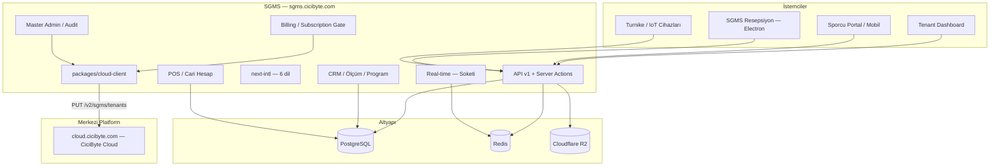

# CiCiByte SGMS — Product & Technical Roadmap

| Alan | Değer |
|------|--------|
| **Proje** | Smart Gym Management System — **Digital Boutique SaaS** |
| **Vizyon** | Standart kayıt panelinden → **Uluslararası, Premium, Tam Kapsamlı Spor Salonu İşletim Sistemi** |
| **VDS** | `/www/wwwroot/sgms.cicibyte.com` → `sgms.cicibyte.com` |
| **Repo** | https://github.com/RealMrNovember/SGMS.git |
| **Strateji** | Local geliştir → Git push → VDS `git pull` (`www:www`) |
| **Merkezi platform** | `cloud.cicibyte.com` — CiciByte Cloud (Developer → Products → `sgms`) |
| **Legacy (kullanımdan kalktı)** | `license.cicibyte.com` — SGMS artık bu servisi kullanmıyor (bkz. Faz 13). Sunucu diğer istemciler (GarageLedger vb.) için ayakta kalmaya devam ediyor, SGMS'in ona bağımlılığı yok. |
| **Kaynak doküman** | `sgms.cicibyte.com - readme.md` (teknik günlük/arşiv), `CiCiByte_SGMS_Ultimate_Enterprise_Blueprint.docx` |

**Son güncelleme:** 2026-07-19 · **Bu dosya artık tek doğru kaynaktır** (`readme.md` sadece hızlı başlangıç talimatlarını barındırır, faz/durum takibi burada yapılır).

---

## Vizyon Özeti

SGMS; spor salonunun **fiziksel** (turnike, RFID, check-in) ve **dijital** (CRM, PT, mesajlaşma, kasa, cari hesap, abonelik/ödeme, çok dilli deneyim) operasyonlarını tek tenant çatısı altında yöneten bir platformdur. Şirket çapında **CiciByte Cloud** (`cloud.cicibyte.com`) merkezi platformuna tenant senkronu ile bağlanır.

| Katman | Kapsam |
|--------|--------|
| **Çekirdek (tamamlandı)** | Multi-tenant, RBAC, CRM, ölçüm, program, mesaj |
| **Premium deneyim** | i18n (6 dil), avatar/kimlik, boutique UI |
| **İşletme & finans** | POS, market/kafe borçları, cari hesap, abonelik/ödeme yönetimi |
| **Yönetim** | Master Admin konsolu, audit log platformu |
| **Bağlantı** | Real-time chat, mobil/sporcu API, SGMS Resepsiyon masaüstü |
| **Fiziksel entegrasyon** | QR/RFID turnike, offline sync |
| **Merkezi platform** | CiciByte Cloud (`cloud.cicibyte.com`) tenant senkronu — şirket çapında görünürlük |

---

## Durum Özeti

| Faz | Ad | Durum | İlerleme |
|-----|-----|--------|----------|
| 0 | Altyapı & Monorepo | ✅ Tamamlandı | 100% |
| 1 | Veritabanı & Web Paneli | ✅ Tamamlandı | 100% |
| 2 | Multi-Tenant Core & API v1 | ✅ Tamamlandı | 100% |
| 3 | Production & Operasyon | ✅ Tamamlandı | 100% |
| 4 | Tenant UI — Core İş Mantığı (CRM) | ✅ Tamamlandı | 100% |
| 5 | ~~Merkezi Lisans Entegrasyonu (license.cicibyte.com)~~ | 🗑️ Emekli (bkz. Faz 13) | — |
| 6 | Uluslararasılaşma (i18n) & Medya/Kimlik | 🔄 Devam ediyor | ~90% (6 dil + medya/kimlik tamamlandı; İtalyanca/Portekizce + küresel lokasyon veritabanı sırada) |
| 7 | Mobil & Sporcu Auth (API-First) | ✅ Tamamlandı | 100% |
| 8 | POS, Kasa, Cari Hesap & Abonelik/Ödeme | 🔄 Devam ediyor | ~90% (ödeme planı/taksit tamamlandı — Invoice modeli + 8.7 salon bazlı online ödeme sağlayıcısı sırada) |
| 9 | Gerçek Zamanlı İletişim (Real-time Chat) | ✅ Tamamlandı | 100% |
| 10 | IoT, Kapı, Turnike & SGMS Resepsiyon | ✅ Tamamlandı | 100% |
| 11 | Marketing & Showcase Sitesi | ✅ Tamamlandı | 100% |
| 12 | Master Admin, Billing & Audit Platformu | ✅ Tamamlandı | 100% (kalıcı silme/hard-delete — 2026-07-19 kapatıldı) |
| 13 | CiciByte Cloud Migrasyonu & Platform Sertleştirme | ✅ Tamamlandı | ~95% (Playwright E2E temel akışlarla kuruldu — 2026-07-19) |
| 14 | Demo Hesap Güvenliği & Master Admin Geçişi | ✅ Tamamlandı | 100% (Demo PT girişi — 2026-07-19 kapatıldı) |
| 15 | Kimlik, Onboarding & Uyum Sertleştirme | ✅ Tamamlandı | ~95% (proaktif hatırlatma + 6 dil çevirisi kaldı) |
| 16 | CiciByte Cloud Ticari Entegrasyonu (Ödeme, Referans/Komisyon, Release) | 🔄 Devam ediyor | ~90% (Platform Ödeme Ayarları paneli — iyzico/PayTR/EFT — 2026-07-19'da eklendi; gerçek anahtarlar bekleniyor) |
| 17 | Üyelik Senaryoları & Ders/Sınıf Yönetimi | ✅ Tamamlandı | 100% (17.0–17.7 — Lead, dondurma/devir, grup üyelik, ders/yoklama/QR, kupon, POS stok, Guest Pass — 2026-07-19) |
| 18 | Uyumluluk & Sağlamlaştırma (2FA, GDPR, E2E, Invoice) | ✅ Tamamlandı | 100% (GDPR self-servis, sağlık rızası, Invoice, 18.1 sözleşme PDF; 2FA+E2E önceden — 2026-07-19) |
| 19 | SGMS Masaüstü Yeniden Yapılandırma | 🔄 Devam ediyor | 0% (ikon/arayüz/otomatik güncelleme/offline — 2026-07-19 başlandı) |
| 20 | SGMS Mobil Uygulama (React Native) | 🔄 Devam ediyor | 0% (Cursor'da başlıyor — 2026-07-19) |
| 21 | PT Performans, Komisyon & Prim Yönetimi | ✅ Tamamlandı | 100% (CSV export ve POS entegrasyonu v2'ye ertelendi) |
| 22 | Personel Yönetimi / HR | ✅ Tamamlandı | 100% (izin, vardiya, performans, disiplin, maaş CSV, /dashboard/hr — 2026-07-19) |
| 23 | Ekipman Yönetimi & Bakım Planları | ✅ Tamamlandı | 100% (envanter, servis, bakım rozetleri, QR — 2026-07-19) |
| 24 | Temizlik Yönetimi | 🔲 Planlandı | 0% |
| 25 | Kasa Yönetimi (Vardiya, X/Z Raporu) | ✅ Tamamlandı | 100% (CashRegisterShift, X/Z, nakit kilidi — 2026-07-19) |
| 26 | Dijital Üyelik Kartı (Wallet/NFC) | 🔲 Planlandı | 0% |
| 27 | Bildirim Merkezi (Push/SMS/WhatsApp/Mail) | 🔄 Devam ediyor | ~35% (tarayıcı Web Push tamamlandı) |
| 28 | İleri Raporlama & Business Intelligence | ✅ Tamamlandı | ~80% (ARR, churn-anketi, Excel/PDF export v2'ye ertelendi) |
| 29 | Yapay Zeka Öngörüleri | 🔲 Planlandı | 0% |
| 30 | Kurumsal Hiyerarşi & Çoklu Şube/Bölge Yönetimi | ✅ Tamamlandı | v1 (branch pricing/finans-İK rolleri v2'ye ertelendi) |
| 31 | Entegrasyon Pazaryeri | 🔲 Planlandı | 0% |
| 32 | Ticarileştirme: Paket & Ek Kapasite Satışı | 🔲 Planlandı | 0% |
| 33 | Dinamik Rol Bazlı Kullanım Kılavuzu + Ayarlar Modernizasyonu | ✅ Tamamlandı | 100% (HelpArticle, /help, bağlamsal ?, Master Admin CRUD, ayarlar sekmeleri — 2026-07-19) |
| 34 | Tam Responsive Tasarım Sistemi | ✅ Tamamlandı | ~97% (sol menü/tema/ikon + mobil tablo/kart + mesajlaşma + profil özyönetimi + interaktif program görünümü tamamlandı — yalnızca video desteği/ilerleme geçmişi Tier 2'ye ertelendi) |
| 35 | Temsilci (Partner) Portalı | ✅ Tamamlandı | 100% |
| 36 | Kritik İş Mantığı Denetimi & Sağlamlaştırma (2026-07-19 canlıya alma denetimi) | ✅ Tamamlandı | 100% (36.1–36.11 tamamı kapatıldı — 2026-07-19) |

> Fazlar 6/9/10'un durum özeti önceki revizyonlarda detay bölümleriyle **çelişiyordu** (özet tablo güncellenmeden unutulmuştu). Bu revizyon koda göre (tüm alt maddeler `[x]`, gerçek commit geçmişi) düzeltilmiştir.

---

## ✅ Faz 0 — Altyapı ve Repo (Tamamlandı)

- [x] Monorepo iskeleti (`pnpm-workspace.yaml`, `apps/*`, `packages/*`)
- [x] Docker: PostgreSQL 16 + Redis 7 (`infra/docker/docker-compose.yml`)
- [x] VDS volume: `data/{postgres,redis}` · bind mount
- [x] aaPanel `www:www` sahiplik + `vds-bootstrap.sh`
- [x] Git remote → GitHub (`RealMrNovember/SGMS`)
- [x] Proje içi Node 20 (`.tools/node`), PM2 (`.pm2`), loglar (`logs/pm2`)
- [x] `ecosystem.config.cjs`, `production-bootstrap.sh`, `systemd/sgms-pm2.service`
- [x] `@reboot` crontab → `pm2 resurrect`

**Çıktılar:** `sgms-postgres` (5432), `sgms-redis` (6380), `sgms-web` (3100)

---

## ✅ Faz 1 — Veritabanı ve Yönetim Paneli (Tamamlandı)

### Veritabanı
- [x] Prisma şema + client (`packages/database`)
- [x] Migration `20260605191622_init`
- [x] SaaS plan seed (Starter / Pro / Enterprise / Franchise × TRY/USD/AZN)
- [x] Migration `20260608193638_add_superadmin_flag`
- [x] Migration `20260608194923_add_gym_member_models` (`GymMember`, `GymMembershipPlan`)

### Kimlik & RBAC
- [x] NextAuth v5 (Credentials + JWT)
- [x] Session: `organizationId`, `role`, `isSuperAdmin`
- [x] Middleware: Super Admin → `/admin` · Tenant → `/dashboard`

### Paneller
- [x] Super Admin: `/admin` — sistem özeti, org listesi, yeni müşteri (`/admin/organizations/new`)
- [x] Tenant: `/dashboard` — özet
- [x] Tenant: `/dashboard/team` — personel davet (OWNER/ADMIN)
- [x] Tenant: `/dashboard/members` — sporcu kaydı (OWNER/ADMIN/STAFF)

### Seed hesapları (demo-gym)
| Rol | E-posta | Parola |
|-----|---------|--------|
| **Master Admin** | `admin@cicibyte.com` | `SEED_ADMIN_PASSWORD` (varsayılan seed) |
| Super Admin (eski demo) | `admin@demo.sgms.local` | `Admin123!` (yalnızca `SEED_ADMIN_EMAIL` override yoksa değişir) |
| Gym OWNER | `owner@demo-gym.local` | `Owner123!` |
| TRAINER | `trainer@demo-gym.local` | `Trainer123!` |
| Sporcu (User) | `athlete@demo-gym.local` | `Athlete123!` |

---

## ✅ Faz 2 — Multi-Tenant Core & API v1 (Tamamlandı)

### Veritabanı (Core ekosistem)
- [x] Migration `20260608210000_add_core_ecosystem_models`
- [x] `GymMember.userId` + `trainerId` (sporcu girişi + PT bağlantısı)
- [x] `HealthMeasurement`, `TrainingProgram`, `DirectMessage`
- [x] `organizationId` denormalizasyonu (tenant izolasyonu)
- [x] Demo seed: ölçüm + WORKOUT programı

### API v1 (Route Handlers)
- [x] `GET/POST /api/v1/members`
- [x] `GET/POST /api/v1/measurements`
- [x] `GET/POST /api/v1/programs`
- [x] `GET/POST /api/v1/messages`
- [x] `lib/api/guard.ts` — NextAuth session + rol + org doğrulama
- [x] Middleware: API → `401 JSON` (HTML redirect yok)
- [x] Bearer token (Faz 7'de tamamlandı), `PATCH`/`DELETE` (Faz 7), OpenAPI spec (Faz 7)

---

## ✅ Faz 3 — Production & Operasyon (Tamamlandı)

### 3.1 Nginx & TLS
- [x] aaPanel `sgms.cicibyte.com` → reverse proxy `127.0.0.1:3100`
- [x] `/_next/static/` Nginx alias
- [x] Site PHP → Static (aaPanel manuel; proxy çalışıyor) — `docs/deployment/AAPANEL-PHP-STATIC.md`
- [x] TLS / Cloudflare — `https://sgms.cicibyte.com/login` → 200
- [x] `AUTH_URL` prod doğrulandı

### 3.2 Deploy otomasyonu
- [x] `docs/deployment/deploy.sh`
- [x] `docs/deployment/verify-production.sh`
- [x] `pnpm db:migrate:deploy` + `pnpm deploy:verify`

### 3.3 Gözlemlenebilirlik
- [x] PM2 log rotasyonu
- [x] Docker healthcheck cron

---

## ✅ Faz 4 — Tenant UI: Core İş Mantığı / CRM (Tamamlandı)

### 4.1 Sağlık ölçümleri
- [x] `/dashboard/members/[id]` — CRM çekirdeği (profil + ölçüm + program)
- [x] `/dashboard/members/[id]/measurements` — detay + trend
- [x] `actions/measurements.ts` + `MEASUREMENT_ADDED` audit
- [x] `MemberHealthHistoryTable` + `AddMeasurementForm`

### 4.2 Antrenman & diyet programları
- [x] `/dashboard/programs` — oluşturma, filtre, aktif/pasif toggle
- [x] Program içerik editörü (`program-content-builder.tsx`, `program-content-view.tsx`)

### 4.3 Mesajlaşma (Faz 9'da real-time'a taşındı)
- [x] `/dashboard/messages` — inbox / sent, okundu işaretleme, thread + canlı yenileme

### 4.4 Salon üyelik planları
- [x] `/dashboard/plans` — `GymMembershipPlan` CRUD

### 4.5 Sporcu detay (CRM)
- [x] Tek Prisma `include` (ölçümler + aktif programlar)
- [x] Tenant izolasyonu (`organizationId` → `notFound`)
- [x] Yabancı üye alanları (foreign member fields, `20260630210000_add_foreign_member_fields`)

**Kabul kriteri:** ✅ OWNER/TRAINER ile ölçüm → program → mesaj → plan akışı panelden mümkün

---

## 🗑️ Faz 5 — Merkezi Lisans Entegrasyonu (Emekli — bkz. Faz 13)

> `license.cicibyte.com` entegrasyonu (`packages/license-client`, hwid/trial/activate/check akışı) **tamamen kaldırıldı** ve `cloud.cicibyte.com` (CiciByte Cloud) tenant senkronu ile değiştirildi. Bu bölüm yalnızca tarihsel referans için tutulur — güncel mimari için **Faz 13**'e bakın.

<details>
<summary>Eski içerik (arşiv)</summary>

- ~~`packages/license-client` → `license.cicibyte.com` (`app_code=sgms`)~~
- ~~Trial / check / activate + `LICENSE_API_KEY`~~
- ~~`pnpm license:heartbeat`~~

</details>

---

## ✅ Faz 6 — Uluslararasılaşma (i18n) & Medya/Kimlik (Tamamlandı)

> **Hedef:** Premium, uluslararası salon markası deneyimi. Resepsiyon ve PT sporcuları isim + fotoğrafla tanır.

### 6.1 Uluslararasılaşma (i18n)

**Altyapı**
- [x] `next-intl` — App Router uyumlu (`localePrefix: never`, cookie + `Accept-Language`)
- [x] Dil dosyaları: `apps/web/messages/{tr,en,ru,fr,es,az}.json`
- [x] Locale routing: cookie/header tabanlı (URL prefix yok — NextAuth `/login` uyumu)
- [x] Varsayılan dil: `Accept-Language` / tarayıcı algılama (middleware)
- [x] Fallback: geçersiz locale → `tr`

**Desteklenen diller**

| Kod | Dil |
|-----|-----|
| `en` | English |
| `tr` | Türkçe |
| `ru` | Русский |
| `fr` | Français |
| `es` | Español |
| `az` | Azərbaycan |

**Kullanıcı tercihi**
- [x] `User.locale` — JWT session + DB
- [x] `GymMember.locale` — sporcu paneli için
- [x] `LocaleSwitcher` — login + dashboard/admin header (cookie + DB güncelleme)
- [x] Org düzeyi varsayılan dil: `Organization.settings.defaultLocale` — `/dashboard/settings`

**Kapsam (tam çeviri)**
- [x] Auth, dashboard nav, admin nav
- [x] CRM üyeler, ölçüm formları, personel listesi
- [x] Mesajlar, planlar, programlar, dashboard özeti
- [x] API v1 hata mesajları — `lib/api/i18n-errors.ts` (`Accept-Language`)
- [x] `athlete` namespace (sporcu portalı, 6 dil)
- [x] `marketing` namespace (showcase sitesi, TR/EN tam, diğerleri genişletilebilir)
- [x] `expenses` namespace (POS/cari hesap, 6 dil)

### 6.2 Medya ve Kimlik Yönetimi

**Veritabanı**
- [x] `User.avatarUrl`, `GymMember.avatarUrl` — nullable `String` (migration `20260609140000_add_avatars_and_locales`)
- [x] Migration + seed placeholder avatarları (opsiyonel) — `SEED_PLACEHOLDER_AVATARS=true`

**UI / UX**
- [x] Üye listesi, sporcu detay CRM, PT/personel listesi — avatar
- [x] Varsayılan avatar: initials / generic silhouette

**Depolama**
- [x] Local storage abstraction (`lib/storage.ts`) + `POST /api/v1/upload/avatar`
- [x] Object storage — Cloudflare R2 (`lib/storage-r2.ts`, `STORAGE_PROVIDER=r2`, `docs/deployment/R2-STORAGE.md`)
- [x] Signed URL / public CDN path, max boyut, MIME whitelist

**Güvenlik**
- [x] Yalnızca kendi avatarı veya yetkili personel yükleyebilir
- [x] Tenant prefix: `{organizationId}/avatars/{entityId}.webp`

### 6.3 Dil Genişletmesi — İtalyanca & Portekizce (yeni, 2026-07-16 eklendi)

> **Pazar notu:** Rakip analizi (Gymie ve global rakipler İtalya/Portekiz/Brezilya pazarlarında güçlü) — 8 dilli bir SaaS, 6 dilliye göre daha geniş bir Avrupa/Latin Amerika kitlesine hitap eder.

- [ ] `apps/web/messages/it.json`, `apps/web/messages/pt.json` — mevcut 6 dosyayla birebir aynı anahtar şemasında (bu oturumda kurulan derin anahtar-parity doğrulama scripti ile 0 eksik anahtar garantisi)
- [ ] `routing.ts` / `next-intl` locale listesine `it`, `pt` eklenir — `detectAutoLocale` (Faz "konum/tarayıcı diline göre otomatik seçim") ülke haritasına İtalya/Portekiz/Brezilya eklenir
- [ ] `LocaleSwitcher` popover'ına yeni diller eklenir (kod değişikliği yok, `routing.locales` üzerinden otomatik türer)
- [ ] Marketing/showcase sitesi dahil **tüm** namespace'lerin (auth, dashboard, admin, athlete, marketing, expenses, checkIn, billing, receptionDesktop vb.) eksiksiz çevirisi — bu oturumda TR/RU/FR/ES/AZ'de bulunan eksik-anahtar sınıfı hataların (bkz. Faz 34 kök neden analizi) İtalyanca/Portekizcede baştan yaşanmaması için **her iki dil de üretime çıkmadan önce parity script ile doğrulanacak**

### 6.4 Küresel Lokasyon Veritabanı — Ülke → Şehir → İlçe (yeni, 2026-07-16 eklendi)

> **Senaryo:** 8 dilli, uluslararası bir SaaS olarak üye/organizasyon adres formlarında serbest metin yerine yapılandırılmış, aranabilir bir konum seçimi sunmak — hem veri kalitesi hem de gelecekteki bölgesel raporlama (Faz 28/30) için gereklidir.
- [ ] `Country` / `City` / `District` modelleri (Prisma) — açık kaynak bir coğrafi veri setinden (ör. GeoNames) seed edilir, `Organization.city`/`GymMember.nationality` gibi mevcut serbest-metin alanların yerini opsiyonel olarak alır (geriye dönük uyumluluk için serbest metin alanı korunur, yapılandırılmış seçim tercih edilir)
- [ ] Çok dilli isimlendirme — her lokasyonun adı 8 dilde gösterilir (kullanıcının aktif diline göre)
- [ ] Adres formlarında (üye kaydı — Faz 1/4, organizasyon kaydı — `/trial`) arama destekli (typeahead) Ülke → Şehir → İlçe seçici

**Kabul kriteri:** ✅ 6 dilde login + dashboard · üye listesinde avatar görünür · dil profilden değiştirilebilir · 🔲 İtalyanca/Portekizce 8. ve 9. dil olarak tüm yüzeylerde eksiksiz · 🔲 adres formlarında yapılandırılmış Ülke/Şehir/İlçe seçimi

---

## ✅ Faz 7 — Mobil & Sporcu Auth — API-First (Tamamlandı)

### 7.1 API token katmanı
- [x] `ApiToken` modeli, `POST /api/v1/auth/login|logout`, `lib/api/token.ts`, `lib/api/auth-context.ts`
- [x] Token revoke Redis cache (`lib/api/token-revoke-cache.ts`)

### 7.2 Sporcu oturumu
- [x] `GymMember.userId` → JWT session `gymMemberId` claim
- [x] `GET /api/v1/me` — profil + üyelik + locale + istatistikler

### 7.3 API tamamlama
- [x] `PATCH`/`DELETE` tüm kaynaklarda, cursor sayfalama
- [x] OpenAPI 3.1 (`docs/api/openapi.yaml`)

### 7.4 Sporcu web portalı
- [x] `/athlete` route group — özet, ölçüm, program, mesaj, hesap (cari bakiye)
- [x] `AthleteNav`, i18n, middleware yönlendirmesi

**Kabul kriteri:** ✅ Bearer ile curl/Postman tam akış

---

## 🔄 Faz 8 — POS, Kasa, Cari Hesap & Abonelik/Ödeme (Invoice ve 8.7 hariç tamamlandı)

> **Hedef:** Salon içi market/kafe/ekstra PT borçları (cari hesap) + SaaS abonelik/ödeme yönetimi.

### 8.1 Veri modeli

| Model | Durum |
|-------|--------|
| `ExpenseCategory`, `Expense`, `Transaction` | ✅ |
| `Invoice` | 🔲 (opsiyonel — sonraki iterasyon, tek eksik kalem) |

### 8.2 İş mantığı
- [x] `actions/expenses.ts` — ekleme, hızlı şablon, tahsilat (FIFO), iptal (audit zorunlu)
- [x] API v1: `expenses`, `transactions`
- [x] Tenant izolasyonu + `getTenantWriteBlockReason` guard

### 8.3 UI
- [x] Sporcu detay CRM: Cari Hesap paneli, hızlı ekleme butonları
- [x] `/dashboard/pos` — resepsiyon mini POS terminali
- [x] Sporcu portal: borç listesi + ödeme geçmişi (read-only)

### 8.4 Raporlama
- [x] Günlük kasa özeti, üye bazlı ekstre (CSV + PDF — `lib/member-statement-pdf.ts`)

### 8.5 Abonelik & Ödeme Yönetimi (2026-07-01 eklendi — önceki revizyonda belgelenmemişti)
- [x] `lib/billing/subscription-gate.ts` — yerel Subscription/Plan kaydına dayalı erişim kapısı (`full` / `billing_only`), deneme/ödeme süresi dolunca otomatik salt-okunur mod
- [x] `lib/billing/period-dates.ts`, `lib/billing/settings.ts` — dönem hesaplama + org ayarlarına gömülü ödeme talebi kuyruğu
- [x] `/dashboard/billing` — salon sahibi: plan talebi, ödeme durumu, `billing-checkout-panel.tsx`, `billing-status-poller.tsx`
- [x] `actions/billing.ts` — `submitBillingRequest`, durum sorgulama
- [x] `actions/admin-billing.ts` — Master Admin: `approveBillingRequest`, `rejectBillingRequest`
- [x] `actions/admin-organizations.ts` — deneme uzatma, abonelik aktifleştirme/iptal, plan değişikliği, dönem/durum düzenleme (tam Master Admin billing kontrolü)
- [x] Her abonelik durum değişikliği artık **cloud.cicibyte.com'a otomatik senkronize edilir** (bkz. Faz 13)

**Kabul kriteri:** ✅ Resepsiyon "Su - 15 TL" ekler → sporcu panelinde borç görünür → tahsilat sonrası bakiye sıfırlanır · deneme/ödeme süresi dolunca panel salt-okunur moda düşer, Master Admin onayıyla açılır

### 8.6 Ödeme Planı / Taksitli Tahsilat — tamamlandı, 2026-07-16

> **Kullanıcı senaryosu (2026-07-16):** *"Salon müşterisi bugün kaydını başlattı ama '3 gün sonra ya da haftaya öderim' dedi. Resepsiyon görevlisi o müşteri için ödeme planı oluşturabilmeli, yönetebilmeli, ödenen/ödenmeyen/kalan borcu görebilmeli."* Faz 8.1'deki `Expense`/`Transaction` çifti bunun için sağlam bir temel olarak kullanıldı — sıfırdan bir ödeme motoru inşa edilmedi.
- [x] `Expense` modeline opsiyonel `dueDate` + `paidAmount` alanları eklendi — vadesi geçmiş (`dueDate` < bugün, hâlâ `OPEN`) kalemler Cari Hesap panelinde, `/dashboard/pos`'ta ve yeni `/dashboard/payment-plans` sayfasında kırmızı/uyarı rozetiyle öne çıkıyor
- [x] Yeni `PaymentPlan` modeli — bir üyeye ait birden çok `Expense` satırını tek bir plan altında gruplar (haftalık/aylık/özel gün aralığı kademeli), her taksit kendi `dueDate`'i olan ayrı bir `Expense` satırı
- [x] `recordPayment` akışına **gerçek kısmi ödeme** desteği eklendi — önceki FIFO mantığındaki bir hata da bu sırada düzeltildi: ödeme tam karşılayamadığı en eski borcu artık sessizce atlamıyor, kısmen kapatıyor (`lib/billing/settle-payment.ts`, hem web hem API v1 `transactions` bu ortak fonksiyonu kullanıyor, 6 Vitest testiyle doğrulandı)
- [x] Sporcu detay CRM'deki Cari Hesap paneline **"Ödeme Planı Oluştur"** aksiyonu — resepsiyon/salon sahibi taksit sayısı + ilk vade tarihini girer, sistem taksitleri otomatik üretir; her taksit için inline kısmi/tam ödeme formu
- [x] Ana dashboard KPI grid'ine **"Vadesi Geçen Taksit"** kartı + amber uyarı bandı, ve kalıcı sol menü öğesi olarak yeni **`/dashboard/payment-plans`** genel bakış sayfası — organizasyon genelinde tüm bekleyen/geciken taksitler tek listede (kullanıcı kararıyla sadece KPI linki değil, kalıcı nav öğesi)
- [x] Sporcu portalındaki mevcut borç listesine (Faz 8.3) salt-okunur taksit planı görünümü eklendi — üye kendi ödeme takvimini görür

**Mimari not:** Var olan `Expense`/`Transaction`/FIFO altyapısı korundu, üstüne ince bir `PaymentPlan` gruplama katmanı + `dueDate`/`paidAmount` eklendi — mevcut cari hesap mantığı kırılmadı, yalnızca genişletildi.

### 8.7 Salon Bazlı Online Ödeme Sağlayıcı Entegrasyonu (Iyzico/PayTR/Banka) — yeni, 2026-07-16 eklendi

> **Kullanıcı notu (2026-07-16):** *"Şirket sahibinin panelinden ayarlar içerisinden online ödeme alacağı banka/Iyzico/Paytr gibi platformların API'lerini bağlayabilmesi lazım."* **Önemli ayrım:** Bu, Faz 16'daki CiciByte Cloud entegrasyonuyla (SGMS'in CiciByte'a kendi abonelik ödemesini yapması, platform-seviyesinde tek bir iyzico hesabı) **karıştırılmamalı** — burada her salonun **kendi** Iyzico/PayTR/banka sözleşmesiyle **kendi üyesinden** doğrudan tahsilat yapabilmesi hedefleniyor (tenant-seviyesinde, çoklu sağlayıcılı).
- [ ] Yeni `TenantPaymentProviderSettings` modeli — `organizationId`, `provider` (`IYZICO`/`PAYTR`/`BANK_TRANSFER`), şifrelenmiş API anahtarı/secret, `isActive` — Faz 16.3'teki `IyzicoClient` (IYZWSv2 HMAC, vendor SDK'sız) deseni **yeniden kullanılır**, yeni bir istemci sıfırdan yazılmaz
- [ ] `/dashboard/settings` → Entegrasyonlar sekmesine (bkz. 33.1) salon sahibinin kendi API anahtarlarını girebileceği bir bölüm — anahtarlar yalnızca sunucu tarafında çözülür, hiçbir zaman client'a gönderilmez
- [ ] Faz 8.6'daki ödeme planı/borç kalemleri için sporcu portalında **"Kartla Öde"** butonu — salonun kendi yapılandırdığı sağlayıcı üzerinden checkout başlatır, sunucu tarafında doğrulanır (Faz 16.3'teki callback-doğrulama desenini birebir izler)
- [ ] Sağlayıcı yapılandırılmamışsa buton güvenli şekilde gizlenir/"sağlayıcı yapılandırılmamış" mesajı gösterir — asla sahte/test ödeme oluşturulmaz (Faz 16'daki aynı güvenlik ilkesi)

**Bağımlılık:** Faz 8.6 (ödeme planı — borç kaleminin kendisi önce var olmalı) · Faz 16.3 (yeniden kullanılacak Iyzico client deseni) · Faz 33.1 (Entegrasyonlar sekmesi bu ayarların barınacağı yer)

---

## ✅ Faz 9 — Gerçek Zamanlı İletişim (Real-time Chat) (Tamamlandı)

### 9.1 Altyapı
- [x] Soketi (self-host, Redis uyumlu, Pusher protokolü) — `sgms-soketi` + `sgms-redis`

### 9.2 Teknik
- [x] `DirectMessage.deliveredAt/readAt`, kanal adlandırma (`lib/realtime/channels.ts`)
- [x] `POST /api/v1/messages` → DB + broadcast (`lib/realtime/hub.ts`)
- [x] SSE fallback (`GET /api/v1/messages/events`), Soketi + Redis adapter, Pusher-js istemci

### 9.3 UI
- [x] Thread görünümü + canlı yenileme (dashboard + sporcu), unread badge, typing indicator

### 9.4 Güvenlik
- [x] Kanal yetkisi (`private-org.{orgId}.user.{userId}`), rate limit, `MessageReport` + `/admin/moderation`

**Kabul kriteri:** ✅ PT mesaj gönderir → sporcu paneli anında güncellenir (<2 sn)

---

## ✅ Faz 10 — IoT, Kapı, Turnike Sistemleri & SGMS Resepsiyon (Tamamlandı)

### 10.1 Cihaz & kayıt
- [x] `POST /api/v1/devices`, device-scoped API key, `Device.status` (ONLINE/OFFLINE/DISABLED/PENDING)

### 10.2 Check-in & erişim
- [x] `POST /api/v1/check-in` — QR (HMAC imzalı), RFID, manuel
- [x] `/dashboard/check-in` — canlı giriş listesi + Soketi canlı yenileme
- [x] Giriş/çıkış yönü (`ENTRY`/`EXIT`) + personel RFID
- [x] Webhook: `POST /api/v1/webhooks/turnstile` (üçüncü parti turnike yazılımı)

### 10.3 Offline sync
- [x] `SyncBatch` modeli, `POST /api/v1/sync/push` + `GET /api/v1/sync/pull`, idempotent `clientEventId`
- [x] Çakışma politikası: `client-wins` / `server-wins` / `reject-if-newer-exists`

### 10.4 SGMS Resepsiyon (masaüstü — Electron + Vite + React)
- [x] v0.3.0 — ilk Windows installer (check-in giriş/çıkış)
- [x] v0.4.0 — Master Admin senkron uyumu, audit iyileştirmeleri
- [x] v0.4.1 — Pusher constructor hata düzeltmesi (login akışı)
- [x] v0.5.0 — **tam resepsiyon masası UI**: üyeler, POS, check-in, ayarlar paneli
- [x] Kod imzalama (Authenticode), Windows toast bildirimleri, frameless UI + logo
- [x] `docs/desktop/RECEPTION-SCENARIO.md`, `docs/desktop/INSTALL.md`, `docs/desktop/CODE-SIGNING.md`
- [x] Web panelinden indirme linkleri (`reception-download-promo.tsx`)

**Kabul kriteri:** ✅ Offline check-in kuyruğu → online sync → `AuditLog` + üye giriş kaydı · SGMS Resepsiyon v0.5.0 ile tam resepsiyon masası akışı

---

## ✅ Faz 11 — Marketing & Showcase Sitesi (Tamamlandı)

### 11.1 Showcase ana sayfa
- [x] `/` — premium marketing landing, mobile-first header + app dock (2026-06-30 revizyonu)
- [x] Oturum açık kullanıcı → dashboard/athlete/admin yönlendirmesi korunur

### 11.2 14 günlük deneme kaydı
- [x] `/trial` — public self-service kayıt formu, `actions/trial-registration.ts`

### 11.3 Marka & iletişim
- [x] Logo, `SgmsLogo`, `lib/site-config.ts`, footer

### 11.4 i18n & teknik
- [x] `marketing` namespace — 6 dil, OpenGraph metadata

**Kabul kriteri:** ✅ Showcase → 14 gün deneme → login akışı çalışıyor

---

## ✅ Faz 12 — Master Admin, Billing & Audit Platformu (Tamamlandı)

> 2026-07-01 tarihinde şirket içi kullanım için eklendi; önceki roadmap revizyonunda hiç belgelenmemişti (bu revizyonun kapattığı en büyük dokümantasyon açığı).

### 12.1 Master Admin Konsolu
- [x] `/admin/admins` — Master Admin hesap yönetimi (`master-admin-panel.tsx`, `actions/admin-master-admins.ts`)
- [x] `/admin/organizations/[id]` — tam organizasyon detay: profil, ekip, abonelik paneli (`organization-subscription-panel.tsx`), hızlı işlemler
- [x] `/admin/plans` — SaaS plan CRUD (`plan-edit-form.tsx`)
- [x] `/admin/communications` — müşteri iletişim şablonları (`lib/admin/email-templates.ts`)

### 12.2 Audit Log Platformu (genişletilmiş)
- [x] `/admin/audit` + `/admin/organizations/[id]/audit` — kategori bazlı filtreleme, export (`GET /api/admin/audit/export`)
- [x] `audit-category-sidebar.tsx`, `audit-log-filters.tsx`, `audit-log-table.tsx`, `audit-log-toolbar.tsx`
- [x] `AuditAction` enum'una eksik değerlerin senkronu (migration `20260701120000_sync_audit_action_enum`) — production drift'i düzeltildi
- [x] Kategori sayaçlarının enum drift'ine karşı sertleştirilmesi

### 12.3 Moderasyon
- [x] `/admin/moderation` — mesaj şikayetleri (`MessageReport`)

### 12.4 Kalıcı Silme (Hard Delete) — yeni, 2026-07-16 eklendi

> **Senaryo:** Deneme süresi boyunca hiç giriş yapılmamış, sahte/test amaçlı oluşturulmuş bir organizasyon veritabanında süresiz kalıyor — Master Admin bunu yalnızca `SUSPENDED`/`ARCHIVED` durumuna çekebiliyor, tamamen silemiyor. Test/demo kirliliğinin temizlenmesi ve KVKK/GDPR'nin "verinin tamamen silinmesi" hakkı için gerçek bir hard-delete gerekiyor.
>
> **Durum:** ✅ *2026-07-19 kapatıldı.*

- [x] `admin/organizations/[id]` sayfasına "Tehlikeli Bölge" bölümünde, çok adımlı onay gerektiren (org adını harfi harfine yazarak doğrulama — buton yalnızca tam eşleşmede aktifleşir) bir **"Kalıcı Olarak Sil"** butonu
- [x] Silme işlemi tek bir `prisma.organization.delete()` çağrısıyla yapılıyor — tüm bağlı tablolardaki (üyeler, personel, ölçümler, mesajlar, işlemler, cihazlar vb. — 30+ ilişki) `organizationId` alanları veritabanı seviyesinde `ON DELETE CASCADE` ile tanımlı olduğundan işlem tek bir atomik SQL ifadesiyle tutarlı şekilde tamamlanıyor (kısmi silinme riski yok); işlem öncesi platform-seviyeli (`organizationId: null`) bir `AuditLog` kaydı (yeni `ORGANIZATION_DELETED` action'ı, metadata'da org adı/slug snapshot'ı) düşülüyor ki silme eylemi kimin/ne zaman yaptığı organizasyon satırı silindikten sonra da izlenebilsin
- [x] Yalnızca Master Admin yetkisi (`requireSuperAdmin`) — demo hesaplar (mevcut `isDemo` engeli) bu butona hiçbir şekilde erişemez

**Kabul kriteri:** karşılandı — Master Admin tek panelden tüm organizasyonları, abonelikleri, planları ve audit geçmişini yönetebiliyor · sahte/test organizasyonlar isim-doğrulamalı onaylı bir akışla kalıcı olarak silinebiliyor

**Dosyalar:** `packages/database/prisma/schema.prisma` (`ORGANIZATION_DELETED`), migration `20260719080000_add_organization_deleted_audit_action`, `actions/admin-organizations.ts`, `components/admin/organization-hard-delete-button.tsx`, `app/(super-admin)/admin/organizations/[id]/page.tsx`, `lib/admin/audit-labels.ts`

---

## 🔄 Faz 13 — CiciByte Cloud Migrasyonu & Platform Sertleştirme (Devam ediyor, ~60%)

> **Hedef:** `license.cicibyte.com` (legacy, tek-cihaz hwid modeli) bağımlılığını tamamen kaldırıp SGMS'i şirketin merkezi platformu **CiciByte Cloud** (`cloud.cicibyte.com`) ile "gerçek" bir multi-tenant SaaS entegrasyonu üzerinden bağlamak; ayrıca eksik kalan mühendislik pratiklerini (test, CI/CD) tamamlamak.
>
> **Mimari karar:** SGMS kendi Subscription/Plan/billing-gate sistemini zaten yerelde barındırıyor (Faz 8.5) — erişim kararı hep yerel veriye göre verilir. `cloud.cicibyte.com`'un eski `trial/activate/check` (hwid tabanlı, tek cihaz lisansı) modeli yerine, çoklu-tenant SaaS ürünleri için tasarlanmış **`PUT /v2/{productSlug}/tenants`** (tenant sync) uç noktası kullanılır — CiciByte Cloud dokümantasyonunda tam da bu senaryo için tarif edilir ("self-managed multi-tenant SaaS... pushes tenant/billing state, rather than gating the product on an external check it doesn't need").

### 13.1 `packages/cloud-client` (yeni paket — `packages/license-client` tamamen kaldırıldı)
- [x] Eski `packages/license-client` dizini silindi (`LicenseClientService`, hwid/trial/activate/check akışı, `LICENSE_API_*` env değişkenleri)
- [x] `CloudClientService.syncOrganization()` — org'un güncel Subscription/Plan durumunu `PUT /v2/sgms/tenants` ile iter
- [x] `CloudClientService.syncAllOrganizations()` — cron/heartbeat için toplu senkron
- [x] `CloudClientService.checkPlatformHealth()` — `GET /v1/health` (public)
- [x] Legacy v1 hwid uçları (`checkDeviceLicense`, `issueOfflineToken` — Ed25519 imzalı offline token) masaüstü/turnike senaryoları için client'ta saklandı ama SGMS web app tarafından **kullanılmıyor** (yalnızca ileride Resepsiyon/turnike cihazları offline-grace-period isterse)
- [x] `AuditAction` enumuna `CLOUD_TENANT_SYNCED` / `CLOUD_SYNC_FAILED` eklendi (migration `20260714000000_add_cloud_sync_audit_actions`), eski `LICENSE_*` değerleri geriye dönük uyumluluk için enum'da bırakıldı (Postgres enum'dan değer silinemez, mevcut audit geçmişi bozulmasın diye)

### 13.2 Entegrasyon noktaları
- [x] `lib/cloud-sync.ts` — `syncOrganizationToCloud()` / `syncAllOrganizationsToCloud()`
- [x] Trial kayıt (`actions/trial-registration.ts`), Master Admin org oluşturma (`actions/organizations.ts`)
- [x] Master Admin abonelik aksiyonları — deneme uzatma, aktivasyon, plan değişikliği, dönem/durum düzenleme, iptal (`actions/admin-organizations.ts`) — **hepsi** artık mutasyon sonrası cloud senkronu tetikliyor
- [x] Ödeme onayı (`actions/admin-billing.ts` → `approveBillingRequest`)
- [x] Login akışı (`lib/auth.ts`) — deneme/ödeme süresi dolduğunda arka planda senkron dener
- [x] Dashboard yüklenişi (`lib/license-dashboard.ts` → `refreshDashboardLicense`)
- [x] `/admin` panelinde "Cloud senkronu" hızlı işlem butonu + `https://cloud.cicibyte.com/licenses` bağlantısı

### 13.3 Temizlik
- [x] Tüm `license.cicibyte.com` / `LICENSE_API_*` referansları kod tabanından temizlendi (env dosyaları, i18n mesajları, deploy scriptleri, `NGINX-AAPANEL.md`) — yalnızca "komşu vhost'a dokunma" uyarıları (gerçek, hâlâ geçerli — sunucu diğer istemciler için ayakta) korundu
- [x] `docs/deployment/license-heartbeat.sh` → `docs/deployment/cloud-heartbeat.sh`
- [x] `scripts/verify-license-integration.sh` → `scripts/verify-cloud-integration.sh` (artık `/v1/health` + key format kontrolü; eski script başka bir üretim sunucusunun MySQL'ine SSH ile bağlanıyordu — kaldırıldı)
- [x] cloud.cicibyte.com production API key rotasyonu: yetim `sgms-web-2026-07-13` anahtarı iptal edildi, yeni `sgms-web-production` (id 7) üretildi — kullanıcı onayıyla
- [x] Production `.env` (sgms.cicibyte.com sunucusu) → `CLOUD_API_BASE_URL` / `CLOUD_PRODUCT_SLUG` / `CLOUD_API_KEY` ile güncellendi
- [x] Kod GitHub `main`'e push edildi (`f3b3686`) ve production'a deploy edildi (`pnpm install` → `db:migrate:deploy` → `build:packages` → `web:build` → `pm2 reload`)
- [x] `pnpm db:migrate:deploy` — `CLOUD_TENANT_SYNCED`/`CLOUD_SYNC_FAILED` enum migration'ı production DB'de uygulandı
- [x] `pnpm cloud:heartbeat` production'da çalıştırıldı: **4/4 organizasyon başarıyla senkronize oldu** (pilates, pasha, test-salon, demo-gym) — cloud.cicibyte.com'da doğru `plan_code`/`billing_status` ile doğrulandı
- [x] `scripts/verify-cloud-integration.sh` → `cloud.cicibyte.com` health check `ok:true`, API key formatı doğru
- [x] `sgms.cicibyte.com/login` → 200 (deploy sonrası canlı doğrulama)

### 13.4 Mühendislik pratikleri (önceki roadmap'in "Teknik Borç" listesinden)
- [x] Test altyapısı: Vitest kuruldu (`packages/cloud-client`, `apps/web`) — 21 gerçek unit test (config normalizasyonu, slug, dönem/lisans hesaplamaları) yeşil
- [x] ESLint (flat config, `next/core-web-vitals` + `next/typescript`) — proje daha önce hiç yapılandırılmamıştı, `pnpm lint` artık çalışıyor
- [x] CI/CD: `.github/workflows/ci.yml` — Postgres servisiyle install → prisma generate → build:packages → typecheck → lint → migrate deploy → test → web build
- [x] Uçtan uca doğrulama: `pnpm typecheck`, `pnpm lint`, `pnpm test`, `pnpm web:build` yerelde çalıştırıldı — 51 route dahil tam production build başarılı
- [ ] Playwright E2E iskeleti (login, CRM ölçüm, expense akışları) — Vitest'ten sonraki adım, henüz kurulmadı
- [ ] `Invoice` modeli (Faz 8'den kalan tek opsiyonel kalem)

### 13.5 Dokümantasyon
- [x] `roadmap.md` tek doğru kaynak haline getirildi — özet tablo ile detay bölümleri arasındaki çelişkiler (Faz 6/9/10) düzeltildi, belgelenmemiş özellikler (Faz 12) eklendi
- [ ] `readme.md` — güncel mimariye göre sadeleştirme (eski "License API NestJS" placeholder'ının kaldırılması)

**Kabul kriteri:** Trial kayıt / plan değişikliği / ödeme onayı → cloud.cicibyte.com'da ilgili tenant anlık güncellenir · production'da `pnpm cloud:heartbeat` başarıyla çalışır · CI pipeline yeşil

**Bağımlılık:** Faz 8.5 (yerel billing-gate) ✅ · CiciByte Cloud License API (`cloud.cicibyte.com`, zaten canlı ve sağlıklı — `GET /v1/health` → 200) ✅

---

## ✅ Faz 14 — Demo Hesap Güvenliği & Master Admin Geçişi (Tamamlandı)

> **Tetikleyici:** Kod denetimi sırasında **canlı bir güvenlik açığı** bulundu — login sayfasındaki tek tıkla demo giriş butonlarından biri (`admin@demo.sgms.local`) gerçek `isSuperAdmin: true` yetkisine sahipti. Bu, sitesine gelen herhangi bir ziyaretçinin tek tıkla **tüm organizasyonları, faturaları, audit kayıtlarını görüntüleyip/değiştirebileceği** anlamına geliyordu — muhtemelen varsayılan seed e-postası `admin@cicibyte.com` olarak değiştirilmeden önceki bir dönemden kalma, hiç temizlenmemiş bir kalıntı.

### 14.1 Demo hesap salt-okunur kilidi
- [x] `User.isDemo` alanı eklendi (migration `20260714010000_add_user_is_demo`) — mevcut 5 demo hesabı (`admin@demo.sgms.local`, `owner/staff/trainer/athlete@demo-gym.local`) production'da işaretlendi
- [x] `isDemo` NextAuth JWT/session'a taşındı (`auth.config.ts`, `auth.ts`)
- [x] Merkezi yazma kapısı (`lib/tenant-access.ts` → `getTenantWriteBlockReason`) demo hesapları engelleyecek şekilde genişletildi — **tek değişiklik** ölçüm, üye, borç, program, plan, ekip, cihaz, mesaj ve API guard'ı (10 dosya) otomatik kapsadı
- [x] 6 admin action dosyasında (`admin-organizations.ts`, `admin-billing.ts`, `admin-master-admins.ts`, `admin-audit.ts`, `admin-team.ts`, `admin-plans.ts`) birebir kopyalanmış `requireSuperAdmin()` fonksiyonu tek bir paylaşılan `lib/admin/guards.ts`'e taşındı ve demo kontrolü eklendi (aynı zamanda bir kod tekrarı temizliği)
- [x] Kalan tekil noktalar da kapatıldı: `organizations.ts` (org oluşturma), `billing.ts` (`requireOwnerContext`), `organization-settings.ts`, `message-reports.ts`, avatar upload API route
- [x] Demo hesaplar panelin **tamamını okuyabilir** (satış aracı olarak değerli — bir potansiyel müşteri Master Admin panelini bile gezebilir) ama her mutasyon net bir "bu bir inceleme hesabıdır" mesajıyla reddedilir
- [x] `seed.ts` güncellendi — yeni kurulumlarda demo hesaplar otomatik `isDemo: true` ile oluşur

### 14.2 Master Admin hesap geçişi
- [x] `admin@cicibyte.com` → `mozkarci1991@gmail.com` (production'da e-posta + parola güncellendi, `isSuperAdmin: true` korundu, org üyelikleri temizlendi — seed script'in orijinal davranışı)
- [x] Yeni parola kullanıcıya iletildi (bu konuşmada — kalıcı olarak saklanmadı)

### 14.3 Demo PT Girişi — yeni, 2026-07-16 eklendi

> **Senaryo:** Sistemi değerlendiren bir potansiyel müşteri (ör. büyük bir zincirin PT departmanı) bugün yalnızca Salon Sahibi/Resepsiyon/Sporcu demo hesaplarını deneyebiliyor — bir PT'nin kendi karnesini, seans planlamasını ve müşterisine program yazma akışını (Faz 21) görmesinin tek yolu gerçek bir hesap açmak. Bu, satış öncesi değerlendirmeyi zorlaştırıyor.
>
> **Durum:** ✅ *2026-07-19 kapatıldı.*

- [x] `demo-accounts.ts`'e `'trainer'` anahtarı eklendi (mevcut `owner`/`staff`/`athlete` demo hesaplarıyla aynı salt-okunur `isDemo: true` deseninde; `seed.ts`'deki mevcut `trainer@demo-gym.local` hesabı — zaten en az bir sporcuya atanmış — yeniden kullanıldı, yeni seed verisi gerekmedi)
- [x] `/login` sayfasındaki demo giriş butonlarına **"PT (Antrenör)"** eklendi — tıklanınca `callbackUrl=/dashboard/trainers`'a yönlendirir; bu sayfa TRAINER rolü için zaten otomatik olarak kendi `/dashboard/trainers/[id]` karnesine (Faz 21) yönlendiriyor
- [x] Diğer demo hesaplarla aynı yazma kısıtlaması (`isDemo` guard, `getTenantWriteBlockReason`) otomatik uygulanıyor — ek kod gerekmedi

**Kabul kriteri:** karşılandı — demo giriş butonlarından hiçbiri herhangi bir kayıt oluşturamıyor/güncelleyemiyor/silemiyor · `mozkarci1991@gmail.com` production'da Master Admin olarak giriş yapabiliyor · giriş ekranında bir "PT" demo butonu bulunuyor ve doğrudan PT karnesine yönlendiriyor

**Bağımlılık:** yok — bağımsız, acil güvenlik düzeltmesi

**Dosyalar:** `lib/demo-accounts.ts`, `components/login-form.tsx`, messages (6 dil)

---

## ✅ Faz 15 — Kimlik, Onboarding & Uyum Sertleştirme (Tamamlandı — 2026-07-15)

> **Hedef:** Ürün denetiminde (2026-07-14, `docs/audit/sgms-product-audit.html`) tespit edilen ve **mevcut 4 canlı müşteriyi doğrudan etkileyen** kritik eksiklerin kapatılması.

### 15.1 Şifremi unuttum (CiciByte Cloud üzerinden e-posta)
- [x] **Cloud tarafı:** `POST /api/v2/{productSlug}/mail/send` — API key ile kimliği doğrulanmış bir ürünün `mail.cicibyte.com` SMTP'si üzerinden e-posta göndermesini sağlar; `mail_relay_logs` tablosuna kaydedilir, `mail-api` rate limiter (20/dk) ile korunur
- [x] SGMS: `password_reset_tokens` tablosu — SHA-256 hash'lenmiş, 60 dakika geçerli, tek kullanımlık token (migration `20260715000000`)
- [x] SGMS: `/login` → "Şifremi unuttum" linki, `/forgot-password` ve `/reset-password` sayfaları
- [x] `packages/cloud-client`'a `sendMail()` metodu eklendi, `actions/password-reset.ts` bunu kullanıyor
- [x] E-posta numaralandırma saldırısına karşı: kayıtlı olmayan e-postalar için de aynı genel "gönderildi" mesajı

### 15.2 Üye listesi — arama, filtre, sayfalama
- [x] `/dashboard/members` — ad/soyad/e-posta/telefon/TC/pasaport arama, durum filtresi, 25'lik sayfalama (önceden sabit `take: 50`, sayfalama yoktu)

### 15.3 Operasyonel KPI dashboard'u
- [x] `/dashboard` ana sayfasına 3 yeni KPI kartı: bugünkü check-in sayısı, bu ayki ciro (Transaction toplamı), 7 gün içinde bitecek üyelik sayısı — mevcut hesap/lisans durumu kartları korunarak üstüne eklendi

### 15.4 Güvenlik sertleştirme
- [x] Login'e rate limiting: e-posta bazlı (10/5dk) + IP bazlı (30/5dk), `auth.ts`'in `authorize()` akışına bağlandı, `USER_LOGIN_FAILED` audit'ine yeni `rate_limited` nedeni eklendi
- [x] Şifre sıfırlama talebine de ayrı rate limit (3/15dk e-posta, 10/15dk IP)
- [ ] Proaktif üyelik/ödeme hatırlatmaları (deneme/üyelik bitmeden otomatik e-posta) — mail API artık hazır, cron job'ı henüz yazılmadı (fast-follow)

### 15.5 Hukuki uyumluluk
- [x] `/privacy` (KVKK aydınlatma metni) ve `/terms` (Kullanım Şartları) sayfaları — Türkçe, footer'dan bağlantılı
- [x] `/trial` kayıt formuna zorunlu açık rıza onay kutusu (Gizlilik Politikası + Kullanım Şartları linkli)
- [ ] 6 dilde tam çeviri — şu an yalnızca Türkçe (diğer diller `tr` içeriğe düşer, hukuki metin niteliği gereği makine çevirisi yerine profesyonel çeviri önerilir)

**Kabul kriteri:** ✅ Bir kullanıcı şifresini unutup e-posta ile sıfırlayabiliyor · üye listesinde arama yapılabiliyor · dashboard günün özetini gösteriyor · KVKK sayfaları yayında

**Bağımlılık:** cloud.cicibyte.com mail API — ✅ kullanıcı onayıyla eklendi ve production'da doğrulandı

---

## 🔄 Faz 16 — CiciByte Cloud Ticari Entegrasyonu (Devam ediyor, ~80% — 2026-07-15)

> **Hedef:** Gerçek ödeme ağ geçidi, referans/komisyon takibi, masaüstü/mobil release'lerin merkezi kayda düşmesi — hepsi cloud.cicibyte.com üzerinden, **tüm CiciByte ürünlerinin (SGMS, BusinessOS, RUNIVERSE, GarageLedger, CleanLedger, TalkMalk) ortak kullanacağı** şekilde tasarlandı.

### 16.1 CiciByte Cloud tarafı — kullanıcı onayıyla tamamlandı
- [x] `PUT /api/v2/{slug}/commerce/checkout` — Organization/Subscription/Invoice/Payment kayıtlarını oluşturur/günceller, **gerçek iyzico Checkout Form** başlatır (IYZWSv2 HMAC imzalı, vendor SDK'sız — `app/Services/Payments/IyzicoClient.php`)
- [x] `POST /api/v2/commerce/callback/iyzico` — ödeme sonucunu **sunucu tarafında yeniden doğrular** (tarayıcı yönlendirmesine güvenmez), ürünün kendi `return_url`'üne yönlendirir
- [x] `GET /api/v2/{slug}/commerce/payments/{id}` — durum sorgulama (polling fallback)
- [x] Ödeme başarılı/başarısız olunca mevcut `WebhookEndpoint::dispatchEvent()` ile ürüne `payment.succeeded`/`payment.failed` webhook'u iletilir
- [x] Products formuna **"Enabled payment providers"** checkbox listesi (`products.enabled_payment_providers`) — kullanıcının tarif ettiği "işaretleyeceğim" akışı; SGMS için `iyzico` işaretlendi
- [x] `TenantSyncController`'a opsiyonel `referrer_name` — aktif bir Partner ile **tam eşleşirse** otomatik atanır, eşleşmezse not olarak bırakılır (yanlış komisyon atamasındansa hiç atamamak tercih edildi)
- [x] Test kapsamı: `tests/Feature/Commerce/CheckoutApiTest.php`, `tests/Feature/Developer/MailRelayTest.php`, `TenantSyncApiTest.php` genişletmesi (izole `cicibyte_cloud_test` DB'sinde, kullanıcı onayıyla çalıştırıldı)
- [ ] PayTR / Stripe gerçek entegrasyonu — veri modeli (`PaymentProviderSettings`) hazır ama SDK bağlantısı yapılmadı; iyzico ilk faz için önceliklendirildi (Türkiye pazarı)
- [ ] Ürün release'lerini API ile kaydetmek için uç nokta — henüz yok, `product_releases` hâlâ yalnızca Filament panelinden elle giriliyor

### 16.2 SGMS tarafı — Referans/Komisyon takibi
- [x] `/trial` formunda **"Sizi kim yönlendirdi? (opsiyonel)"** alanı, 6 dilde
- [x] `Organization.settings.referrerName` olarak kaydedilir, `syncOrganizationToCloud()` her senkronda Cloud'a iletir

### 16.3 SGMS tarafı — Gerçek ödeme entegrasyonu
- [x] `/dashboard/billing` → **"Kartla öde"** butonu gerçek cloud.cicibyte.com checkout'una yönlendirir (eski "yakında" placeholder'ının yerini aldı)
- [x] `POST /api/v1/webhooks/cloud-commerce` — Cloud'dan gelen `payment.succeeded`/`payment.failed` webhook'unu `X-CB-Signature` HMAC imzasıyla doğrular, `Subscription`/`Organization` durumunu otomatik günceller (manuel Master Admin onayına gerek kalmadan)
- [x] Ödeme dönüşünde (`?payment_id=&status=`) anlık başarı/başarısızlık banner'ı
- [x] Manuel "ödedim/onaylıyorum" akışı (banka havalesi için) korunuyor — iki yöntem birlikte sunuluyor

### 16.4 SGMS Resepsiyon / gelecek masaüstü-mobil release'leri
- [ ] `pnpm reception:dist` sonrası otomatik Cloud release API'sine `POST` — 16.1'deki release API'si tamamlanınca yapılacak
- [x] **[Karar verildi]** Mevcut v0.3.0–v0.5.0 release'leri geriye dönük kaydedilmeyecek (kullanıcı: "sorunlu ve problemli, henüz müşteri yok") — yalnızca gelecekteki release'ler otomatikleşecek

### 16.5 Production doğrulaması
- [x] `POST /api/v2/sgms/mail/send`, `/commerce/checkout` uç noktaları canlıda 401/403 davranışlarıyla doğrulandı
- [x] `POST /api/v1/webhooks/cloud-commerce` geçersiz imzayı doğru şekilde reddediyor (401)
- [x] cloud.cicibyte.com'da SGMS için `WebhookEndpoint` kaydı oluşturuldu (`payment.succeeded`, `payment.failed`), secret production `.env`'e yazıldı
- [ ] **[Kullanıcı kararı bekliyor]** `DeveloperSettings::sandbox_mode_enabled` şu an **`true`** (platform genelinde, yalnızca SGMS'e özel değil) — bu açıkken webhook teslimatları **simüle edilir**, gerçek HTTP isteği SGMS'e ulaşmaz. Gerçek iyzico anahtarları girilip canlıya geçilecekse bu ayarın kapatılması gerekir; diğer ürünleri de etkileyen bir platform ayarı olduğu için tek taraflı değiştirilmedi.
- [ ] **[Kullanıcı kararı bekliyor]** Gerçek iyzico (sandbox veya production) API anahtarlarının Platform Settings → Payment Providers'a girilmesi — bu olmadan "Kartla öde" butonu güvenli şekilde "sağlayıcı yapılandırılmamış" hatası döner, hiçbir sahte/test ödeme oluşturulmaz

**Kabul kriteri:** ✅ Kod tarafı tamamlandı ve production'da yayında · 🔲 Gerçek bir ödeme uçtan uca yalnızca iyzico anahtarları girilip sandbox modu kapatıldıktan sonra test edilebilir

**Bağımlılık:** yok — hem Cloud hem SGMS tarafı bu oturumda tamamlandı; kalan tek şey kullanıcının gerçek ödeme sağlayıcı kimlik bilgilerini girmesi

---

## ✅ Faz 17 — Üyelik Senaryoları & Ders/Sınıf Yönetimi (Öncelik: P1)

> **Kullanıcı notu (2026-07-15):** *"Adam 12 aylık aldı, 3 ay sonra askere gitti, üyelik donduruldu, sonra eşine devretti... kurumsal üyelik, aile paketi, çift paketi, çocuk üyeliği — bunlar oldukça yaygın."* Gerçek bir salonda üyelik tek bir "aktif/pasif" durumu değil; bir **yaşam döngüsü**dür. Bu faz, ürün denetiminin "Önemli" bulgusu olan büyüme özelliklerini gerçek hayat senaryolarıyla derinleştirir.

### 17.0 Potansiyel Müşteri (Lead) Takibi — yeni, 2026-07-16 eklendi (pazar analizi — Gymie karşılaştırması)

> **Senaryo:** Bir aday salonu gezer, fiyat teklifi alır ama o gün kayıt olmaz. Bugün SGMS'te bu kişi hiçbir yerde tutulmuyor — resepsiyon bir defter veya WhatsApp'tan hatırlamaya çalışıyor. Rakip ürünlerin (Gymie dahil) neredeyse tamamında bu bir çekirdek CRM özelliğidir; üyelik döngüsünün **en başındaki** adımdır, bu yüzden Faz 17'nin ilk maddesi olarak konumlandırıldı.
>
> **Durum:** ✅ *2026-07-19 kapatıldı.*

- [x] `Lead` modeli — `name`, `phone`, `email`, `source` (`WALK_IN`/`REFERRAL`/`SOCIAL_MEDIA`/`WEBSITE`/`OTHER`), `interestedPlan`, `status`: `NEW`/`CONTACTED`/`FOLLOW_UP_SCHEDULED`/`CONVERTED`/`LOST`, `assignedToId` (hangi resepsiyonist/satış temsilcisi takip ediyor)
- [x] `LeadFollowUp` — planlanan geri dönüş kaydı (`scheduledAt`, `method`: `CALL`/`MESSAGE`/`EMAIL`, `notes`, `completedAt`). Faz 27 Bildirim Merkezi'ne push entegrasyonu bilinçli olarak **kapsam dışı bırakıldı** (ayrı bir cron/queue altyapısı gerektirir) — bunun yerine gecikmiş/bugünkü takipler kanban kartında görsel olarak (kırmızı "Gecikmiş" rozeti) öne çıkarılıyor
- [x] `/dashboard/leads` — kanban tarzı pipeline görünümü (Yeni → İletişime Geçildi → Takip Planlandı → Üye Oldu/Kayıp), her aday kartında not, takip planlama ve tek tıkla durum değişimi; OWNER/ADMIN/STAFF erişebilir, TRAINER kapsam dışı (bkz. Faz 36.5 gerekçesi)
- [x] Bir `Lead` üye olduğunda tek tıkla gerçek bir `GymMember` kaydına dönüştürülür (ad/telefon/e-posta tekrar girilmez; adayın kaynağı üye notuna işlenir); üye limiti kontrolü (`assertWithinMemberLimit`) dönüşümde de uygulanıyor
- [x] Kabul kriteri: karşılandı — aday kanban panelinde ilerletilebiliyor, takip planlanıp tamamlanabiliyor, tek tıkla üyeye dönüştürülüyor, tüm aksiyonlar audit log'a yazılıyor

**Dosyalar:** `packages/database/prisma/schema.prisma` (Lead/LeadFollowUp), migration `20260719070000_add_lead_tracking`, `actions/leads.ts`, `app/(tenant)/dashboard/leads/page.tsx`, `components/leads/*`, `lib/admin/audit-labels.ts`, `dashboard/layout.tsx` (nav), messages (6 dil)

### 17.1 Üyelik dondurma/erteleme — ✅ 2026-07-19
- [x] `GymMemberStatus`'a `FROZEN`; `MembershipFreeze` (`startDate`, `endDate`, `reason`: `MILITARY`/`MEDICAL`/`TRAVEL`/`OTHER`, onay akışı)
- [x] Onayda dondurma süresi kadar `membershipEndsAt` ileri kayar; çözmede `ACTIVE`'e dönüş
- [x] Sporcu portalından talep → staff onay/red; üye detayında dondurma/çözme paneli

### 17.2 Üyelik devri ve hak satışı — ✅ 2026-07-19
- [x] `MembershipTransfer` — kalan gün/plan aktarımı (`fromMemberId` → `toMemberId`)
- [x] Kalan hak kredisi — cari hesaba mahsup (`Expense` / credit kaydı)

### 17.3 Kurumsal, aile, çift ve çocuk üyelikleri — ✅ 2026-07-19
- [x] `MembershipGroupType`: `INDIVIDUAL` / `COUPLE` / `FAMILY` / `CORPORATE`
- [x] `MembershipGroup` + üye bağlama, grup iskontosu, firma adı; `/dashboard/groups` şirket panosu (üye sayısı + 30g check-in kullanımı)
- [x] Çocuk/veli: `guardian*` alanları + veli onay akışı (üyelik grubu/üye kaydı)

### 17.4 Ders/Sınıf Yönetimi (Group Class Scheduling) — ✅ 2026-07-19
> **Senaryo:** Pazartesi 18:00 Pilates dersi… kontenjan dolunca bekleme listesi; iptalde sıradaki otomatik yükseltilir (SMS/push Faz 27'ye bırakıldı).
- [x] `GymClass` — kapasite, süre, salon, eğitmen, haftalık gün şablonu
- [x] `ClassSession` — somut oturum; 4 haftalık seans üretimi
- [x] `ClassBooking` — `BOOKED`/`WAITLISTED`/`CANCELLED`/`ATTENDED`/`NO_SHOW`; bekleme listesi otomasyonu
- [x] Sporcu portalı `/athlete/classes` — yaklaşan seanslar, rezervasyon/iptal
- [x] QR derse giriş — `CheckIn.classSessionId`; kayıtlı olmayan için net red
- [x] Resepsiyon yoklama — `/dashboard/classes/[sessionId]`

### 17.5 İndirim/kupon/referans kodu sistemi — ✅ 2026-07-19
- [x] `DiscountCode` + `DiscountRedemption` — yüzde/sabit, kullanım limiti, geçerlilik; `/dashboard/discounts`

### 17.6 POS stok/envanter takibi — ✅ 2026-07-19
- [x] `ExpenseCategory.stockQuantity` / `lowStockThreshold`; satışta otomatik düşüm; dashboard düşük stok KPI

### 17.7 Misafir Geçiş İzni (Guest Pass) — ✅ 2026-07-19

> **Senaryo:** Üye arkadaşı / aday için tek günlük misafir QR.
- [x] `GuestPass` — host üye, geçerlilik aralığı, HMAC QR; `AccessSubjectType.GUEST`
- [x] `/dashboard/guest-passes` — oluşturma + anlık QR; iptal
- [x] `/api/v1/check-in/guest` + process hook — süresi dolmuş/geçersiz misafir için net uyarı

**Kabul kriteri:** ✅ Karşılandı — dondurma/devir · grup/kurumsal pano · ders rezervasyonu + bekleme + yoklama/QR · Lead (17.0) · Guest Pass · POS stok KPI

**Dosyalar (17.1–17.7):** migration `20260719080000_faz17_membership_scenarios`, `actions/membership-lifecycle|membership-groups|classes|discount-codes|guest-passes.ts`, dashboard/athlete sayfaları, `lib/check-in/guest-qr.ts`, messages (6 dil)

**Bağımlılık:** Faz 15 · Faz 27 (bekleme listesi SMS/push — bilinçli olarak kapsam dışı) · Faz 10 (QR)

---

## ✅ Faz 18 — Uyumluluk & Sağlamlaştırma (Öncelik: P2) — ✅ 2026-07-19

- [x] 2FA (Master Admin / OWNER — TOTP; önceden tamamlandı)
- [x] Kendi kendine veri indirme / hesap silme talebi (KVKK/GDPR — `/dashboard/settings` → Gizlilik; hard-delete yok, Master Admin bildirimi)
- [x] Personel vardiya planlama — Faz 22 `Shift`/`ShiftAssignment` ile birleştirildi (ayrı model yok)
- [x] Sağlık formu / rıza — `healthConsentAcceptedAt/ById/Version`; üye detayında kayıt; sözleşme PDF'ine gömülür
- [x] Playwright E2E — önceden tamamlandı (Faz 13.4)
- [x] `Invoice` resmi alanları (`invoiceNumber`, `taxId`, `issuedAt`) + POS tahsilatta fatura düzenleme

### 18.1 Otomatik PDF Üretimi (Üyelik Sözleşmesi / Risk Kabul Formu) — ✅ 2026-07-19

> **Senaryo:** Salon markalı üyelik sözleşmesi / risk formu — `pdf-lib` + `ContractTemplate` değişken doldurma (`fillEmailTemplate` deseni).
- [x] `ContractTemplate` — `{uyeAdi}`, `{planAdi}`, `{tarih}`, `{fiyat}`, `{salonAdi}`, rıza alanları
- [x] `lib/contract-pdf.ts` — mevcut `member-statement-pdf` / pdf-lib altyapısı (yeni kütüphane yok)
- [x] Üye detayında "Sözleşmeyi indir"; `/api/v1/members/[id]/contract-pdf`

**Kabul kriteri:** ✅ Veri indirme · ✅ sözleşme PDF · ✅ Invoice POS entegrasyonu · ✅ 2FA/E2E (önceden)

**Dosyalar:** migration `20260719090000_faz18_22_23_25_compliance_hr_equipment_cash`, `actions/privacy|contracts|invoices.ts`, `lib/contract-pdf.ts`, settings privacy paneli, messages (6 dil)

**Bağımlılık:** Faz 15-17 ✅

---

## 🟡 Faz 19 — SGMS Masaüstü Yeniden Yapılandırma (Öncelik: P1) — 19.1/19.3 ✅ (v0.6.0 yayınlandı), 19.2/19.4 kısmi — 2026-07-19

> **Kullanıcı talebi (2026-07-19):** *"Masaüstü uygulamayı da baştan yazmalıyız çünkü hem çok eski kaldı hem de hiç modern değil. Logo hala başlat çubuğunda ve masaüstünde farklı görünüyor, uygulama logosu görünmüyor. Hem de tamamen otomatik güncelleme alabilecek şekilde yapılandırmalıyız. Online ve offline çalışmak durumunda."*
>
> **Karar (kullanıcı onaylı):** Electron + React + Vite iskeleti korunuyor (2026 itibarıyla güncel bir stack — tepsi simgesi, bildirimler, IPC katmanı zaten sağlam çalışıyor); asıl sorun çerçeve değil, arayüzün Faz 34'teki web paneli modernizasyonundan **önceki** eski tasarımda kalmış olması. Tauri'ye tam geçiş (tüm native katmanın Rust'ta yeniden yazılması) değerlendirildi ve daha yüksek risk/süre nedeniyle ertelendi.
>
> **Senaryo:** Resepsiyonist sabah bilgisayarı açar, SGMS Resepsiyon Windows açılışında otomatik başlar, sistem tepsisinde masaüstü kısayoluyla **birebir aynı** ikonla görünür. İnternet kısa süreliğine kesilir (modem sıfırlanır) — turnike/manuel check-in olayları yerel bir kuyrukta birikir, ekranda net bir "Çevrimdışı · 3 olay bekliyor" göstergesi belirir; bağlantı gelince otomatik ve sırayla senkronize olur, hiçbir giriş kaybolmaz. Yeni bir sürüm yayınlandığında resepsiyonist hiçbir şey yapmaz — uygulama arka planda indirir, bir sonraki yeniden başlatmada (ya da gece kapanışta) yeni sürüm devrede olur.

### 19.1 İkon/marka kimliği kök neden düzeltmesi — ✅ 2026-07-19 kapatıldı
- [x] **Kök neden teşhis edildi ve doğrulandı:** eski `resources/logo.svg`, `feGaussianBlur`/`feMerge` filtresi ve gömülü `font-family` metni (`SGMS` yazısı) içeriyordu; `sharp`/librsvg bunu build makinesinde güvenilir rasterize edemiyordu (renderer'da Chromium doğru çiziyordu, bu yüzden sorun yalnızca `.ico` çıktısında fark ediliyordu)
- [x] Yeni filtre'siz, metinsiz, yalnızca vektör path'lerden oluşan ikon kaynağı: `resources/icon-mark.svg`
- [x] `generate-icons.mjs` artık tek kaynaktan (`icon-mark.svg`) üretiyor + her boyut (16/32/48/64/128/256) için piksel-şeffaflık doğrulaması yapıyor (tamamen şeffaf/boş bir ikon sessizce pakete girerse build'i patlatıyor)
- [x] Windows ikon önbelleği: NSIS `customInstall` makrosu kurulum sonrası `ie4uinit.exe -ClearIconCache` + explorer.exe yeniden başlatma çalıştırıyor (`installer-branding/installer.nsh`)

**Kabul kriteri:** ✅ 256/32/16px'de manuel rasterizasyon kontrolü yapıldı, hiçbiri şeffaf/boş çıkmıyor. ⚠️ Gerçek "temiz Windows makinesinde kurulum sonrası piksel-piksel karşılaştırma" henüz yapılmadı — bu, ilk gerçek `pnpm release` + NSIS kurulumunda doğrulanmalı.

### 19.2 Arayüz modernizasyonu — 🟡 kısmi (tema/bağlantı rozeti tamam, tam bileşen yeniden tasarımı bilinçli olarak ertelendi)
- [ ] ~~Web panelinin Faz 34 tasarım dilinin tam taşınması (kompakt üst çubuk + kart düzeni, `Dashboard`/`CheckInCard`/`LiveFeedPanel`/`SidebarNav` yeniden tasarımı)~~ — **bilinçli kapsam kararı:** mevcut koyu altın/camgöbeği tema zaten 2026 standardına yakın bulundu; büyük bir görsel yeniden tasarım yerine daha somut ve ölçülebilir bir iyileştirme olan tema desteğine odaklanıldı. Tam bileşen redesign'ı istenirse ayrı bir alt-faz olarak açılabilir.
- [x] Karanlık/aydınlık tema desteği — web panelindeki `:root[data-theme]` CSS değişken deseniyle birebir aynı yaklaşım (`index.css`), tercih `electron-store`'da saklanıyor, `TitleBar`'da güneş/ay ikonlu geçiş butonu
- [x] Bağlantı/kuyruk durumu göstergesi — `Dashboard`'da çevrimdışı + bekleyen olay sayısı rozeti (`pendingQueueCount`, Faz 19.4 ile aynı veri kaynağı)

**Kabul kriteri:** ✅ tema geçişi çalışıyor ve kalıcı · ✅ bağlantı/kuyruk rozeti görünür · ⚠️ tam görsel yeniden tasarım kapsam dışı bırakıldı (yukarıya bkz.)

### 19.3 Otomatik güncelleme — ✅ 2026-07-19 kapatıldı (v0.6.0 gerçek GitHub Release olarak yayınlandı)
- [x] `electron-updater` entegrasyonu — `provider: github` (`owner: RealMrNovember, repo: SGMS`), `src/main/auto-updater.ts`: 10sn gecikme + 4 saatte bir kontrol
- [x] `package.json`: `perMachine: false` (sessiz/silent güncelleme için elevasyon istemeyen per-user kurulum ön koşulu), `allowElevation` kaldırıldı, yeni `release` script'i (`electron-builder --win --publish always`)
- [x] Sessiz arka plan indirme + `TitleBar`'da "Güncelleme hazır · yeniden başlat" rozeti (kullanıcı tıklayınca `installUpdateNow` IPC'si tetikleniyor); tıklanmazsa bir sonraki normal kapanışta devreye giriyor
- [x] Web sitesindeki indirme linki artık GitHub Releases'e işaret ediyor (`lib/reception-desktop.ts` → `releases/download/v{version}/{fileName}`); versiyon her release'te elle güncellenir (GitHub'ın `/releases/latest/download/` deseni sabit dosya adı gerektirdiği için, artifact adı versiyonlu olduğundan kullanılamadı)
- [x] **v0.6.0 gerçekten build edilip GitHub Releases'e yayınlandı** (`gh release view v0.6.0` → `isDraft: false`, `SGMS-Resepsiyon-0.6.0-Setup.exe` + `latest.yml` + blockmap yüklü) — büyük dosya yüklemesi `electron-builder --publish`'in kendi yükleyicisinde iki kez `ECONNRESET` ile koptu, `gh release upload` ile tamamlandı

**Kabul kriteri:** ✅ v0.6.0 GitHub Releases'te yayında ve `latest.yml` electron-updater'ın okuyacağı formatta mevcut. ⚠️ Otomatik güncellemenin **çalışan bir v0.5.0 kopyasından** gerçekten v0.6.0'a geçtiği uçtan uca henüz gözlemlenmedi (bir sonraki sürümde doğrulanabilir).

### 19.4 Offline-first mimari — 🟡 kısmi (yalnızca check-in kapsamında, bilinçli olarak dar tutuldu)
- [x] Yerel kalıcı kuyruk — `electron-store` tabanlı `src/main/offline-queue.ts`: `enqueueCheckIn`, `flushQueue`, `getQueueStatus`, `onQueueStatusChange`, `MAX_ATTEMPTS=20`
- [x] Gönderim başarısız olursa (ağ hatası) check-in isteği kuyruğa alınır, Pusher `connected` olayında + 30sn periyodik olarak yeniden denenir; başarılı olunca kuyruktan silinir
- [ ] ~~Mevcut `sync/push`/`sync/pull` (`SyncBatch`) altyapısının yeniden kullanılması~~ — **yapılmadı**, kuyruk doğrudan `/api/v1/check-in` uç noktasını tekrar çağırıyor (bu uç nokta zaten Faz 36.11'in 8sn Redis debounce'u ile idempotent); `SyncBatch` deseni turnike/cihaz senkronu için farklı bir akış, birleştirme ayrı bir iş olarak değerlendirilmeli
- [ ] `issueOfflineToken`/`checkDeviceLicense` (Ed25519) devreye alınması — **yapılmadı**, kapsam dışı bırakıldı
- [x] UI: "Çevrimdışı · N olay bekliyor" rozeti (`Dashboard`, `.connection--queue`)
- **Bilinçli kapsam kararı:** kuyruk yalnızca check-in'e (zaten idempotent, düşük risk) uygulandı; POS/finansal yazma işlemleri **kasıtlı olarak dışarıda bırakıldı** — düzgün bir client-side idempotency-key mekanizması olmadan çevrimdışı kuyruğa alınan bir ödeme, bağlantı geri geldiğinde çift tahsilat/çift kayıt riski taşır (bkz. Faz 36.7)

**Kabul kriteri:** ✅ check-in için internet kesildiğinde uygulama çökmüyor, olay kuyrukta birikiyor, bağlantı gelince kayıpsız senkron oluyor · ⚠️ POS/finansal akışlar bu offline garantisinin kapsamında değil, ayrı bir faz gerektirir.

**Dosyalar:** `apps/reception/resources/icon-mark.svg` (yeni), `scripts/generate-icons.mjs`, `installer-branding/installer.nsh`, `src/renderer/src/index.css` + `App.tsx` + `TitleBar.tsx` + `Dashboard.tsx` + `ManualCheckInPanel.tsx` (tema + kuyruk rozeti), `src/main/auto-updater.ts` (yeni), `src/main/offline-queue.ts` (yeni), `src/main/index.ts`, `src/preload/index.ts`, `package.json` (`electron-updater`, `build.publish`, `perMachine:false`)

**Bağımlılık:** yok — web tarafı (Faz 15-18) zaten tamamlandı, bağımsız başlatılabilir

---

## 🟡 Faz 20 — SGMS Mobil Uygulama (React Native) (Öncelik: P1) — MVP yayınlandı (v0.1.0), 2026-07-19

> **Kullanıcı talebi (2026-07-19, ilk plan):** *"Mobil uygulama hiç yazmadık ama şu süreçte imzasız apk dosyası yazabiliriz ve sitemiz içerisinden direk indirme linki koyabiliriz."*
> **Kullanıcı talebi (2026-07-19, uygulama günü):** *"Panelde desktop app'in olduğu yere android app de eklememiz lazım... showroom sayfasına da eklememiz lazım... Desktop app ve mobil app'in güncel ve çalışır olduklarına emin ol ve yayınla."* — kapsam netleştirildi: **şimdi minimal MVP** (giriş + QR check-in), diğer özellikler bir sonraki sürüme.
>
> **Karar (kullanıcı onaylı):** React Native (Expo) ile sıfırdan native bir uygulama. İlk sürüm **yalnızca Android**, **imzasız APK** olarak GitHub Releases üzerinden doğrudan indirme linkiyle dağıtılır. Backend zaten hazır: API v1, Bearer token (Faz 7) — mobil için hiçbir yeni sunucu ucu gerekmedi.
>
> **Kritik toolchain kararı — `apps/mobile` pnpm workspace'inin DIŞINDA, kendi `npm`/`package-lock.json`'ıyla yönetiliyor.** Sebep: pnpm'in peer-dependency hash'li `.pnpm/<paket>@<peers>/` klasör adları (ör. `expo-modules-core@57.0.6_react-native@0.86.0_@babel+core@7.29.7_...`) Android/CMake native build'lerinin (`expo-modules-core` prefab adımı) ürettiği dosya yollarıyla birleşince Windows'un 260 karakterlik `MAX_PATH` sınırını aşıyor (`CreateProcess error=2` ile sessizce başarısız oluyor — dosya gerçekten var ama JVM'in native process başlatıcısı onu bulamıyor). Windows'ta `LongPathsEnabled` registry ayarı bir sistem ayarı değişikliği olduğu için otomatik yapılmadı; bunun yerine `apps/mobile`'ı `pnpm-workspace.yaml`'da `!apps/mobile` ile hariç tutup düz (flat, hash'siz) `npm install` kullanmak native build'i çalışır hale getirdi. **Yeni katkıda bulunanlar için:** `apps/mobile`'da bağımlılık eklerken kök dizinden `pnpm add` DEĞİL, `apps/mobile` içinden `npm install <paket>` çalıştırılmalı.

### 20.1 Proje iskeleti ve kimlik doğrulama — ✅ 2026-07-19
- [x] `apps/mobile` — Expo (SDK 57, managed workflow), yerel Android SDK + JDK 17 ile `expo prebuild` + `gradlew assembleRelease` (EAS Build kullanılmadı — bu makinede zaten tam bir Android SDK/NDK kurulu olduğu için buluta ihtiyaç duyulmadı)
- [x] API v1 Bearer token girişi (`POST /api/v1/auth/login`, `scope: 'athlete'`) — token `expo-secure-store` ile güvenli depoda saklanıyor (`src/lib/api.ts`, `src/lib/storage.ts`)
- [ ] Çoklu dil desteği — **yapılmadı**, MVP tek dilde (Türkçe) sabit metinlerle; sonraki sürümde `next-intl` messages'a eşdeğer bir RN i18n çözümü eklenmeli

### 20.2 Temel sporcu akışları — `/athlete` web portalının native karşılığı — 🟡 yalnızca QR check-in (MVP kapsamı)
- [x] QR check-in ekranı — **sporcunun scan ETMEDİĞİ, telefonun QR kodu GÖSTERDİĞİ** akış (web portalındaki `CheckInQrPanel` ile birebir aynı sözleşme: `GET /api/v1/check-in/qr`, 4 dakikada bir otomatik yenileme, `react-native-qrcode-svg` ile render) — kamera/tarama gerekmiyor, bu da MVP'yi önemli ölçüde basitleştirdi
- [ ] Antrenman/beslenme programları görüntüleme — **ertelendi**, sonraki sürüm
- [ ] Ölçüm geçmişi görüntüleme + yeni ölçüm ekleme — **ertelendi**, sonraki sürüm
- [ ] PT ile mesajlaşma — **ertelendi**, sonraki sürüm

### 20.3 İmzasız APK dağıtım hattı — ✅ 2026-07-19
- [x] Yerel Gradle ile imzasız `.apk` üretimi (`gradlew assembleRelease`, tüm ABI'ler tek APK'da — 72 MB); artifact adı: `SGMS-Sporcu-0.1.0.apk`
- [x] GitHub Releases'e yüklendi (`mobile-v0.1.0` tag'i, desktop'tan ayrı bir tag namespace'i) ve web sitesinden bağlandı: showroom/marketing sayfasında yeni `#mobile-athlete` bölümü (`MobileDownloadPromo` bileşeni, `ReceptionDownloadPromo` ile aynı desen) + tenant dashboard panelinde ve check-in sayfasında masaüstü kartının hemen yanında bir Android kartı — **giriş gerektirmeden** (showroom herkese açık)
- [ ] Kurulum sonrası "bilinmeyen kaynak" uyarısı için ekran görüntülü rehber — **yapılmadı**, şimdilik yalnızca kısa bir metin uyarısı (`unsignedNotice` i18n anahtarı) var

**Kabul kriteri:** ✅ Sporcu web sitesinden (showroom, giriş gerektirmeden) veya panelden APK'yı indirip kurabiliyor, sporcu hesabıyla giriş yapabiliyor, otomatik yenilenen QR koduyla check-in yapabiliyor. ⚠️ Programlar/ölçümler/mesajlaşma bir sonraki sürüme bırakıldı — bu bilinçli bir MVP kapsam kararı, eksiklik değil.

**Ertelendi (v2):** Antrenman programı/ölçüm/mesajlaşma ekranları, çoklu dil, Play Store süreci + push bildirim (imzasız bir uygulamada Firebase/APNs sertifikasyon riski yüksek), iOS sürümü, EAS Build'e geçiş (CI'da otomatik APK üretimi için gerekebilir).

**Dosyalar:** `apps/mobile/` (yeni, Expo projesi — kendi `package-lock.json`'ı ile, pnpm workspace dışında), `pnpm-workspace.yaml` (`!apps/mobile` hariç tutma), `apps/web/src/lib/mobile-app.ts` (yeni), `apps/web/src/components/reception/mobile-download-promo.tsx` (yeni), `apps/web/src/app/(marketing)/page.tsx` + `marketing-header.tsx` + `(tenant)/dashboard/page.tsx` + `(tenant)/dashboard/check-in/page.tsx` (indirme bölümleri), `messages/*.json` (6 dil, `mobileAthlete` + `marketing.nav.mobileAthlete` anahtarları)

**Bağımlılık:** yok — API v1 zaten hazır (Faz 7), bu faz web/masaüstünden tamamen bağımsız başlatıldı

---

# Genişleme Vizyonu — "Tam Kapsamlı Spor Salonu İşletim Sistemi" (Faz 21-34)

> **Kaynak:** Kullanıcı talebi, 2026-07-15 — *"PT tarafı daha derin olabilir... gerçek salonlarda bunlar önemli."* Bu bölüm, SGMS'i basit bir üye takip sisteminden gerçek bir **spor salonu ERP'sine** taşıyacak 14 yeni fazı, gerçek işletme senaryolarıyla birlikte tanımlar. Fazlar önceliklendirilmiştir ama bağımsız modüller olarak da başlatılabilir — hiçbiri bir öncekinin bitmesini zorunlu kılmaz (Faz 21 hariç, çünkü PT prim/komisyon hesaplaması POS/Transaction üzerine kuruludur).

## ✅ Faz 21 — PT (Personal Trainer) Performans, Komisyon & Prim Yönetimi (2026-07-15'te tamamlandı)

> **Senaryo:** Salon sahibi ay sonunda "Mehmet Hoca bu ay kaç ders verdi, ne kadar ciro yaptı, primi ne kadar?" sorusuna artık tek ekrandan cevap verebiliyor.

- [x] `TrainerProfile` modeli (organizasyon + User bazında benzersiz) — `commissionModel`: `FIXED_PER_SESSION` / `PERCENTAGE_OF_REVENUE` / `TIERED`, `baseCommissionRate`, `hourlyRate`
- [x] `PtSession` modeli — `trainerUserId`, `gymMemberId`, `scheduledAt`, `durationMinutes`, `status`: `SCHEDULED`/`COMPLETED`/`CANCELED_BY_MEMBER`/`CANCELED_BY_TRAINER`/`NO_SHOW`, `revenueAmount`, `commissionAmount`
- [x] Otomatik hesaplananlar (aylık, PT bazında): tamamlanan seans sayısı, çalışılan saat, brüt ciro, hak edilen komisyon/prim, iptal sayısı ve **no-show oranı** — `lib/trainers/queries.ts`
- [x] Komisyon hesaplama motoru (`lib/trainers/commission.ts`, birim testli): sabit tutar, cirodan yüzde, ve basitleştirilmiş kademeli model (20+ seans sonrası +%5 — v1, daha esnek çok kademeli yapı ileride eklenebilir)
- [x] `/dashboard/trainers` — PT roster'ı + aylık performans kartları (OWNER/ADMIN/STAFF görür); `/dashboard/trainers/[id]` — tek PT'nin detaylı karnesi, komisyon modeli tanımlama, seans planlama, tamamlama/iptal/no-show işaretleme
- [x] PT'nin kendi görünümü: TRAINER rolüyle giriş yapan bir kullanıcı otomatik olarak kendi karnesine yönlendirilir, yalnızca kendi seanslarını planlayıp tamamlayabilir/iptal edebilir (başka PT'ninkine dokunamaz)
- [x] Her işlem audit log'a yazılır (`TRAINER_PROFILE_UPDATED`, `PT_SESSION_SCHEDULED`, `PT_SESSION_COMPLETED`, `PT_SESSION_CANCELED`)

**Ertelendi (v2):** bordroya taşınabilir CSV export · aylık prim özetinin POS/cari hesaba otomatik `Expense` kalemi olarak yansıması (şimdilik yalnızca raporlama amaçlı, gerçek ödeme POS'tan ayrı yürütülüyor)

**Kabul kriteri:** ✅ Salon sahibi ay sonunda her PT için ciro/seans/saat/prim/iptal/no-show özetini tek ekrandan görebiliyor

**Bağımlılık:** Faz 8 (POS/cari hesap) ✅ · Faz 17.4 (ders yönetimi, grup dersi veren PT'ler için — henüz yapılmadı, bağımsız ilerledi)

---

## ✅ Faz 22 — Personel Yönetimi / HR (Öncelik: P2) — ✅ 2026-07-19

> **Senaryo:** İzin talebi + haftalık vardiya — WhatsApp yerine panel.
- [x] `LeaveRequest` — yıllık/mazeret/sağlık; PENDING→APPROVED/REJECTED; OWNER/ADMIN onay
- [x] `Shift` / `ShiftAssignment` — haftalık çizelge, çakışma uyarısı (Faz 18 vardiya ile aynı model)
- [x] `PerformanceReview` — OWNER/ADMIN
- [x] `DisciplinaryRecord` — hassas; yalnızca OWNER/ADMIN + audit
- [x] `baseSalary` + `bonusSummary` + CSV dışa aktarım (bordro yok)
- [x] `/dashboard/hr` — özet; `/hr/leaves`, `/hr/shifts`

**Kabul kriteri:** ✅ İzin talebi/onay · ✅ haftalık vardiya ekipçe görünür

**Dosyalar:** `actions/hr.ts`, `app/(tenant)/dashboard/hr/**`, `components/hr/*`

**Bağımlılık:** Faz 1 ✅

---

## ✅ Faz 23 — Ekipman Yönetimi & Bakım Planları (Öncelik: P2) — ✅ 2026-07-19

> **Senaryo:** Koşu bandı QR → garanti / bakım / servis geçmişi.
### 23.1 Ekipman Envanteri — ✅
- [x] `GymEquipment` — kategori, seri, garanti, konum, foto URL, HMAC QR (`lib/equipment-qr.ts`)
- [x] `EquipmentStatus`: OPERATIONAL / UNDER_MAINTENANCE / OUT_OF_SERVICE / RETIRED

### 23.2 Servis ve Bakım — ✅
- [x] `EquipmentServiceLog` — arıza bildirimi + servis kaydı
- [x] `MaintenanceSchedule` — tesis/ekipman; gecikmiş/bugün rozetleri (push Faz 27'ye bırakıldı)
- [x] `/dashboard/equipment/scan/[code]` — QR ile açılış + arıza bildir

**Kabul kriteri:** ✅ QR ile ekipman detayı · görsel bakım rozetleri (otomatik push kapsam dışı)

**Dosyalar:** `actions/equipment.ts`, `dashboard/equipment/**`, `lib/equipment-qr.ts`

**Bağımlılık:** Faz 27 push — bilinçli olarak kapsam dışı

---

## 🔲 Faz 24 — Temizlik Yönetimi (Öncelik: P3)

> **Senaryo:** Sabah vardiyasında temizlik personeli soyunma odası, duş, havuz ve kardiyo alanını temizler, her birini işaretleyip imzalar. Büyük zincirlerde (özellikle havuzlu/spa'lı tesislerde) bu bir hijyen/denetim gerekliliğidir.

- [ ] `CleaningChecklistTemplate` — salon bazında tanımlanabilir kontrol listesi şablonu (ör. "Sabah Açılış", "Akşam Kapanış"), madde listesi (soyunma odası, duş, havuz, kardiyo alanı vb.)
- [ ] `CleaningChecklistRun` — bir vardiyada doldurulan somut kayıt: her madde için işaretleme + opsiyonel fotoğraf + personelin dijital imzası (mevcut oturum/kimlik doğrulamasıyla — gerçek imza atma değil, "onaylıyorum" tıklaması + zaman damgası + kullanıcı kimliği, hukuken yeterli bir denetim izi)
- [ ] `/dashboard/cleaning` — günlük checklist durumu, tamamlanmamış maddeler için OWNER/ADMIN'e uyarı

**Kabul kriteri:** Sabah vardiyası temizlik listesini işaretleyip onaylayabiliyor, salon sahibi günün tüm checklist'lerinin tamamlanma durumunu görebiliyor

**Bağımlılık:** yok — bağımsız, düşük karmaşıklıkta bir modül

---

## ✅ Faz 25 — Kasa Yönetimi (Vardiya, X/Z Raporu) (Öncelik: P2) — ✅ 2026-07-19

> **Senaryo:** Açılış nakit + kapanış sayım farkı.
- [x] `CashRegisterShift` — opening/expected/counted/discrepancy + `reportSnapshot`
- [x] X raporu (ara özet) / Z raporu (kapanış + yöntem kırılımı)
- [x] `Transaction.cashRegisterShiftId` — CASH için açık vardiya zorunlu; CARD/TRANSFER serbest (mevcut ödeme kilitlerine dokunulmadan ek katman)
- [x] `/dashboard/pos` vardiya paneli + `/dashboard/pos/shifts` arşiv

**Kabul kriteri:** ✅ Aç/kapa · ✅ fark otomatik · Z özeti snapshot'ta

**Dosyalar:** `actions/cash-register.ts`, `lib/cash-register/report.ts`, POS UI

**Bağımlılık:** Faz 8 ✅

---

## 🔲 Faz 26 — Dijital Üyelik Kartı (Öncelik: P2)

> **Senaryo:** Üye salona giderken fiziksel kart taşımak istemiyor, telefonunun kilit ekranından tek dokunuşla giriş yapmak istiyor.

- [ ] **Apple Wallet / Google Wallet** entegrasyonu — mevcut QR check-in token'ı (Faz 10, `lib/check-in/qr-token.ts`) bir `.pkpass` (Apple) / Google Wallet nesnesine gömülür; üyelik durumu değiştiğinde (dondurma, süre bitişi) kart otomatik güncellenir/geçersiz kılınır
- [ ] **NFC kart** desteği — mevcut `rfidTag` altyapısı (Faz 10) zaten hazır; fiziksel NFC kart basımı için üçüncü parti kart üretici entegrasyonu (opsiyonel, salon tercihine bağlı)
- [ ] **iOS/Android widget** — sporcu mobil uygulaması (Faz 20) çıkınca, ana ekrandan tek dokunuşla QR gösterimi

**Kabul kriteri:** Bir üye Apple Wallet'a eklediği SGMS kartıyla turnikeden geçebiliyor, üyeliği donunca kart otomatik pasif görünüyor

**Bağımlılık:** Faz 10 (QR/RFID altyapısı) ✅ · Faz 20 (mobil uygulama, widget için)

---

## 🔄 Faz 27 — Bildirim Merkezi (Öncelik: P1) — ~35%

> **Hedef:** Push, SMS, WhatsApp, e-posta ve (opsiyonel) Telegram bildirimlerinin **tek bir yerden** yönetilmesi — bugün her kanal (varsa) ayrı ayrı, tutarsız şekilde tetikleniyor.

### 27.1 Tarayıcı Web Push (2026-07-15 itibarıyla tamamlandı) ✅
- [x] `PushSubscription` modeli — kullanıcı bazlı, çoklu cihaz/tarayıcı desteği
- [x] VAPID tabanlı Web Push (`web-push` paketi), service worker (`public/sw.js`) — **masaüstü veya mobil uygulama kurmaya gerek kalmadan**, doğrudan tarayıcıdan bildirim
- [x] Salon girişi/çıkışı bildirimi: bir üye turnikeden geçtiğinde OWNER/ADMIN/STAFF/TRAINER rolündeki tüm aktif personel anlık push bildirimi alır (`lib/check-in/process.ts`)
- [x] Yeni mesaj bildirimi: `sendDirectMessage` her zaman alıcıya push gönderir — PT ↔ sporcu, personel ↔ personel (`actions/messages.ts`)
- [x] Kullanıcı arayüzü: dashboard, sporcu portalı ve temsilci panelinin üst çubuğunda tek tıkla bildirim aç/kapat butonu (🔔/🔕)
- [x] Geçersiz/süresi dolmuş abonelikler (410/404) otomatik temizlenir

### 27.2 Sırada (henüz yapılmadı) 🔲
- [ ] `NotificationTemplate` — kanal bazlı şablon (`channel`: `EMAIL`/`SMS`/`WHATSAPP`/`PUSH`/`TELEGRAM`, `trigger`: `TRIAL_ENDING`/`MEMBERSHIP_EXPIRING`/`CLASS_WAITLIST_OPENED`/`MAINTENANCE_DUE`/`PAYMENT_FAILED`/... — Faz 15-26'daki her modülün tetiklediği olaylar burada toplanır)
- [ ] `NotificationLog` — gönderim geçmişi, teslim durumu (gönderildi/başarısız/okundu — kanal destekliyorsa)
- [ ] Kanal sağlayıcıları: E-posta zaten hazır (Faz 15.1, cloud.cicibyte.com mail-relay); SMS ve WhatsApp Business API için Faz 31 Entegrasyon Pazaryeri'nde sağlayıcı seçimi (Twilio, Netgsm, WhatsApp Cloud API gibi) yapılır
- [ ] `/dashboard/settings` → Bildirim tercihleri: hangi olay hangi kanaldan gitsin (salon bazında yapılandırılabilir)
- [ ] Kullanıcı (üye/personel) kendi bildirim tercihini yönetebilir (`/athlete/account`, `/dashboard/settings`)

### 27.3 Zamanlanmış/Kuyruk Tabanlı Otomatik Tetikleyiciler — yeni, 2026-07-16 eklendi

> **Senaryo:** "Üyeliğinin bitmesine 3 gün kalanlara otomatik SMS/e-posta gönder" gibi zaman tabanlı kurallar, PM2/cron'da sürekli çalışan bir sürece değil, **serverless bir kuyruk/zamanlayıcıya** ihtiyaç duyar — sunucu yeniden başlasa bile kaçırılan bir tetikleyici kalmaz, yeniden deneme (retry) otomatik yönetilir.
- [ ] Değerlendirme: **Inngest** (event-driven, TypeScript-native, yerel geliştirmede de çalışır) vs **Upstash QStash** (basit HTTP tabanlı gecikmeli görev, mevcut altyapıyla — zaten Redis kullanılıyor — doğal uyum) vs **Trigger.dev** (uzun süreli iş akışları için) — **öneri: Upstash QStash**, çünkü proje zaten Redis/Upstash ekosistemine yakın (bkz. `packages/database`'deki mevcut Redis kullanımı) ve kurulumu en basit olan bu
- [ ] `27.2`'deki `NotificationTemplate`/`trigger` sistemi bu kuyruğun **üzerine** inşa edilir — her tetikleyici (`TRIAL_ENDING`, `MEMBERSHIP_EXPIRING` vb.) günlük bir zamanlanmış görev tarafından taranır, eşleşen kayıtlar için kuyruğa mesaj bırakılır, worker uç noktası (`/api/v1/queue/*`) asıl gönderimi yapar
- [ ] Yeniden deneme politikası (SMS/WhatsApp sağlayıcısı geçici olarak başarısız olursa otomatik 3 deneme, üstel gecikmeyle)

**Kabul kriteri:** ✅ Bir üye turnikeden geçtiğinde resepsiyon anlık tarayıcı bildirimi alıyor · 🔲 üyelik bitmeden 3 gün önce e-posta/SMS/WhatsApp otomatik gitmiyor henüz (şablon/tetikleyici sistemi kurulmadı) · 🔲 zamanlanmış tetikleyiciler bir kuyruk motoruyla (QStash/Inngest) güvenilir şekilde çalışmıyor henüz

**Bağımlılık:** Faz 15.1 (mail-relay) ✅ — SMS/WhatsApp sağlayıcıları Faz 31'de eklenecek

---

## ✅ Faz 28 — İleri Raporlama & Business Intelligence (2026-07-15'te tamamlandı — ~80%)

> **Senaryo:** Salon sahibi şunları sormak ister: Bugün kaç kişi geldi? En yoğun saat/gün hangisi? En çok PT satan kim? En çok satılan ürün ne? Kaç kişi yeniledi, kaç kişi iptal etti? Faz 15.3'teki temel KPI'lar (bugünkü check-in, aylık ciro, süresi dolan üyelik) bunun yalnızca başlangıcıydı.

- [x] `/dashboard/reports` — ayrı bir raporlama çalışma alanı (OWNER/ADMIN), tarih aralığı seçilebilir (7/30/90 gün, bu ay)
- [x] **Operasyonel raporlar:** günlük ziyaretçi trendi (bar grafik), saat bazlı yoğunluk (salonun kendi `Organization.timezone` alanına göre — UTC değil, gerçek yerel saat), haftanın en yoğun günleri, PT bazlı ciro sıralaması (Faz 21 verisiyle), POS kategori bazlı satış sıralaması
- [x] **Üyelik iş metrikleri:** MRR (aktif üyelerin plan fiyatının aylık eşdeğeri), LTV tahmini (ortalama aylık değer × ortalama üyelik süresi), yenileme oranı (dönemde süresi dolan üyeliklerden hâlâ aktif olan yüzdesi), kayıp üye sayısı, ortalama üyelik süresi (ay)
- [x] Dışa aktarma: her rapor tablosu için tek tıkla CSV indirme (UTF-8 BOM'lu, Excel'de Türkçe karakter sorunu yaşanmaz)
- [x] Birim testli saf bucketing fonksiyonu (`lib/reports/bucketing.ts`) — 7 test, zaman dilimi doğruluğu dahil

**Ertelendi (v2):** ARR, churn-nedeni anketi (üyelik iptalinde "neden ayrılıyorsunuz" formu — GymMember modeline yeni alan gerektirir), Excel/PDF export, zamanlanmış haftalık e-posta raporu (Faz 27'nin tam Bildirim Merkezi'ni bekliyor)

**Kabul kriteri:** ✅ Salon sahibi son 30 günün en yoğun saatini, en çok satan PT'yi ve yenileme oranını tek ekrandan görebiliyor

**Bağımlılık:** Faz 21 (PT verisi) ✅ · Faz 25 (kasa) ✅ · Faz 27 (zamanlanmış e-posta raporları için, v2)

---

## 🔲 Faz 29 — Yapay Zeka Öngörüleri (Öncelik: P2 — farklılaştırıcı özellik)

> **Vizyon:** *"AI; son 30 günde gelmeyen üyeleri tespit etti → otomatik kampanya öner → bu üye üyeliğini iptal edecek gibi → bu PT'nin performansı düştü → bu ay protein satışları arttı → fiyatı %5 artırırsanız geliriniz artabilir."* Bu, SGMS'i rakiplerinden ayıracak katman.

- [ ] **Devamsızlık tespiti:** son N günde check-in yapmamış aktif üyelerin otomatik listelenmesi + "geri kazanma" kampanya önerisi (indirim kodu/mesaj taslağı)
- [ ] **Churn tahmini (basit model, kural tabanlı başlangıç):** check-in sıklığı düşüşü + ödeme gecikmesi + PT seans iptal oranı gibi sinyallerin ağırlıklı skoru — "bu üye önümüzdeki 30 gün içinde ayrılma riski taşıyor" etiketi (gelişmiş ML modeli fast-follow; ilk sürüm açıklanabilir kural tabanlı skor olmalı — "kara kutu" değil)
- [ ] **PT performans anomali tespiti:** bir PT'nin aylık ders/ciro trendinde ani düşüş tespit edilirse OWNER'a bildirim
- [ ] **Satış trend analizi:** POS verisinden ürün bazlı trend ("bu ay protein satışları %20 arttı")
- [ ] **Fiyatlandırma önerisi (bilgilendirici, otomatik uygulanmaz):** talep/doluluk verisine göre "plan fiyatını %X artırırsanız, geçmiş trend baz alındığında geliriniz artabilir" — **öneri sunar, karar her zaman salon sahibine aittir**
- [ ] `/dashboard/insights` — AI öngörüleri tek panelde, her öneri "neden bu sonuç" açıklamasıyla (şeffaflık — kullanıcı güveni için kritik)

**Kabul kriteri:** Sistem 30 gündür gelmeyen üyeleri otomatik listeleyip bir kampanya taslağı önerebiliyor · churn riski taşıyan üyeler önceden işaretleniyor

**Bağımlılık:** Faz 28 (raporlama altyapısı — AI, ham veri üzerine değil, zaten hesaplanmış metrikler üzerine kurulur)

---

## ✅ Faz 30 — Kurumsal Hiyerarşi & Çoklu Şube/Bölge Yönetimi (2026-07-15'te tamamlandı — v1)

> **Senaryo:** 100 şubeli bir zincir (ör. büyük bir gym markası) — her şubede bir Şube Müdürü, üstünde Bölge Müdürü, üstünde Ülke Müdürü/CEO farklı gösterge panelleri görüyor. Bugüne kadar SGMS'te `Organization` = tek salon; holding yapısı yoktu.

- [x] **Veri modeli:** `Organization.parentOrganizationId` (self-relation, additive) — zincirleme ile keyfi derinlikte ağaç (Şirket → Bölge → Şube), mevcut `OrganizationRole` (OWNER/ADMIN/STAFF/TRAINER/VIEWER) yetki sistemine dokunulmadı
- [x] Yeni, ayrı `HierarchyMember` modeli + `HierarchyRole` enum (`COMPANY_ADMIN`, `REGIONAL_MANAGER`) — bir düğüme (şirket/bölge) atanan kullanıcı, o düğümün tüm alt ağacı üzerinde salt-okunur konsolide görünürlük kazanır; kendi şubesindeki mevcut rolünden tamamen bağımsız ek bir katman
- [x] Konsolide raporlama: `/dashboard/enterprise` — aktif üye, personel, ciro (PAYMENT işlemleri) ve ziyaret toplamları, alt ağaç genelinde toplanıp şube bazında dökümü gösterilir (tarih aralığı 7/30/90 gün, bu ay)
- [x] Master Admin UI: `admin/organizations/[id]` sayfasına ebeveyn organizasyon atama (döngü koruması ile) ve `HierarchyMember` atama/kaldırma paneli eklendi
- [x] Ağaç gezinimi Prisma'nın recursive CTE desteklememesi nedeniyle JS tarafında seviye seviye yapılır (`lib/enterprise/hierarchy.ts`) — gerçekçi hiyerarşi boyutları (~100 şube) için yeterli

**Ertelendi (v2):** `BRANCH_MANAGER` rol değişimi (mevcut OWNER zaten bu işlevi görüyor), şube bazlı fiyatlandırma/tek merkezi faturaya konsolidasyon, Finans/İK'ya özel fonksiyonel roller (Faz 22 HR'a bağımlı)

**Kabul kriteri:** ✅ Bir `COMPANY_ADMIN`/`REGIONAL_MANAGER` ataması olan kullanıcı, atandığı düğümün altındaki tüm şubelerin konsolide üye/personel/ciro/ziyaret verisini `/dashboard/enterprise`'da görebiliyor; Master Admin organizasyonları hiyerarşiye bağlayıp yetki atayabiliyor

**Bağımlılık:** Faz 28 (raporlama, konsolidasyonun üzerine kurulduğu temel) ✅ · mevcut Franchise planı (Faz 1'den beri satılıyor, bu fazla ilk kez gerçek bir mimari karşılığı kazandı)

---

## 🔲 Faz 31 — Entegrasyon Pazaryeri (Öncelik: P2 — uzun vadeli platform değeri)

> **Vizyon:** SGMS bugün kendi içinde yaşıyor. Gerçek bir salon ekosisteminde bağlanılması gereken çok sayıda dış sistem var.

### 31.0 Harici Donanım API v2 & Cihaz Entegrasyon Arayüzü — yeni, 2026-07-16 eklendi

> **Senaryo:** Bir salon sahibi kendi turnike üreticisiyle zaten çalışıyor ve o üreticinin sistemi SGMS'e "sorgu" atabilmek istiyor (ör. bir kart numarasının geçerli olup olmadığını kontrol etmek) — bugün Faz 10'daki webhook (`POST /api/v1/webhooks/turnstile`) yalnızca **içeri** veri alıyor, dışarıdan **sorgulanabilir**, versiyonlanmış bir API yok. Ayrıca salon sahibi kendi API anahtarını/webhook URL'sini yönetebileceği bir arayüzden yoksun — bugün bunu yalnızca Master Admin/geliştirici elle yapabiliyor.
- [ ] `GET/POST /api/v2/hardware/*` — mevcut Faz 10 check-in/device modelinin üzerine, **versiyonlanmış** (v1 webhook'u bozmadan) ve dışarıdan sorgulanabilir bir API katmanı: üye/kart geçerlilik sorgusu, cihaz durumu, check-in geçmişi
- [ ] `/dashboard/settings` (veya yeni `/dashboard/devices`) → **"Cihazlar / Turnike Entegrasyonu"** paneli: salon sahibinin kendi API anahtarını görüntülemesi/yenilemesi, kendi webhook URL'sini tanımlaması (üçüncü parti turnike yazılımına SGMS'in olayları göndermesi için — check-in gerçekleştiğinde salonun kendi sistemine de bildirim gitsin)
- [ ] Mevcut `Device` modeli (Faz 10) bu yeni panelin veri kaynağı olarak yeniden kullanılır — yeni bir cihaz modeli gerekmez, yalnızca sahibinin kendi kendine yönetebileceği bir arayüz eklenir
- [ ] **RFID okuyucu bağlantı ayarları** (yeni, 2026-07-16) — kart *atama* zaten var (`member-rfid-form.tsx`/`staff-rfid-field.tsx`, Faz 10), eksik olan salon sahibinin okuyucu **donanımını** yapılandırabilmesi: bağlantı modu (USB/Seri/Ağ üzerinden turnike), kart format doğrulama kuralı (ör. Wiegand 26-bit vs. üreticiye özel), aynı "Cihazlar" panelinde bir alt bölüm olarak

### 31.1 Sağlık/fitness cihazları
- [ ] Apple Health, Google Fit, Garmin, Fitbit — üyenin kendi rızasıyla adım/nabız/kalori verisini SGMS'e senkronize etmesi (sporcu portalı ölçüm geçmişini zenginleştirir)

### 31.2 Ödeme ve muhasebe
- [ ] Faz 16'daki iyzico entegrasyonuna ek olarak PayTR, Stripe (cloud.cicibyte.com Commerce üzerinden, zaten veri modeli hazır)
- [ ] Muhasebe yazılımları (Logo, Mikro, Paraşüt gibi Türkiye'de yaygın olanlar) ile senkron — `Transaction`/`Invoice` verisinin dışa aktarımı
- [ ] **E-Fatura** entegrasyonu — GİB uyumlu e-fatura/e-arşiv kesimi (Faz 18'deki opsiyonel `Invoice` modelinin üzerine inşa edilir)

### 31.3 İletişim
- [ ] SMS servisleri (Netgsm, İleti Merkezi gibi Türkiye'de yaygın sağlayıcılar)
- [ ] WhatsApp Business API (resmi Meta API — Faz 27 Bildirim Merkezi'nin soyutlama katmanına eklenir)
- [ ] Bildirim Merkezi'nin (Faz 27) soyut `NotificationDispatcher` arayüzüne somut sağlayıcı implementasyonları

### 31.4 Fiziksel güvenlik
- [ ] Kamera sistemleri (üye sayımı, güvenlik — üçüncü parti API'ler üzerinden, ör. doluluk analizi)
- [ ] Akıllı kilit sistemleri (dolap/soyunma odası kilitleri, üye kimliğiyle eşleşen dijital kilit açma)

### 31.5 Marketplace altyapısı
- [ ] `Integration` modeli — her entegrasyonun bağlantı durumu, API anahtarları (şifreli saklanır), aktif/pasif
- [ ] `/dashboard/integrations` — kullanıcının kendi entegrasyonlarını yönetebileceği bir "mağaza" arayüzü (her kart: logo, açıklama, "Bağlan" butonu)

**Kabul kriteri:** Bir salon sahibi kendi Netgsm hesabını bağlayıp SMS gönderimini aktifleştirebiliyor · bir üye Apple Health'i bağlayıp adım verisini SGMS'te görebiliyor

**Bağımlılık:** Faz 27 (Bildirim Merkezi soyutlaması), Faz 16 (Commerce altyapısı deseni — entegrasyon kimlik bilgisi yönetimi aynı güvenli saklama desenini kullanır)

---

## 🔲 Faz 32 — Ticarileştirme: Paket Yapısı, Ek Kapasite Satışı & Pazar Konumlandırma (Öncelik: P0 — gelir modeli)

> **Pazar araştırması (2026-07):** Uluslararası rakipler — Mindbody $129-469/ay, Glofox ~$110-350/ay, Zenoti (kurumsal) $400-1.800/ay; genel pazar girişi $0-100/lokasyon/ay'dan başlayıp kurumsal seviyede $300-1.000+/ay'a çıkıyor. Türkiye'deki yerel rakipler (Gymsoft vb.) çok daha düşük, tek katmanlı fiyatlandırma (~690₺/ay) kullanıyor ve genellikle üye/PT sayısına göre şeffaf olmayan fiyatlandırma sunuyor. **SGMS'in mevcut fiyatlandırması (999-9999₺/ay = ~$29-349) bu iki uç arasında, "Türkiye'de premium ama uluslararası ölçekte erişilebilir" konumlanmayı zaten doğru şekilde yakalamış durumda** — büyük bir fiyat değişikliğine gerek yok, ama paket **yapısı** gerçek satış ihtiyaçlarını karşılamıyor.
>
> *(Kaynaklar: [Gymdesk — Gym Software Cost 2026](https://gymdesk.com/blog/gym-management-software-cost), [Swipe Savvy — Mindbody vs Glofox 2026](https://swipesavvy.com/resources/blog/savvy-life-gym-fitness-management/), [Zenoti — Best Gym Software 2026](https://www.zenoti.com/thecheckin/best-fitness-gym-software-2026))*

### 32.1 Mevcut 4 katman korunuyor, içerik zenginleştiriliyor
| Plan | Fiyat (TRY/ay) | Hedef kitle | Bu fazdan sonra eklenen ayırt edici özellikler |
|---|---|---|---|
| **Starter** | 999₺ (~$29) | Tek şube, ≤150 üye stüdyo | Temel CRM + check-in (bugünkü kapsam) |
| **Pro** | 2.499₺ (~$79) | Büyüyen tek salon, 150-500 üye | + PT performans/komisyon (Faz 21), Ders Yönetimi (Faz 17.4), Bildirim Merkezi temel (Faz 27) |
| **Enterprise** | 5.999₺ (~$199) | Çok personelli tek/çift şube | + HR (Faz 22), Ekipman & Bakım (Faz 23), Kasa/Vardiya (Faz 25), İleri Raporlama (Faz 28) |
| **Franchise** | 9.999₺ (~$349) | Zincir/holding | + Kurumsal Hiyerarşi (Faz 30), AI Öngörüleri (Faz 29), Entegrasyon Pazaryeri (Faz 31) |

### 32.2 Ek kapasite satışı (add-on marketplace)
> **Senaryo:** Pro paketteki bir salon 500 üye sınırına yaklaşıyor ama Enterprise'a geçmeye henüz hazır değil — sadece "50 üye daha" almak istiyor.
- [ ] `PlanAddOn` modeli — `type`: `EXTRA_MEMBERS` (blok halinde, ör. +50 üye), `EXTRA_STAFF` (+1 personel koltuğu), `EXTRA_DEVICES` (+1 turnike/cihaz), `EXTRA_BRANCH` (Faz 30 sonrası, +1 şube)
- [ ] `OrganizationAddOn` — bir organizasyonun satın aldığı ek kapasiteler, `Subscription`'a ek olarak faturalandırılır (aynı cloud.cicibyte.com Commerce akışından — Faz 16)
- [ ] `/dashboard/billing` → "Kapasite Yönetimi" bölümü: mevcut kullanım (örn. "487/500 üye"), "+50 üye ekle" butonu, anlık `Plan.maxMembers + toplam OrganizationAddOn` hesaplaması

### 32.3 PT'nin personel limitine dahil olup olmadığının netleştirilmesi
> **Kullanıcı sorusu:** *"Personel sayısına PT dahil mi değil mi bunları da bilebilmeli."*
- [ ] `Plan`'a `ptCountsTowardStaffLimit: boolean` eklenir. **Öneri:** Starter'da PT, personel limitine dahildir (küçük stüdyoda ayrım gereksiz karmaşıklık); Pro ve üzeri planlarda PT'ler **ayrı bir limitte** sayılır (`maxTrainers` alanı eklenir) — çünkü gerçek salonlarda PT sayısı, idari personelden çok daha hızlı büyür (10 admin personele karşı 40 PT olması yaygın) ve bunu idari personel limitine dahil etmek paketleri gereksiz pahalılaştırır
- [ ] Fatura/kapasite ekranında bu ayrım açıkça gösterilir: "Personel: 8/10 · PT: 23/30" gibi

**Kabul kriteri:** Bir Pro paket müşterisi panelden "+50 üye" satın alıp anında limitinin arttığını görebiliyor · bir salon sahibi PT'lerinin idari personel limitine dahil olup olmadığını net şekilde görebiliyor

**Bağımlılık:** Faz 16 (Commerce checkout altyapısı — add-on satın alma da aynı akıştan geçer) · bu faz **pricing/paket değişikliği içerdiğinden, canlı ödeme yapan müşterileri etkileyebilir — uygulamadan önce kullanıcı onayı gerektirir**

---

## ✅ Faz 33 — Dinamik, Rol Bazlı Kullanım Kılavuzu (Help Center) (Öncelik: P1) — tamamlandı 2026-07-19

> **Hedef:** Her kullanıcı tipi SGMS'i farklı amaçla kullanır — bir PT'nin ihtiyacı olan bilgiyle bir salon sahibinin ihtiyacı olan bilgi tamamen farklıdır. Tek, genel bir "yardım" sayfası yerine **role özel, bağlamsal** bir kılavuz sistemi.
>
> **Durum:** ✅ *2026-07-19 kapatıldı.*

- [x] `HelpArticle` + `HelpArticleTranslation` modeli — `audiences`: `OWNER`/`ADMIN`/`STAFF`/`TRAINER`/`ATHLETE`/`RECEPTION`, `category`, çok dilli çeviriler (UI 6 dil + yapısal `it`/`pt` hazır), `relatedFeatureFlag`, onboarding bayrakları
- [x] `/help` — role göre otomatik filtrelenen kılavuz merkezi + tam metin arama (`title`/`bodyMarkdown` contains)
- [x] Bağlamsal yardım: `ContextualHelpButton` (sayfa `?` ikonu → ilgili slug); POS/check-in/ayarlar sekmelerinde aktif; pathname→slug haritası (`HELP_TOPIC_BY_PATH`)
- [x] 4 başlangıç rehberi seed: Salon Sahibi, Resepsiyon, PT, Sporcu (+ konu makaleleri: POS, check-in, üyeler, programlar, ayarlar, fatura, ekip, güvenlik, entegrasyonlar)
- [x] Master Admin CRUD: `/admin/help`, `/admin/help/new`, `/admin/help/[id]` + audit `HELP_ARTICLE_*`
- [x] Nav: tenant sidebar **Kılavuz**, sporcu header linki, admin **Kılavuz içerikleri**

### 33.1 Profesyonel "Ayarlar" Ekranı Modernizasyonu — tamamlandı 2026-07-19

> **Kullanıcı notu (2026-07-16):** *"Müşteriler ve personeller ayarlar menüsüne girdiğinde çok profesyonel bir ekranla karşılaşmalı."*
>
> **Durum:** ✅ *2026-07-19 kapatıldı.*

- [x] `/dashboard/settings` — sekmeli düzen: Genel, Ekip & Roller, Bildirimler, Fatura, Entegrasyonlar, Güvenlik; her sekmede ilgili HelpArticle linki + `?`
- [x] Rol bazlı görünürlük: OWNER/ADMIN tüm sekmeler; STAFF/TRAINER/VIEWER yalnızca **Güvenlik** (karmaşa yok)
- [x] Entegrasyonlar sekmesi: API anahtarlarının sunucu-side kalacağı hazırlık alanı (Faz 8.7 / donanım için)

**Kabul kriteri:** ✅ Yeni resepsiyonist kendi rol rehberini `/help`’te görüyor · ✅ sayfa `?` ikonu bağlamsal kılavuza gidiyor · ✅ ayarlar role göre filtrelenmiş profesyonel sekmeli düzen

**Dosyalar:** migration `20260719070000_help_articles`, `lib/help/*`, `app/help/*`, `admin/help/*`, `components/settings/settings-workspace.tsx`, `pnpm --filter @sgms/database help:seed`

**Bağımlılık:** yok — Faz 32 coming-soon bayraklarıyla `relatedFeatureFlag` üzerinden bütünleşir

---

## ✅ Faz 34 — Tam Responsive Tasarım Sistemi & Arayüz Yenileme (Öncelik: P0 — kullanıcı deneyimi) — ~97%

> **Denetim bulgusu (2026-07-15):** Mevcut `/dashboard` üst navigasyonu (`layout.tsx`) 10 menü öğesini + dil seçici + çıkış butonunu tek bir `flex flex-wrap` satırına sığdırmaya çalışıyor — mobil ekranda (375px) bu, çok satırlı, dağınık bir menüye dönüşüyor. Yeni modüller (Faz 21-31) eklendikçe bu sorun katlanarak büyüyecekti.
>
> **Kullanıcı geri bildirimi (2026-07-16):** Mevcut tasarımdan memnuniyetsizlik — üst menü mobil bir siteymiş gibi hissettiriyor, dil seçici hantal ve yanındaki bir eleman tıklanınca sayfa scroll'u bozuluyor, dark/light tema seçimi hiç yok. Sistemin tamamında bütünlük kazanan, sol menü tabanlı, spor salonuna özgü ikon/animasyon içeren, teknik bilgisi olmayan kullanıcıların bile rahat kullanabileceği modern bir tasarım istendi.

### 34.1 İlk acil düzeltme (2026-07-15)
- [x] Tenant dashboard navigasyonu: mobilde açılır menü (hamburger + kayan panel), masaüstünde yatay menü
- [x] "Çok Yakında" sayfası (`/dashboard/coming-soon/[feature]`) — her yeni modül için markaya uygun bekleme sayfası

### 34.2 Sistem genelinde arayüz yenilemesi (2026-07-16'da tamamlandı)
- [x] **Tema sistemi:** `globals.css`'te tek kaynaklı CSS değişken seti (`--surface`, `--gold`, `--sidebar-*`, semantik durum renkleri vb.) + `:root[data-theme='light']` override bloğu — `.admin-shell`/`.login-shell`/`.marketing-shell` artık aynı tokenlara işaret ediyor (tekrar yok). `apps/web/src/actions/theme.ts` (cookie tabanlı, `setLocale` ile aynı desen) + kök `layout.tsx`'te SSR'da `data-theme` ataması (flaş yok)
- [x] `apps/web/src/components/theme-toggle.tsx` — güneş/ay ikonlu, anlık geçiş yapan tema butonu (tüm kimlik doğrulamalı yüzeylerde + marketing/login header'ında)
- [x] `apps/web/src/components/locale-switcher.tsx` — native `<select>` yerine kompakt `Globe` ikonlu popover (click-outside + Escape ile kapanır) — eski scroll bozulma hatasının kök nedeni (düzgün olmayan `onBlur`/`setTimeout` menü kapatma) ortadan kalktı
- [x] `apps/web/src/components/app-sidebar-nav.tsx` + `app-bottom-nav.tsx` — paylaşılan, gruplu, ikonlu (lucide-react) sol menü + mobilde alt sekme çubuğu ("Diğer" sheet'i ile tam menüye erişim); sidebar her zaman ikon+etiket, daraltılabilir (tercih localStorage'da saklanır)
- [x] `apps/web/src/components/gym-loader.tsx` — spor salonu temalı (barbell kaldırma animasyonlu, `prefers-reduced-motion` destekli) route-level loading ekranı
- [x] **Dashboard**: header+yatay menüden sol menüye geçirildi, gruplu nav ("Günlük İşlemler", "Yönetim", "Analiz")
- [x] **Temsilci (Partner) paneli**: aynı shell'e geçirildi
- [x] **Master Admin paneli**: eski `AdminSidebarNav` yerine paylaşılan `AppSidebarNav` + artık mobilde de çalışan alt menü (önceden mobilde hiç nav yoktu)
- [x] **Sporcu portalı**: mobil-öncelikli alt sekme deseni korundu (zaten uygundu), ikon eklendi + tema/dil header'a eklendi
- [x] Yeni çeviri anahtarları 6 dilin tamamına eklendi, derin anahtar-parity scripti ile 0 eksik doğrulandı
- [x] RSC sınırı hatası (ikon bileşenleri sunucu bileşeninden istemciye fonksiyon referansı olarak geçiriliyordu) tespit edilip düzeltildi — production log izlemesiyle yakalandı

### 34.3 Mobil tablo/kart görünümü, dokunmatik hedef denetimi, wizard formlar (Tier 1 tamamlandı, 2026-07-16)

> POS (`pos-terminal.tsx`) ve audit log (`audit-log-feed.tsx`) araştırma sırasında zaten kart tabanlı olduğu görüldü (`.admin-audit-feed__item` deseni) — bu ikisi zaten hedefteki görünümdeydi, yeni iş gerekmedi. Gerçekte ham `<table>` kullanan 15 dosya bulundu; bu turda **tenant tarafı (Tier 1)** dönüştürüldü, **Master Admin/Temsilci tarafı (Tier 2)** bilinçli olarak ertelendi (aşağıya bakın).

- [x] Paylaşılan `.data-card-list`/`.data-card` CSS deseni (`globals.css`) — mevcut audit-feed kart görünümünden ilham alan, her tabloda yeniden kullanılan sınıflar
- [x] Dokunmatik hedef denetimi: `.icon-btn` 37.6px → 44px, `.app-sidebar-collapse-btn` min-height 44px, admin satır aksiyon butonları (`organization-team-member-row.tsx`, `master-admin-panel.tsx`) — bu düzeltme ucuz olduğu için Tier 2 dosyalarında da uygulandı
- [x] Tier 1 tablo → kart dönüşümü: üye listesi, personel listesi, programlar, PT seansları, ölçüm geçmişi (2 kullanım yeri), kurumsal şube tablosu — hepsi `hidden md:block` (masaüstü tablo) + `data-card-list md:hidden` (mobil kart) ikili render deseniyle
- [x] Genel `FormWizard` bileşeni (`components/form-wizard.tsx`) — harici kütüphane yok, native `:invalid`/`reportValidity()` ile adım doğrulama, mevcut `useActionState`/server action deseniyle tam uyumlu
- [x] `add-member-form.tsx` 3 adıma bölündü (Kişisel Bilgiler / Üyelik / Notlar & Onay), `create-program-form.tsx` 2 adıma bölündü (Program Bilgileri / İçerik — `program-content-builder.tsx` değişmeden 2. adıma taşındı)
- [ ] **Sonraki tur (Tier 2, ertelendi):** Master Admin org listesi, temsilci/partner listesi, master admin paneli, admin-taraflı ekip yönetimi, program content builder egzersiz tablosu, reports tabloları — gerekçe: bu ekranları gerçek kullanım senaryosunda CiciByte iç ekibi masaüstünden kullanıyor, salon personeli/sahibi mobilden asıl kendi tenant ekranlarına bakıyor
- [ ] Marketing/login sayfalarının görsel dilinin (hero, animasyonlar) yeni ikon sistemiyle daha da zenginleştirilmesi
- [ ] Performans: mobil ağlarda ilk yükleme süresi hedefi (Core Web Vitals — LCP < 2.5s)

> **Kasıtlı olarak yapılmadı:** `trial-registration-form.tsx` wizard'a çevrilmedi — dönüşüm formlarına eklenen her ekstra adım gerçek dünyada kayıt oranını düşürür (bilinen UX riski), form zaten makul uzunlukta (7 alan).

### 34.4 Mesajlaşma Arayüzü Modernizasyonu (WhatsApp/Telegram tarzı) — tamamlandı, 2026-07-16

> **Kullanıcı notu (2026-07-16):** *"Mevcut mesajlaşma arayüzü çok eski usül hissettiriyor."* Faz 9'un real-time altyapısı (Soketi + Redis, <2sn teslimat) zaten sağlam — eksik olan yalnızca arayüz. **Araştırma sırasında ortaya çıktı:** iki panelli düzen, sohbet listesi gruplaması ve mobilde tam ekran geçişi (`hidden lg:block` + geri linki) **zaten mevcuttu ve doğru çalışıyordu** — bu maddeler yeniden inşa edilmedi, yalnızca doğrulandı. Gerçek eksikler tikler, gerçek zamanlı okundu bildirimi ve görsel cilaydı.
- [x] İki panelli düzen + mobilde tam ekran sohbet görünümü — zaten mevcut, korundu (yeniden inşa gerekmedi)
- [x] Mesaj balonlarına teslim/okundu tikleri eklendi (`deliveredAt`/`readAt` zaten vardı, yalnızca görselleştirilmedi) — tek gri tik (sunucuya ulaştı), çift gri tik (teslim edildi), çift renkli tik (okundu)
- [x] Yeni `message.read` gerçek zamanlı olayı (`hub.ts`/`pusher-server.ts`, mevcut `message.typing` deseninin birebir kopyası) — alıcı mesajı okuduğunda gönderenin ekranındaki tikler sayfa yenilemeden anında güncelleniyor
- [x] Sohbet listesi ve sohbet başlığında düz baş-harf yuvarlağı yerine gerçek `UserAvatar` (mevcut bileşen, `User.avatarUrl`)
- [x] Geri linkinde düz "←" yerine `ArrowLeft` ikonu, "yazıyor…" metni yerine 3-nokta zıplama animasyonlu balon (`prefers-reduced-motion` destekli)
- [x] Ölü kod temizliği: kullanılmayan `mark-read-button.tsx` silindi

**Kapsam dışı (v2'ye ertelendi):** tam optimistic-UI/WebSocket-driven mesaj ekleme (şu an her yeni mesajda `router.refresh()` tam sayfa yenilemesi var — yeterince hızlı, düşük riskli, korunuyor); gerçek push-delivery-ack tabanlı "teslim edildi" semantiği (bugün `deliveredAt` mesaj oluşturulduğu an set ediliyor, gerçek cihaz-teslim onayı değil).

### 34.5 Sporcu Profil Özyönetimi — tamamlandı, 2026-07-16

> **Senaryo:** Bir üye telefon numarasını değiştirdi veya profil fotoğrafını güncellemek istiyor — bugün bunun için resepsiyona gitmesi gerekiyor. Kendi kendine yönetebilmesi hem üyenin hem resepsiyonun işini azaltır. **Araştırma sırasında düzeltilen varsayım:** roadmap "e-posta değişiminde mevcut e-posta doğrulama deseni" varsaymıştı, ama `User.emailVerifiedAt` alanı kod tabanında hiç kullanılmıyor — böyle bir doğrulama akışı gerçekte yoktu. Aynı şekilde "oturum açıkken parola değiştirme" deseni de yoktu (yalnızca forgot-password e-posta/token akışı vardı).
- [x] `/athlete/account`'a profil fotoğrafı yükleme eklendi — mevcut `AvatarUpload`/`lib/storage.ts` altyapısı doğrudan yeniden kullanıldı. Bulunan bir yetkilendirme boşluğu düzeltildi: `/api/v1/upload/avatar` rotasının `gym_member` dalı yalnızca personel API bağlamı kabul ediyordu, bir sporcunun kendi oturumuyla erişimi her zaman 403 ile reddediliyordu — artık sporcu kendi `gymMemberId`'siyle eşleşince personel bağlamı atlanıp doğrudan izin veriliyor (personelin başka bir üyenin fotoğrafını yönetme akışı değişmedi)
- [x] Görünen ad (`User.name`), iletişim telefonu/e-postası ve doğum tarihi (`GymMember` alanları) için özyönetim formları — `MEMBER_UPDATED` audit kaydı (`source: 'self'`) düşülüyor
- [x] Oturum açıkken parola değiştirme (mevcut parola + yeni parola) — `password-reset.ts`'teki bcrypt/zod güvenlik parametreleriyle birebir aynı, `PASSWORD_RESET_COMPLETED` audit kaydı düşülüyor

**Kapsam dışı (v2'ye ertelendi):** Giriş kimlik bilgisi olan `User.email`'in doğrulamalı değişimi — yeni bir token modeli/migration, yeni bir mail şablonu ve yeni bir onay sayfası gerektirir (doğrulanmamış e-posta değişimi hesap ele geçirme riski taşır); iletişim bilgisi olan `GymMember.email`/`phone` alanları bu turda güncellenebiliyor, yalnızca giriş e-postası dokunulmadı.

### 34.6 İnteraktif Antrenman Programı Görünümü — Tier 1 tamamlandı, 2026-07-16

> **Kullanıcı notu (2026-07-16):** *"PT'nin yazdığı programların sporcu tarafındaki görünümü çok daha modern, interaktif ve detaylı incelenebilir bir arayüze kavuşturulacak."* Faz 4.2'deki program içerik editörü (`program-content-builder.tsx`) PT tarafında zaten esnek bir veri yapısı üretiyor — eksik olan, sporcunun bunu **kullanırken** gördüğü arayüz. **Araştırma sırasında ortaya çıkan gerçek:** "tek dokunuşla işaretleme"nin sayfa yenilendiğinde kaybolmaması için PT içerik editörüne dokunmadan, sporcunun kendi ilerlemesini tutan **yeni ve küçük bir tablo** (`ExerciseSetLog`) gerekti — bu "yalnızca arayüz" değil, ince bir veri katmanı + arayüzdü.
- [x] Set/tekrar için tek dokunuşla işaretleme — kalıcı (`ExerciseSetLog`, gün/egzersiz/tarih bazlı, PT'nin içerik editörü değişmeden)
- [x] Set tamamlanınca egzersizin `rest` metninden (ör. "90 sn") ayrıştırılan bir geri sayım sayacı — tamamen istemci tarafı, kalıcılık gerekmez
- [x] Ağırlık takibi — roadmap'in istediği "set/tekrar/**ağırlık**" isteği PT'nin reçetesine sabit bir alan olarak değil, **sporcunun her seti tamamlarken opsiyonel olarak girdiği gerçek kullanılan ağırlık** olarak karşılandı (progresif yüklenme takibi, gerçek salon senaryosuna daha uygun)
- [ ] **Sonraki tur (Tier 2, ertelendi):** Egzersiz başına opsiyonel video/görsel bağlantısı; bir egzersizin geçmiş seanslarla (ağırlık/tekrar artışı) karşılaştırmalı ilerleme geçmişi görünümü; PT/personel tarafında sporcunun ilerlemesinin görünürlüğü (`dashboard/members/[id]/page.tsx`) — `ExerciseSetLog` verisi zaten bunun için hazır, yalnızca bir okuma arayüzü eksik

**Kabul kriteri:** ✅ Dashboard/Partner/Admin/Athlete artık ortak, ikonlu, dark/light temalı bir sol-menü + mobil alt-menü sistemine sahip · ✅ veri tabloları mobilde kart görünümüne geçti (Tier 1) · ✅ mesajlaşma WhatsApp-tarzı iki panelli bir arayüze kavuştu (tik/avatar/canlı okundu) · ✅ sporcular kendi profillerini (parola, avatar, iletişim bilgisi, doğum tarihi) yönetebiliyor · ✅ antrenman programları set/tekrar/ağırlık etkileşimi + dinlenme sayacıyla görüntülenebiliyor (video desteği ve PT-tarafı görünürlük sonraki tura ertelendi)

**Bağımlılık:** yok — bu faz diğer tüm fazların üzerine sürekli uygulanan bir kalite katmanıdır, tek seferlik "bitti" denecek bir faz değildir

---

## ✅ Faz 35 — Temsilci (Partner) Portalı (2026-07-15'te tamamlandı)

> **Senaryo:** Enes ÖZKARCI, CiciByte'ın referans/satış temsilcisidir. Kendi getirdiği bir spor salonu sahibiyle bizzat ilgilenmek ister — deneme süresini uzatabilmeli, kayıt kampanyasına özel bir indirim tanımlayabilmeli, salon büyüdükçe ek üye/personel/cihaz kapasitesi verebilmeli. Ama Master Admin'in tüm yetkilerine sahip olmamalı; yalnızca kendi getirdiği salonlara, sınırlı ve denetlenebilir bir yetkiyle dokunabilmeli.

- [x] `Partner` modeli — `User`'a 1-1 bağlı (`isPartner` bayrağı), benzersiz `code`, `commissionRate`, `isActive`
- [x] `Organization.partnerId` — bir organizasyonu getiren temsilciyle eşleştirir (Master Admin onayıyla atanır, `admin/organizations/[id]` sayfasından)
- [x] `Organization.extraMemberCapacity` / `extraStaffCapacity` / `extraDeviceCapacity` — plan taban limitinin üzerine, organizasyona özel ek kapasite (Faz 32.2'nin add-on konseptinin ilk çalışan sürümü)
- [x] `Subscription.partnerDiscountPercent` / `partnerDiscountNote` — bu organizasyona özel, temsilcinin tanımladığı indirim
- [x] `/partner` — temsilci girişi sonrası kendi salonlarının listesi: **hem firma adı hem sahibinin adı** aynı ekranda (Master Admin'in `/admin/organizations` listesiyle aynı ilke)
- [x] `/partner/organizations/[id]` — üç ayrı form: deneme süresi uzatma (maks. 30 gün), özel indirim (maks. %30), ek kapasite (maks. +100 üye / +10 personel / +5 cihaz) — sınırlar iş kuralı olarak koddan yönetilir, Master Admin bu sınırların üzerinde her zaman yetkilidir
- [x] `requirePartnerOwnsOrganization()` — her işlemde organizasyonun gerçekten bu temsilciye atanmış olduğu doğrulanır (bir temsilci başka bir temsilcinin salonuna asla dokunamaz)
- [x] Tüm temsilci işlemleri `AuditLog`'a yazılır (`PARTNER_TRIAL_EXTENDED`, `PARTNER_DISCOUNT_UPDATED`, `PARTNER_CAPACITY_ADJUSTED`) — kimin, ne zaman, neyi değiştirdiği Master Admin tarafından her zaman görülebilir
- [x] `/admin/partners` — Master Admin temsilci oluşturma (tek seferlik geçici parola üretimi) ve aktif/pasif yönetimi

**Kabul kriteri:** Bir temsilci yalnızca kendisine atanmış salonları görebiliyor ve yönetebiliyor · Master Admin her organizasyona bir temsilci atayabiliyor/kaldırabiliyor · her temsilci işlemi audit log'da görünüyor

**Bağımlılık:** Faz 12 (Master Admin platformu) ✅ · Faz 32.2'nin add-on kapasite konseptini organizasyon bazında öne çekti

---

## 🔄 Faz 36 — Kritik İş Mantığı Denetimi & Sağlamlaştırma (Öncelik: P0 — 2026-07-19 canlıya alma denetimi)

> **Arka plan:** Canlıya alma öncesi 4 paralel ajanla gerçek işletme senaryoları üzerinden tam bir mantık denetimi yapıldı (üyelik/para akışı, check-in/turnike, personel/roller/mesajlaşma, raporlama/hiyerarşi/SGMS'in kendi ödeme sistemi). 10 kritik + 7 ikincil öncelikli bulgu tespit edildi. Bu faz, kullanıcı onayıyla önceliklendirilmiş **tüm bulguların** kalıcı çözümünü kapsar — hiçbiri "not düşüldü" olarak bırakılmadı, hepsi somut kabul kriterine bağlandı.

### 36.1 Üyelik Yenileme / Paket & Süre Uzatma Aksiyonu

> **Senaryo:** Bir üyenin 1 aylık paketi bugün bitiyor. Resepsiyonist ya üyeye yeni bir paket sattığında (POS'tan tahsilat alarak) ya da bir temsilci/admin salon adına "süre uzatma" talebiyle bunu düzeltebilmeli — bugün ikisi de mümkün değil, `membershipEndsAt` hiçbir UI'dan güncellenemiyor.
>
> **Durum:** ✅ *2026-07-19 kapatıldı.*

- [x] `renewMembership` server action — yeni `GymMembershipPlan` seçilir, `membershipStartsAt`/`membershipEndsAt` otomatik hesaplanır (`durationDays` ile; süre dolmamışsa üstüne ekleme, dolmuşsa bugünden başlatma — `lib/membership/dates.ts`)
- [x] Yenileme, POS/Expense akışına bağlanır — paket satışı `Expense` oluşturur; `pay_now` seçilirse `Transaction` + `applyPaymentToExpenses` ile kapanır (`charge_open` açık borç bırakır)
- [x] `/dashboard/members/[id]` — "Paketi Yenile / Süre Uzat" paneli (`MembershipRenewalPanel`): OWNER/ADMIN/STAFF satış yapabilir; ücretsiz uzatma yalnızca OWNER/ADMIN
- [x] Manuel uzatma (`extendMembershipManually`) gerekçe zorunlu, audit `MEMBER_UPDATED` (`kind: membership_extended_manual`); satış yolu `kind: membership_renewed` + EXPENSE/PAYMENT audit
- [x] Kabul kriteri: resepsiyon paket satıp tahsilat alarak süreyi uzatabiliyor; admin ücretsiz uzatma yapabiliyor; her iki yol audit log'da görünüyor
- [x] Birim test: `lib/membership/dates.test.ts` (stack / expired / complimentary)

**Dosyalar:** `lib/membership/dates.ts`, `actions/membership.ts`, `components/membership-renewal-panel.tsx`, `dashboard/members/[id]/page.tsx`, messages (6 dil)

**Not:** Partner/Master Admin salon-deneme uzatması (org seviyesi) zaten vardı; gym-member seviyesinde ücretsiz uzatma tenant OWNER/ADMIN üzerinden karşılandı (partner panelinde üye listesi yok — v2'de partner'a üye uzatma eklenebilir).

### 36.2 Çoklu Para Birimi Doğrulama & Bakiye Motoru

> **Senaryo:** Expat üye John'un aylık paketi **200 USD**, aynı gün resepsiyonda protein bar için **150 TRY** POS borcu açılıyor. Resepsiyonist nakit 150 ₺ alınca sistem eskiden tek “açık bakiye” sayısına topluyordu (350 gibi anlamsız bir rakam) veya ödemeyi yanlışlıkla USD borcuna uygulayabiliyordu. Gerçek hayatta iki defter ayrı tutulmalı: tahsilat yalnızca kendi para birimindeki borca düşmeli; ekranda **150 ₺ + 200 $** gibi ayrıştırılmış görünmeli.
>
> **Durum:** ✅ *2026-07-19 kapatıldı.*

- [x] Yeni `Expense` eklerken üyenin mevcut açık borçlarından **farklı** para birimi engellenir (`addMemberExpense` / `quickAddCategoryExpense` + net hata mesajı) — üye birincil currency alanı yerine “açık borç para birimi tutarlılığı” kuralı
- [x] `getMemberOpenBalancesByCurrency` — para birimine göre gruplanmış bakiye (`{ TRY: 150, USD: 200 }`); `getMemberAccountSummary` / POS snapshot bunu taşır
- [x] `applyPaymentToExpenses` FIFO uygularken yalnızca **aynı currency** OPEN borçları dikkate alır (`currency` zorunlu parametre)
- [x] `recordPayment` tahsilat para birimini form / hedef Expense / tek açık currency’den alır; çoklu currency’de seçim zorunlu
- [x] Üye detay + POS + sporcu hesabı: bakiye her para birimi için ayrı satır; tahsilat formunda currency seçici
- [x] Ekstre CSV/PDF: para birimine göre açık bakiye satırları + satır bazlı currency
- [x] Birim test: `lib/billing/settle-payment.test.ts` (aynı currency settle, farklı currency’ye dokunmama)
- [x] Kabul kriteri: karşılandı — USD ve TRY borcu karışmıyor; ekranda ayrıştırılmış bakiye; tahsilat yalnızca kendi currency borcuna düşüyor

**Dosyalar:** `lib/member-balance.ts`, `lib/billing/settle-payment.ts`, `actions/expenses.ts`, `actions/membership.ts`, `api/v1/transactions`, `components/member-account-panel.tsx`, `components/pos-terminal.tsx`, `lib/member-statement.ts` / `-pdf.ts`, athlete account, messages (6 dil)

### 36.3 2FA Kurtarma — E-posta + Master Admin

> **Senaryo:** Salon sahibi telefonunu kaybeder, yedek kodları da elinde yoktur. Bugün bu kişi kendi hesabına **kalıcı olarak kilitleniyor** — bu, bu gece eklenen zorunlu 2FA'nın getirdiği bir risktir ve acilen kapatılmalı.
>
> **Durum:** ✅ *2026-07-19 kapatıldı.*

- [x] E-posta ile kurtarma: `requestTwoFactorRecovery(email)` — `TwoFactorRecoveryToken` (password-reset ile aynı desen: rastgele token, hash'lenmiş saklama, 60dk TTL, rate limit) e-postayla gönderilir; `completeTwoFactorRecovery(token)` 2FA'yı sıfırlar (`totpSecret`/`twoFactorEnabledAt` temizlenir, backup code'lar silinir) — `/forgot-2fa` ve `/reset-2fa` sayfaları, login formunun TOTP adımından bağlantı
- [x] Kötüye kullanım koruması: `consumeTwoFactorRecoveryRateLimit` (email+IP), audit log (`TWO_FACTOR_DISABLED`, `stage: requested|completed`), hesap sahibine "2FA'nız sıfırlandı" bilgilendirme maili (kimse habersiz sıfırlanamaz)
- [x] Master Admin tarafı: `adminResetTwoFactor` — `/admin/organizations/[id]` ekip listesinde "2FA sıfırla" butonu (yalnızca 2FA etkin kullanıcılarda görünür), audit log + bilgilendirme maili
- [x] Kabul kriteri: karşılandı — hem e-posta hem Master Admin üzerinden kurtarma çalışıyor, ikisi de audit log'da iz bırakıyor

**Dosyalar:** `lib/two-factor-recovery.ts`, `actions/two-factor.ts`, `app/forgot-2fa`, `app/reset-2fa`, `actions/admin-team.ts` (`adminResetTwoFactor`), migration `20260719050000_add_two_factor_recovery_tokens`

### 36.4 Personel Çıkarma & Oturum İptali

> **Senaryo:** Bir resepsiyonist işten çıkarılır. Salon sahibinin panelde bunu yapacak bir butonu yok; üstelik biri onu devre dışı bıraksa bile, çıkarılan kişi haftalarca (JWT süresi dolana kadar) sisteme girmeye devam edebiliyor.
>
> **Durum:** ✅ *2026-07-19 kapatıldı.*

- [x] `/dashboard/team` — "Çıkar" butonu (`removeStaffMember`, OWNER/ADMIN, kendi kaydını çıkaramaz): `OrganizationMember.isActive = false`, RFID otomatik boşaltılır, bekleyen `StaffInviteToken`'lar iptal edilir, son OWNER korunur
- [x] Master Admin tarafında da aynı temizlik: `adminToggleMemberActive` artık RFID temizliyor + davet token'larını iptal ediyor + revocation cache'i işaretliyor
- [x] **Oturum iptali:** Redis tabanlı `staff:deactivated:{orgId}:{userId}` cache (`lib/api/staff-revoke-cache.ts`) — `lib/auth.ts`'teki `auth()` sarmalayıcısı her çağrıda kontrol eder (yalnızca Node.js runtime; middleware'in Edge NextAuth örneği etkilenmez), pozitifse oturum `null` döner. JWT `maxAge` 24 saate çekildi (Redis hiç çalışmasa bile üst sınır)
- [x] Kabul kriteri: karşılandı — deaktivasyon sonrası mevcut oturum bir sonraki `auth()` çağrısında (pratikte saniyeler içinde) geçersiz oluyor, RFID otomatik boşalıyor

**Dosyalar:** `lib/api/staff-revoke-cache.ts`, `lib/auth.ts`, `lib/auth.config.ts`, `actions/team.ts` (`removeStaffMember`), `actions/admin-team.ts`, `components/remove-staff-button.tsx`

**Not:** Temsilci (Partner) panelinde bugün üye/personel listesi yok (yalnızca org-seviyesi deneme/indirim/kapasite) — temsilciye personel çıkarma yetkisi v2'de eklenebilir.

### 36.5 Rol Bazlı API Erişim Sıkılaştırması — TRAINER Finansal Veri Erişimi

> **Senaryo:** Bir PT/antrenör, hiçbir üyenin ödeme geçmişini görmemeli — bu resepsiyonistin ve salon sahibinin işi.
>
> **Durum:** ✅ *2026-07-19 kapatıldı.*

- [x] `GET /api/v1/transactions`, `GET /api/v1/expenses`, `GET /api/v1/members/[id]/statement` artık yalnızca `OWNER`/`ADMIN`/`STAFF` — `TRAINER` 403 alıyor
- [x] `/dashboard/members/[id]` sayfasında `MemberAccountPanel` (bakiye/harcama/tahsilat) artık `canManageAccount` (OWNER/ADMIN/STAFF) arkasında render ediliyor — önceden herkese (TRAINER dahil) gösteriliyordu
- [x] Kabul kriteri: karşılandı — bir TRAINER bearer token'ıyla `/api/v1/transactions`'a istek attığında 403 alıyor; UI'da da hiçbir finansal panel görünmüyor

**Dosyalar:** `app/api/v1/transactions/route.ts`, `app/api/v1/expenses/route.ts`, `app/api/v1/members/[id]/statement/route.ts`, `dashboard/members/[id]/page.tsx`

### 36.6 Çoklu Şube Personel Desteği & Organizasyon Switcher

> **Senaryo:** Aynı kişi (örneğin bir bölge müdürü ya da birden fazla şubede çalışan bir PT) hem Gym A'da hem Gym B'de personel olabilmeli ve panelde şubeler arasında geçiş yapıp her birinin kendi müşterileriyle ayrı ayrı ilgilenebilmeli.
>
> **Durum:** ✅ *2026-07-19 kapatıldı.*

- [x] Aynı e-posta birden fazla organizasyonda personel olabiliyor — mevcut hesap sahibi başka bir salona eklendiğinde `inviteTeamMember` artık sessizce no-op yapmıyor: yeni üyelik oluşturulup kullanıcıya "mevcut hesabınla giriş yapabilirsin" bildirimi e-postayla gönderiliyor (`actions/team.ts`)
- [x] Login'de (`lib/auth.ts` `authorize()`) artık `take: 1` ile tek üyelik değil, kullanıcının **tüm aktif üyelikleri** (`availableMemberships: { organizationId, organizationName, role }[]`) JWT'ye taşınıyor
- [x] Dashboard header/topbar'da **profesyonel bir organizasyon switcher** (`components/org-switcher.tsx`) — tek üyelik varsa sade metin, birden fazlaysa tıkla-aç dropdown; şube değişimi `useSession().update({ organizationId })` ile sayfa yenilenmeden JWT'yi günceller, ardından `router.refresh()` ile sunucu verisi tazelenir
- [x] Aktif organizasyon geçişi sunucu tarafında doğrulanıyor — `auth.config.ts` jwt callback'i istemciden gelen `organizationId`'yi doğrudan güvenmiyor, yalnızca token'daki `availableMemberships` listesinde (login anında DB'den doğrulanmış) gerçekten yer alan bir org'a geçişe izin veriyor; sahte/yetkisiz bir `organizationId` enjekte edilemez
- [x] Tüm sorgular hâlâ o an aktif olan tek bir `session.user.organizationId`'ye göre scoped kalıyor (switcher yalnızca hangi org'un aktif olduğunu değiştiriyor, hiçbir sorgu birden fazla org'u aynı anda karıştırmıyor) — bir şubenin verisi asla diğerinde sızmıyor
- [x] Kabul kriteri: aynı e-posta Gym A ve Gym B'de ayrı ayrı personel olabiliyor; kullanıcı panelde tek tıkla şube değiştirebiliyor; her şubede yalnızca o şubenin üyeleri/verileri görünüyor

**Dosyalar:** `lib/auth.ts`, `lib/auth.config.ts`, `components/org-switcher.tsx`, `app/(tenant)/dashboard/layout.tsx`, `actions/team.ts`

### 36.7 Ödeme İşlemi Idempotency — Çifte Aktivasyon Önleme

> **En kritik madde.** Aynı anda iki ödeme talebi (kart + manuel, ya da çift tıklama) abonelik süresini iki kez uzatmamalı, iki proforma göndermemeli.
>
> **Durum:** ✅ *2026-07-19 kapatıldı.*

- [x] `withOrgBillingLock` (`lib/billing/lock.ts`) — organizasyon başına Postgres transaction-scoped advisory lock (`pg_advisory_xact_lock(hashtext(organizationId))`); commit/rollback'te otomatik serbest kalır, ek "unlock" gerekmez
- [x] `activateSubscriptionFromRequest` (`lib/billing/activate.ts`) tüm oku-kontrol-et-yaz kritik bölümü bu kilit içinde tek bir transaction'a alındı (`tx` client) — iki eşzamanlı çağrı asla ikisi de "pending" görüp ikisi de aktivasyon yapamaz; yavaş I/O (cloud sync, proforma e-postası) kilit dışında, commit sonrası çalışır
- [x] `submitBillingRequest` ve `startCardCheckout`'taki "bekleyen talep var mı" kontrolü + yeni talep/`GatewayCheckoutSession` oluşturma da aynı kilit içine alındı — kart ödemesiyle yarışan manuel talep artık ikinci bir "pending" kaydı oluşturamıyor
- [x] iyzico/PayTR webhook route'ları: find-then-update yerine atomik "claim" — `updateMany({ where: { id, status: 'pending' }, data: { status: 'processing' } })`; `count === 0` ise (tekrarlanan webhook) hiçbir şeye dokunmadan çıkılır
- [x] Kabul kriteri: karşılandı — aynı organizasyon için eşzamanlı iki ödeme denemesi olsa bile abonelik yalnızca bir kez uzuyor, yalnızca bir proforma gönderiliyor; ikinci deneme "bekleyen talep bulunamadı" yanıtı alıyor

**Dosyalar:** `lib/billing/lock.ts`, `lib/billing/activate.ts`, `actions/billing.ts`, `app/api/v1/webhooks/iyzico/route.ts`, `app/api/v1/webhooks/paytr/route.ts`

### 36.8 Abonelik Kilidi ↔ Cihaz/Turnike Check-in Tutarlılığı

> **Senaryo:** Deneme süresi/ödeme bitip panel kilitlendiğinde, salonun turnikesi de bilinçli bir kurala göre davranmalı — bugün panel kilitli olsa da turnike süresiz çalışmaya devam ediyor, bu da salonun hiç ödemeden sonsuza kadar işletilebileceği anlamına geliyor.
>
> **Durum:** ✅ *2026-07-19 kapatıldı.*

- [x] **Nezaket penceresi (ürün kararı):** Panel `billing_only` olduğunda turnike **anında** kapanmaz. Varsayılan **5 gün** (`DEVICE_CHECKIN_GRACE_DAYS` env, 0–30) kilit anından (`trialEndsAt` / `currentPeriodEnd` / `licenseExpiresAt`) itibaren check-in’e izin verilir. `org_suspended` ve `no_subscription` → nezaket yok, anında kapalı.
- [x] `resolveDeviceCheckInAccess` + `assertDeviceCheckInAllowed` — panel erişiminden bağımsız cihaz fazı: `full` | `grace` | `blocked`
- [x] Cihaz yolları abonelik kontrolünden geçirildi:
  - `POST /api/v1/check-in` (X-Device-Key)
  - `POST /api/v1/webhooks/turnstile`
  - `POST /api/v1/sync/push`
  - Red: `403 subscriptionDeviceBlocked`
- [x] **Panel uyarısı:** Kilitliyken `/dashboard/billing` üzerinde amber (nezaket, kalan gün + bitiş tarihi) veya rose (turnike de kapandı) banner
- [x] **E-posta:** Nezakete ilk girişte sahibe tek seferlik bilgilendirme (`Redis SET NX` `billing:device-grace-mail:{orgId}`) + audit `device_grace_notified`
- [x] Birim test: `lib/billing/device-checkin-access.test.ts` (full / grace / exhausted / suspended / PAST_DUE anchor)
- [x] Kabul kriteri: ödemesi bitmiş salonun turnikesi tanımlı nezaket sonunda kapanıyor; süreç boyunca billing sayfasında ve (ilk seferde) e-postada net uyarı var — sürpriz kesinti yok

**Dosyalar:** `lib/billing/device-checkin-access.ts`, `lib/billing/assert-device-checkin.ts`, `lib/billing/subscription-gate.ts` (`licenseExpiresAt`), check-in/turnstile/sync-push route’ları, billing page, messages (6 dil), i18n-errors

### 36.9 İade (Refund) Akışı

> **Senaryo:** Resepsiyonist Ahmet’e yanlışlıkla **1.200 ₺** kart tahsilatı kaydeder; üye 10 dk sonra fark eder. Eskiden iptal/iade kaydı yoktu — ya borcu “VOID” edip defteri bozuyorlardı ya da Excel’de eksi satır tutuyorlardı. Gerçek hayatta kısmi/tam iade orijinal tahsilata bağlanmalı, borç `paidAmount` düşmeli (gerekirse OPEN’a dönmeli) ve audit’te iz bırakmalı.
>
> **Durum:** ✅ *2026-07-19 kapatıldı.*

- [x] `recordRefund` server action — `PAYMENT` seçilip kısmi/tam iade; `type: REFUND` Transaction + `refundOfTransactionId` self-relation
- [x] `applyRefundToExpenses` — LIFO/hedefli `paidAmount` düşürme; PAID → OPEN geri dönüş mümkün
- [x] Üye cari panelinde iade formu (OWNER/ADMIN/STAFF via `canManage`) + gerekçe (≥3 karakter) + kalan iade edilebilir tutar kontrolü
- [x] Audit `REFUND_RECORDED` + Master Admin etiketleri; raporlarda REFUND cirosu düşürür (36.10)
- [x] Migration: `20260719060000_currency_balance_refund_revenue` (`refund_of_transaction_id`, `REFUND_RECORDED`)
- [x] Birim test: `applyRefundToExpenses` settle-payment testlerinde
- [x] Kabul kriteri: karşılandı — kısmi/tam iade, borç güncellemesi, audit + ekstrede REFUND satırı

**Dosyalar:** `schema.prisma` (Transaction refund relation), `lib/billing/settle-payment.ts`, `actions/expenses.ts` (`recordRefund`), `components/member-account-panel.tsx`, `lib/admin/audit-labels.ts`, messages (6 dil)

### 36.10 Birleşik Ciro/Rapor Motoru

> **Senaryo:** Zincir sahibi `/dashboard/reports`’ta “bu ay ciro 80.000” görür; kurumsal `/dashboard/enterprise` aynı ay için “95.000” gösterir — biri Expense (faturalanan), diğeri Transaction (ödeme) toplamıydı; iadeler hiç düşülmüyordu. Gerçek hayatta yönetim toplantısında tek rakam konuşulur: **tahsil edilen net** (ödeme − iade); faturalanan ayrı satırda etiketlenir.
>
> **Durum:** ✅ *2026-07-19 kapatıldı.*

- [x] Merkezi `getRevenueForPeriod(organizationId|ids, range)` — `lib/reports/revenue.ts`: collected = PAYMENT − REFUND; billed = Expense (VOID hariç); `byCurrency` ayrımı
- [x] `getCollectedRevenueByOrganization` — enterprise konsolidasyon aynı motoru kullanır
- [x] Dashboard KPI `revenueThisMonth` = net tahsilat; `billedThisMonth` ayrı alan
- [x] `/dashboard/reports` — “Tahsil edilen” vs “Faturalanan” kartları + para birimi satırları
- [x] Kabul kriteri: karşılandı — tenant rapor ile enterprise aynı tanımı kullanır; iadeler net cirosu düşürür; billed ≠ collected karışmaz

**Dosyalar:** `lib/reports/revenue.ts`, `lib/dashboard-kpis.ts`, `lib/enterprise/queries.ts`, `dashboard/reports/page.tsx`, messages (6 dil)

### 36.11 İkincil Öncelikli Sağlamlaştırma Kalemleri

> **Durum (2026-07-19):** Aşağıdaki 7 ikincil açık kodda doğrulandı, gerçek hayat senaryolarıyla kapatıldı ve production migration (`20260719040000_hardening_qr_device_drain_proforma_email`) uygulandı.

- [x] **QR check-in tek kullanımlık hale getirme** — ✅ *2026-07-19 kapatıldı.*
  - **Senaryo:** Üye Ahmet telefonundaki QR'ı resepsiyonda gösterir; Ali ekran görüntüsü alır ve 3 dk sonra aynı kodla turnikeden geçer → iki kişi tek üyelikle girer.
  - **Düzeltme:** Token gövdesine `jti` eklendi; `verifyAndConsumeCheckInQrToken` Redis `SET NX` (`qr:used:{jti}`, TTL≈kalan süre) ile tek kullanımlık tüketir; ikinci sunum `409 checkInQrAlreadyUsed`. Redis yoksa süreç-içi bellek fallback.
  - **Dosyalar:** `lib/check-in/qr-token.ts`, `lib/check-in/process.ts`, `lib/redis.ts` (`redisSetNx`), `lib/api/i18n-errors.ts`

- [x] **Offline turnike senkronunda `direction` alanının işlenmesi** — ✅ *2026-07-19 kapatıldı.*
  - **Senaryo:** İnternet kesilir; turnike ENTRY@10:01 ve EXIT@10:45 kaydeder ama push sırası ters gelir. Sunucu `direction`'ı yok sayıp `inferDirection` ile auto-toggle yapınca kayıtlar ters düşer; kişi içeri "çıkış" yapmış görünür.
  - **Düzeltme:** `sync/push/route.ts` body'den `direction` (ENTRY|EXIT) ve `staffUserId` haritalanır; `processSyncPushBatch` zaten `parseDirection` ile kullanıyordu.
  - **Dosyalar:** `app/api/v1/sync/push/route.ts`

- [x] **Cihaz devre dışı bırakılırken bekleyen offline veri koruması** — ✅ *2026-07-19 kapatıldı.*
  - **Senaryo:** Teknik servis "eski turnikeyi kapat" der; cihaz `DISABLED` olur. Cihazda 40 offline check-in vardır; push 401 alır, paketler silinince veri kaybolur.
  - **Düzeltme:** Yeni `DeviceStatus.DRAINING` — canlı check-in reddedilir, `sync/push|pull` kabul edilir. UI önce "Devre dışı (boşalt)" → DRAINING; sonra "Kalıcı kapat" veya onaylı "Zorla kapat" → DISABLED. Pull/processCheckIn DRAINING'i ONLINE'a ezmez.
  - **Dosyalar:** `schema.prisma`, migration, `lib/api/device-auth.ts` (`validateDeviceKeyForSync`), `actions/devices.ts`, `components/device-management-panel.tsx`, `api/v1/devices/[id]/route.ts`, sync pull/push

- [x] **Check-in idempotency/kilit** — ✅ *2026-07-19 kapatıldı.*
  - **Senaryo:** Resepsiyon aynı üye kartını 2 sn içinde iki kez okutur / formu çift tıklar → iki ENTRY; günlük "giriş" KPI şişer.
  - **Düzeltme:** Aynı org+subject+direction için 8 sn Redis debounce (`rl:checkin:...`); tarihsel offline olaylarda DB penceresi. `too_rapid` → 429. ENTRY→EXIT zinciri engellenmez (direction anahtarda).
  - **Dosyalar:** `lib/check-in/process.ts`, `api/v1/check-in/route.ts`, i18n

- [x] **Bekleyen personel davetleri için görünürlük + yeniden gönderme** — ✅ *2026-07-19 kapatıldı.*
  - **Senaryo:** Salon Starter (3 personel) planında; davet giden Zeynep maili görmez. Liste "aktif" gösterir, koltuk dolu, yeniden davet/iptal yok → aylarca ghost seat.
  - **Düzeltme:** `user.status === 'INVITED'` → "Davet bekliyor" rozeti; `resendStaffInvite` / `cancelStaffInvite` (koltuk serbest). E-posta davetinde `joinedAt` null, kabulde set. Eski token'lar resend'de tüketilir.
  - **Dosyalar:** `actions/team.ts`, `actions/staff-invite.ts`, `components/staff-invite-actions.tsx`, `dashboard/team/page.tsx`, messages (6 dil)

- [x] **Üye limiti kontrolünün API reaktivasyon yoluna da uygulanması** — ✅ *2026-07-19 kapatıldı.*
  - **Senaryo:** Plan 100 üye; 100 aktif. Entegrasyon `INACTIVE` üyeyi `PATCH … status=ACTIVE` ile geri açar → 101. üye, cap aşılır.
  - **Düzeltme:** `PATCH /api/v1/members/[id]` içinde `INACTIVE → ACTIVE|SUSPENDED` geçişinde `assertWithinMemberLimit`; aşımsa 403 `memberLimitReached`.
  - **Dosyalar:** `app/api/v1/members/[id]/route.ts`, i18n

- [x] **Proforma e-postası için yeniden deneme/kayıt** — ✅ *2026-07-19 kapatıldı.*
  - **Senaryo:** Ödeme onaylanır, abonelik açılır; Cloud mail API 503 verir. `.catch(console.error)` yüzünden salon sahibi faturayı hiç almaz, panelde iz/resend yok.
  - **Düzeltme:** `ProformaToken.emailStatus` (`pending|sent|failed`) + `emailSentAt` + `lastEmailError`; gönderim sonucu audit `PROFORMA_SENT`; Master Admin "Proforma e-postasını yeniden gönder" (`resendProformaEmail`). Onay UI'sı mail başarısızlığını açıkça bildirir.
  - **Dosyalar:** `schema.prisma`, migration, `lib/billing/proforma.ts`, `lib/billing/activate.ts`, `actions/admin-billing.ts`, `billing-request-actions.tsx`, admin org detail page

**Kabul kriteri (faz geneli):** Yukarıdaki 10 kritik maddenin tamamı üretim ortamında doğrulanmış, gerçek senaryolarla test edilmiş ve audit log'a bağlanmış olmalı; **7 ikincil madde (36.11) 2026-07-19'da kapatıldı** — QR tek-kullanım, sync direction, DRAINING, check-in debounce, davet pending/resend, üye limiti reaktivasyon, proforma e-posta retry.

**Bağımlılık:** Faz 8 (POS/Cari) · Faz 12 (Master Admin) · Faz 16 (Ödeme sağlayıcı — bu gece eklendi) · Faz 30 (Kurumsal hiyerarşi — 36.6 için)

---

## Teknik Borç & Paralel İyileştirmeler

| Öğe | Öncelik | Faz | Durum |
|-----|---------|-----|-------|
| CiciByte Cloud API key rotasyonu (production) | P0 | 13 | ✅ tamamlandı |
| Production `.env` + migration deploy + `cloud:heartbeat` doğrulaması | P0 | 13 | ✅ tamamlandı — 4/4 organizasyon senkronize |
| Test altyapısı (Vitest) | P1 | 13 | ✅ kuruldu, 21 test yeşil |
| CI/CD GitHub Actions | P1 | 13 | ✅ `.github/workflows/ci.yml` |
| ESLint yapılandırması | P1 | 13 | ✅ hiç yoktu, bu revizyonla eklendi |
| E2E (Playwright): login, CRM ölçüm, expense | P2 | 18 | 🔲 |
| `Invoice` modeli | P2 | 18 | 🔲 opsiyonel |
| Ödeme planı/taksit yönetimi (vade tarihi + kısmi ödeme) | P0 | 8 | ✅ tamamlandı — 2026-07-16 |
| Salon bazlı online ödeme sağlayıcı entegrasyonu (Iyzico/PayTR/Banka) | P1 | 8 | 🔲 yeni, 2026-07-16 eklendi — Faz 8.6'ya bağımlı |
| RFID okuyucu donanım bağlantı ayarları (Ayarlar paneli) | P2 | 31 | 🔲 yeni, 2026-07-16 eklendi
| `readme.md` sadeleştirme | P2 | 13 | ✅ bu revizyonla kapatıldı |
| 8 dile genişletme (İtalyanca, Portekizce) + küresel lokasyon veritabanı | P1 | 6 | 🔲 |
| `roadmap.md` ↔ kod senkronu | P2 | — | ✅ bu revizyonla kapatıldı |
| Demo hesap yazma engeli | P0 | 14 | ✅ tamamlandı — 2026-07-14 |
| Master Admin hesap geçişi (mozkarci1991@gmail.com) | P0 | 14 | ✅ tamamlandı |
| Master Admin kalıcı silme (hard-delete) | P1 | 12 | 🔲 |
| Demo PT girişi (login ekranı) | P1 | 14 | 🔲 |
| Şifremi unuttum + cloud.cicibyte.com mail API | P0 | 15 | ✅ tamamlandı — production'da doğrulandı |
| Üye listesi arama/filtre/sayfalama | P0 | 15 | ✅ tamamlandı |
| Operasyonel KPI dashboard'u | P0 | 15 | ✅ tamamlandı |
| Login/API rate limiting | P0 | 15 | ✅ tamamlandı |
| KVKK/Gizlilik/Kullanım Şartları | P0 | 15 | ✅ tamamlandı (yalnızca TR; 6 dil çevirisi kaldı) |
| Gerçek ödeme ağ geçidi (Cloud Commerce üzerinden) | P0/P1 | 16 | ✅ kod tamamlandı — 🔲 gerçek iyzico anahtarı + sandbox modu kapatma bekliyor |
| Referans/komisyon takibi | P1 | 16 | ✅ tamamlandı |
| Masaüstü/mobil release → Cloud kaydı | P1 | 16 | 🔲 API henüz yok (Cloud tarafı) — mevcut release'ler kasıtlı olarak geriye dönük kaydedilmedi |
| Üyelik dondurma/devir/kurumsal, ders/sınıf yönetimi, kupon, stok | P1 | 17 | 🔲 |
| Lead/potansiyel müşteri takibi (follow-up hatırlatmalı) | P1 | 17 | 🔲 |
| Misafir geçiş izni (Guest Pass) | P2 | 17 | 🔲 |
| 2FA, GDPR self-servis, personel vardiya, sağlık formu | P2 | 18 | 🔲 |
| Otomatik PDF sözleşme/risk formu üretimi | P1 | 18 | 🔲 |
| SGMS Masaüstü genişletme (offline lisans, auto-update) | P2 | 19 | 🔲 gelecek vizyon |
| SGMS Mobil Uygulama | P3 | 20 | 🔲 gelecek vizyon |
| PT performans/komisyon/prim | P1 | 21 | ✅ tamamlandı — 2026-07-15 |
| Personel/HR (izin, vardiya, performans) | P2 | 22 | 🔲 |
| Ekipman envanteri & bakım planları (QR) | P2 | 23 | 🔲 |
| Temizlik checklist/imza | P3 | 24 | 🔲 |
| Kasa vardiya açma/kapama + X/Z raporu | P2 | 25 | 🔲 |
| Dijital üyelik kartı (Apple/Google Wallet, NFC) | P2 | 26 | 🔲 |
| Bildirim Merkezi (Push/SMS/WhatsApp/Mail/Telegram) | P1 | 27 | 🔄 ~35% — tarayıcı Web Push tamamlandı, SMS/WhatsApp/Telegram + şablon sistemi kaldı |
| Serverless kuyruk motoru (QStash/Inngest) — zamanlanmış bildirimler | P1 | 27 | 🔲 |
| İleri raporlama & BI (MRR/ARR/LTV/Churn) | P1 | 28 | ✅ tamamlandı — 2026-07-15 (ARR + churn-anketi v2'ye ertelendi) |
| Yapay Zeka öngörüleri (churn, kampanya, fiyatlandırma) | P2 | 29 | 🔲 |
| Kurumsal hiyerarşi (Organizasyon→Bölge→Şube) | P1 | 30 | ✅ tamamlandı — 2026-07-15 (v1) |
| Entegrasyon Pazaryeri (Health/SMS/WhatsApp/E-Fatura) | P2 | 31 | 🔲 |
| Harici donanım API v2 + cihaz entegrasyon arayüzü | P2 | 31 | 🔲 |
| Paket + ek kapasite satışı (add-on) + PT/personel limit ayrımı | P0 | 32 | 🔲 gelir modeli — kullanıcı onayı gerektirir |
| Rol bazlı dinamik kullanım kılavuzu (Help Center) | P1 | 33 | 🔲 |
| Ayarlar ekranı modernizasyonu (rol bazlı, kategorili) | P1 | 33 | 🔲 |
| Tam responsive tasarım sistemi | P0 | 34 | 🔄 ~70% — sol menü + dark/light tema + ikon sistemi tüm yüzeylerde tamamlandı, tablo/form mobil turu kaldı |
| Mesajlaşma arayüzü modernizasyonu (WhatsApp/Telegram tarzı) | P0 | 34 | ✅ tamamlandı — 2026-07-16 |
| Sporcu profil özyönetimi (parola/avatar/doğum tarihi) | P1 | 34 | ✅ tamamlandı — 2026-07-16 (giriş e-postası doğrulamalı değişimi v2'ye ertelendi) |
| İnteraktif antrenman programı görünümü (set/tekrar/ağırlık + dinlenme sayacı) | P2 | 34 | ✅ tamamlandı — 2026-07-16 (video desteği + PT-tarafı görünürlük Tier 2'ye ertelendi) |
| Temsilci (Partner) Portalı | P1 | 35 | ✅ tamamlandı — 2026-07-15 |
| Production `ExpenseStatus` enum case-drift düzeltmesi (`/dashboard/pos` hatası) | P0 | — | ✅ tamamlandı — 2026-07-15, kök neden: 2026-06-30'daki elle migration kurtarma |
| 14 günlük deneme kaydı: `registerTrialOrganization`'da hiç try/catch yoktu — herhangi bir DB hatası kullanıcıya ham hata ekranı olarak yansıyor ve hesap oluşmuyordu | P0 | — | ✅ tamamlandı — 2026-07-15, transaction + cloud sync artık ayrı ayrı yakalanıyor, kullanıcıya her zaman dostane mesaj dönüyor |
| Uygulama genelinde hiç `error.tsx` yoktu — herhangi bir render/action hatası Next.js'in çıplak varsayılan hata sayfasını gösteriyordu | P1 | — | ✅ tamamlandı — 2026-07-15, marketing/dashboard/athlete/admin/partner + kök `global-error.tsx` eklendi |
| Çıkış yaptıktan sonra sayfa yenilenince tekrar giriş yapılmış görünme riski — next-auth@5 beta'nın Server Action içinden tetiklenen signOut+redirect kombinasyonunda çerez temizleme bazı reverse-proxy kurulumlarında güvenilir değil | P0 | — | ✅ savunmacı düzeltme tamamlandı — 2026-07-15: `performSignOut()` bilinen tüm NextAuth çerezlerini elle temizliyor; ayrıca nginx no-cache kuralına eksik olan `/athlete` ve `/partner` yolları eklendi (yalnızca login/dashboard/admin kapsıyordu) |
| Konum (Cloudflare geo) + tarayıcı diline göre otomatik site dili | P2 | — | ✅ tamamlandı — 2026-07-15 |
| PHP → Static (aaPanel) | P3 | 3 | ✅ `docs/deployment/AAPANEL-PHP-STATIC.md` |
| **Git Contributors Düzenlemesi** — GitHub'ın "Contributors" grafiğinde `cursoragent` görünüyor çünkü 34 eski commit'te `Co-authored-by: Cursor <cursoragent@cursor.com>` trailer'ı var (bu oturumdan önceki bir geliştirme evresinden kalma). Tek gerçek sahip/geliştirici `RealMrNovember` (Mikail) olmalı. | P0 | — | 🔲 **⚠️ Dikkat — destructive işlem:** bu, mevcut 34 commit'in tarihini `git filter-repo`/`git rebase` ile yeniden yazmayı ve **force-push** yapmayı gerektirir; tüm commit hash'leri değişir. Kullanıcı onayı olmadan uygulanmayacak — yalnızca not düşüldü |

---

## Önerilen Build Sırası

```text
Tamamlanan:
  Faz 0–4    Altyapı → CRM                                    ✅
  Faz 6–12   i18n/Medya, Mobil API, POS/Billing, Real-time,   ✅
             Turnike/Resepsiyon, Marketing, Master Admin
  Faz 13     CiciByte Cloud migrasyonu + test/CI sertleştirme  ✅ (~90%)
  Faz 14     Demo hesap güvenliği + Master Admin geçişi        ✅
  Faz 15     Kimlik/onboarding/uyum sertleştirme               ✅ (~95%)

Emekli:
  Faz 5      license.cicibyte.com entegrasyonu                🗑️ (→ Faz 13)

Devam ediyor:
  Faz 16     CiciByte Cloud ticari entegrasyonu                ← ~80%, gerçek API anahtarı bekliyor

Şimdi canlı (production'da):
  Faz 8.6    Ödeme planı / taksitli tahsilat + kısmi ödeme        ✅
  Faz 34.1   Responsive dashboard nav + "Çok Yakında" sayfası    ✅
  Faz 34.2   Sol menü + dark/light tema + ikon sistemi (tüm yüzeyler) ✅ (~70%)
  Faz 34.3   Responsive tablo/kart + wizard formlar (Tier 1)     ✅ (Tier 2 ertelendi)
  Faz 34.4   Mesajlaşma arayüzü modernizasyonu (tik/avatar/canlı okundu) ✅
  Faz 34.5   Sporcu profil özyönetimi (avatar/iletişim/parola)    ✅
  Faz 34.6   İnteraktif antrenman görünümü (set/tekrar/ağırlık)   ✅ (video + Tier 2 ertelendi)
  Faz 35     Temsilci (Partner) Portalı                          ✅
  Faz 27.1   Tarayıcı Web Push bildirimleri                      ✅ (~35% — SMS/WhatsApp/şablon kaldı)
  Faz 21     PT performans/komisyon/prim yönetimi                ✅
  Faz 28     İleri raporlama & Business Intelligence             ✅ (~80% — ARR/churn-anketi v2)
  Faz 30     Kurumsal hiyerarşi & çoklu şube/bölge               ✅ (v1 — bkz. ertelenenler)

Faz 36 tamamlandı (2026-07-19 canlıya alma denetimi — kullanıcı onaylı sıra, 11/11 madde kapatıldı):
  Faz 36 · Sprint 1 — Güvenlik & Erişim                                        ✅ 2026-07-19
    36.5     TRAINER'ın finansal API erişiminin kapatılması        ✅ 2026-07-19
    36.4     Personel çıkarma + gerçek zamanlı oturum iptali        ✅ 2026-07-19
    36.3     2FA kurtarma (e-posta + Master Admin)                  ✅ 2026-07-19

  Faz 36 · Sprint 2 — Para/Defter Bütünlüğü
    36.1     Üyelik yenileme / paket & süre uzatma                 ✅ 2026-07-19
    36.2     Çoklu para birimi doğrulama & bakiye motoru           ✅ 2026-07-19
    36.9     İade (refund) akışı                                  ✅ 2026-07-19
    36.10    Birleşik ciro/rapor motoru                           ✅ 2026-07-19

  Faz 36 · Sprint 3 — Ödeme Güvenliği & Abonelik Politikası
    36.7     Ödeme idempotency — çifte aktivasyon önleme            ✅ 2026-07-19
    36.8     Abonelik kilidi ↔ cihaz/turnike check-in tutarlılığı   ✅ 2026-07-19

  Faz 36 · Sprint 4 — Çoklu Şube                                              ✅ 2026-07-19
    36.6     Çoklu şube personel desteği & organizasyon switcher     ✅ 2026-07-19

  Faz 36 · Sprint 5 — İkincil sağlamlaştırma (36.11)                          ✅ 2026-07-19
    QR tek kullanımlık · offline sync direction · cihaz DRAINING ·
    check-in debounce · davet pending/resend · üye limiti reaktivasyon ·
    proforma e-posta retry + Master Admin resend

Tamamlanan paralel çalışma (2026-07-19, çakışmayı önlemek için dosya bazında ayrılmıştı):
  Faz 17.0    Potansiyel müşteri (Lead) takibi           ✅ 2026-07-19 (Claude) — Lead/LeadFollowUp modeli, /dashboard/leads
  Faz 33/33.1 Kullanım kılavuzu + ayarlar modernizasyonu ✅ 2026-07-19 (Cursor) — HelpArticle modeli, /help, /dashboard/settings
  Faz 17.1–17.7 Üyelik senaryoları & ders/sınıf yönetimi ✅ 2026-07-19 (Cursor) — freeze/transfer, grup, GymClass,
                 kupon, POS stok, Guest Pass
  Faz 12.4 + 14.3 Master Admin kalıcı silme + Demo PT girişi     ✅ 2026-07-19 (Claude)
  Faz 18 + 18.1  Uyumluluk + sözleşme PDF                        ✅ 2026-07-19 (Cursor) — GDPR, rıza, Invoice, ContractTemplate
  Faz 22         Personel Yönetimi / HR                              ✅ 2026-07-19 (Cursor) — izin, vardiya, /dashboard/hr
  Faz 23         Ekipman Yönetimi & Bakım                            ✅ 2026-07-19 (Cursor) — QR, servis, bakım rozetleri
  Faz 25         Kasa Yönetimi (X/Z)                                 ✅ 2026-07-19 (Cursor) — CashRegisterShift, POS kilidi

E2E doğrulama turu (2026-07-19, Claude) — tek günde çok fazla yeni yüzey canlıya çıktığı için
Playwright suite'i (daha önce CI'da hiç çalıştırılmamıştı) izole bir test veritabanına karşı
gerçekten çalıştırıldı ve bu süreçte **iki kritik, canlıda aktif hata** bulunup düzeltildi:

- 🐛 **`nav.groups` çakışması** — Cursor'ın Faz 17 partisi, `nav` mesaj nesnesine yeni bir düz
  metin `"groups": "Gruplar"` anahtarı eklerken, ZATEN var olan iç içe `nav.groups.{dailyOps,
  management,analytics}` nesnesiyle (sidebar bölüm başlıkları) aynı adı kullandı — JSON'da
  aynı isimli iki anahtardan sonuncusu kazanır, bu da 6 dilin TAMAMINDA sidebar bölüm
  başlıklarını kırdı (`MISSING_MESSAGE`/`INSUFFICIENT_PATH` hatası, `/dashboard` render'ı
  yavaşlayıp bazı durumlarda bozuk render). **Düzeltme:** yeni anahtar `nav.membershipGroups`
  olarak yeniden adlandırıldı (6 dilde), `dashboard/layout.tsx`'teki tek kullanım noktası
  güncellendi. es/fr/ru/az'de nesnenin kendisi de (birleştirme sürecinde) tamamen kaybolmuştu —
  4 dilde yeniden eklendi.
- 🐛 **2FA kurulumundan sonra sonsuz yönlendirme döngüsü** — OWNER/ADMIN için zorunlu 2FA
  (Faz 3) kurulumu tamamlandığında yalnızca veritabanı güncelleniyordu; JWT session'daki
  `twoFactorEnabled` bayrağı hiçbir zaman yenilenmiyordu (NextAuth JWT'leri yalnızca girişte
  veya açık bir `update()` tetikleyicisiyle değişir). Sonuç: **yeni kaydolan her OWNER,
  zorunlu 2FA kurulumunu tamamladıktan sonra çıkış yapıp tekrar girene kadar
  `/dashboard/account/security` sayfasına sonsuza dek geri yönlendiriliyordu** — paneli hiç
  kullanamıyordu. Canlı tarayıcıda birebir yeniden üretildi ve doğrulandı. **Düzeltme:**
  `TwoFactorSetupPanel` artık `useSession().update({ twoFactorEnabled })` çağırıyor,
  `auth.config.ts`'nin `jwt` callback'i bu tetikleyiciyi işleyip token'ı anında yeniliyor.
- Playwright altyapısı da düzeltildi: `locale: 'tr-TR'` (varsayılan `en-US` Türkçe metin
  arayan testleri kırıyordu), `baseURL` `localhost` (`AUTH_URL` ile eşleşmesi için,
  `127.0.0.1` farklı origin sayılıyordu), yerelde `workers: 1` (`next dev` paralel isteklerde
  tutarsız derleniyor — CI'da `next start` kullanıldığından paralellik güvenli).
- Yeni `e2e/cash-register.spec.ts` + `e2e/helpers/register-org.ts` — gerçek `/trial` kaydı +
  zorunlu 2FA kurulumu (otplib ile) + kasa vardiyası aç/X raporu/kapat akışının uçtan uca
  otomatik testi.

**Dosyalar:** `messages/*.json` (6 dil), `dashboard/layout.tsx`, `lib/auth.config.ts`,
`components/two-factor-setup-panel.tsx`, `playwright.config.ts`, `e2e/check-in.spec.ts`,
`e2e/cash-register.spec.ts`, `e2e/helpers/register-org.ts`, `.gitignore`

2026-07-19 içinde tamamlanan (plan Cursor'a Faz 20'yi vermeyi öngörmüştü, ama Cursor o gün
başka işlerle meşgul olduğu için kullanıcı "sen devam et" dedi — ikisi de Claude tarafından
aynı oturumda yapıldı):
  Faz 19   SGMS Masaüstü yeniden yapılandırma (Electron) — ikon kök neden düzeltmesi, tema,
           electron-updater, offline kuyruk; v0.6.0 GitHub Releases'e yayınlandı
  Faz 20   SGMS Mobil Uygulama (React Native/Expo, apps/mobile) — MVP (giriş + QR check-in),
           yerel Android SDK ile imzasız APK, v0.1.0 GitHub Releases'e yayınlandı

Sıradaki (Faz 36 sonrası — profesyonel değerlendirme, P0 en önce):
  Faz 32     Ticarileştirme: paket + ek kapasite satışı          ← P0, gelir modeli (kullanıcı onayı gerekli)
  [Repo]     Git contributors düzenlemesi (cursoragent kaldırma) ← P0, ⚠️ onay gerekli (destructive, force-push)

  Faz 8.7    Salon bazlı online ödeme sağlayıcısı (Iyzico/PayTR) ← P1, Faz 8.6'ya bağımlı, Faz 16.3 deseni yeniden kullanılır
  Faz 27.3   Serverless kuyruk motoru (QStash/Inngest)           ← P1, Faz 27.2'nin önkoşulu
  Faz 6.3/.4 Dil genişletmesi (İtalyanca/Portekizce) +           ← P1, pazar genişletme
             küresel lokasyon veritabanı

  Faz 34.6   İnteraktif antrenman programı görünümü              ← P2
  Faz 26     Dijital üyelik kartı (Wallet/NFC)                   ← P2, Apple/Google Wallet imzalama sertifikası gerekli (henüz yok)
  Faz 29     Yapay Zeka öngörüleri                                ← P2, Faz 28 verisine dayanır
  Faz 31     Entegrasyon Pazaryeri + 31.0 donanım API v2/RFID     ← P2, Faz 27 soyutlamasına dayanır
  Faz 24     Temizlik yönetimi                                    ← P3

Not: Fazlar bağımsız modüller olarak paralel de ilerletilebilir — Faz 21 (PT) hariç
hiçbiri bir öncekinin bitmesini şart koşmaz. Sıralama, en yüksek iş değeri /
en düşük bağımlılık oranına göre önerilmiştir; kullanıcı önceliği değiştirebilir.
```

---

## Mimari Diyagram (Güncel Durum)



---

## Hızlı Komutlar (VDS)

```bash
cd /www/wwwroot/sgms.cicibyte.com
pnpm install
pnpm db:migrate:deploy
pnpm db:seed
pnpm web:build
pnpm pm2:reload
sudo bash docs/deployment/deploy.sh
pnpm deploy:verify
pnpm cloud:heartbeat
bash scripts/verify-cloud-integration.sh
```

---

## Referanslar

- Teknik günlük (arşiv): [`sgms.cicibyte.com - readme.md`](./sgms.cicibyte.com%20-%20readme.md)
- CiciByte Cloud License API sözleşmesi: `C:\CicibyteCloud\docs\license-api.md`, `docs/licensing.md` (CiciByte Cloud reposu)
- Nginx: [`docs/deployment/NGINX-AAPANEL.md`](./docs/deployment/NGINX-AAPANEL.md)
- Cloud client: `packages/cloud-client/src/cloud-client.service.ts`
- API guard: `apps/web/src/lib/api/guard.ts`
- Prisma: `packages/database/prisma/schema.prisma`
